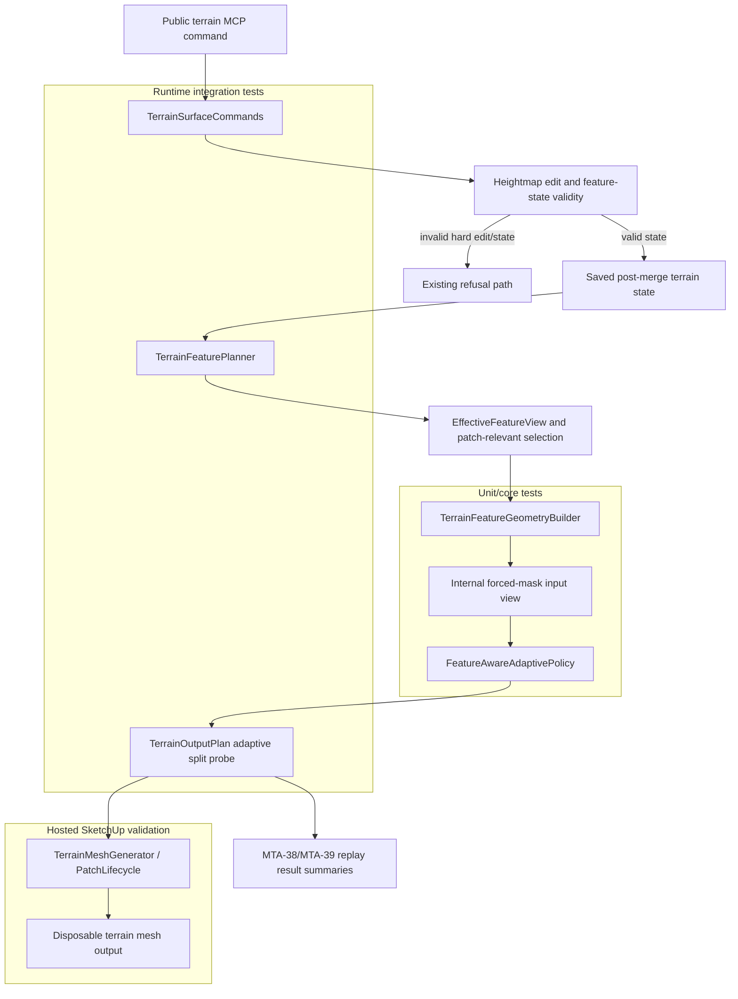

# Technical Plan: MTA-40 Add Forced Subdivision Masks For Feature-Critical Geometry
**Task ID**: `MTA-40`
**Title**: `Add Forced Subdivision Masks For Feature-Critical Geometry`
**Status**: `finalized`
**Date**: `2026-05-17`

## Source Task

- [Add Forced Subdivision Masks For Feature-Critical Geometry](./task.md)

## Problem Summary

MTA-39 lets feature intent influence adaptive output through local tolerance and bounded density
pressure, but residual-only subdivision can still skip topology around feature-critical geometry.
MTA-40 adds explicit forced subdivision pressure for supported anchors, protected boundaries, and
corridor transition geometry while preserving the current adaptive patch/cell output path.

The task must keep a clean boundary between terrain/feature edit validity and disposable mesh
generation. Existing hard-feature edit/state refusals remain valid. For an already valid terrain
heightmap, unsupported forced-mask inputs must skip or fall back without preventing mesh output.

## Goals

- Add deterministic forced subdivision pressure around supported feature-critical geometry.
- Keep forced subdivision separate from MTA-39 tolerance and density pressure.
- Preserve valid-heightmap disposable mesh generation when unsupported mask inputs are encountered.
- Preserve existing hard edit/state refusal behavior.
- Preserve PatchLifecycle, dirty-window scope, no-delete replacement, registry/readback, and public
  MCP contracts.
- Prove topology influence, corridor-specific quality, timing, face-count, and dirty-scope behavior
  through local tests, replay evidence, and hosted validation.

## Non-Goals

- Exact hard-feature topology representation, segment-aligned edges, diagonal optimization, seam
  upgrades, CDT/local CDT islands, sparse local detail tiles, or patch component promotion.
- Broad corridor interior densification as a proxy for corridor quality.
- Public tool/request/response/schema changes.
- Forensic diagnostics, raw feature graph dumps, raw coordinates, patch IDs, cell IDs, or per-cell
  split traces in public responses.
- Making generated mesh topology the terrain source of truth.

## Related Context

- [Managed Terrain Surface Authoring HLD](specifications/hlds/hld-managed-terrain-surface-authoring.md)
- [Recommended Backend Architecture](specifications/research/managed-terrain/recommended_new_adaptive_backend_architecture.md)
- [MTA-38 summary](specifications/tasks/managed-terrain-surface-authoring/MTA-38-establish-feature-aware-adaptive-baseline-policy-and-validation-harness/summary.md)
- [MTA-39 summary](specifications/tasks/managed-terrain-surface-authoring/MTA-39-add-feature-aware-tolerance-and-density-fields/summary.md)
- [MTA-36 summary](specifications/tasks/managed-terrain-surface-authoring/MTA-36-productize-windowed-adaptive-patch-output-lifecycle-for-fast-local-terrain-edits/summary.md)
- [MTA-33 summary](specifications/tasks/managed-terrain-surface-authoring/MTA-33-implement-patch-relevant-terrain-feature-constraints/summary.md)
- [MTA-31 summary](specifications/tasks/managed-terrain-surface-authoring/MTA-31-enable-cdt-terrain-output-after-disabled-scaffold/summary.md)
- [MTA-20 summary](specifications/tasks/managed-terrain-surface-authoring/MTA-20-define-terrain-feature-constraint-layer-for-derived-output/summary.md)

## Research Summary

- MTA-39 is the closest production implementation analog. It proved the adaptive policy seam works,
  but broad corridor density pressure was reverted because it increased corridor interior faces
  without proving quality.
- MTA-38 is the validation analog. Replay rows, timing, face counts, dirty-window scope, and row
  verdicts must be first-class evidence, not afterthoughts.
- MTA-36 is the lifecycle analog. SketchUp-hosted validation is required because local tests cannot
  fully prove no-delete replacement, entity ownership, registry/readback, or persistence behavior.
- MTA-33 and MTA-31 provide the feature intent/effective-view substrate and hard/protected selection
  behavior. MTA-40 should harden only the supported-mask handoff, not redesign the whole feature
  model.
- UE landscape source research was used only to resolve local planning choices: keep authoring
  state separate from derived output inputs, keep output/update regions bounded, treat corridor
  detail as width/falloff/cap transition geometry, and do not let unsupported output inputs
  invalidate already valid terrain source data.

## Technical Decisions

### Data Model

- Add a small internal forced-mask input view/helper derived from `TerrainFeatureGeometry`.
- The view is not durable terrain state and is not public contract.
- Supported mask inputs:
  - anchors and fixed/survey control points;
  - rectangle/circle protected boundaries;
  - corridor side-transition, endpoint-cap, falloff, and overlap reference geometry.
- Unsupported/skipped mask inputs:
  - broad corridor pressure regions;
  - arbitrary exact breaklines;
  - polygon/curved hard or protected primitives;
  - any unsupported output-only mask primitive.
- The view should keep only compact counters when useful: supported inputs by role, skipped inputs
  by reason, and forced split hit count. It must not retain per-cell traces or raw public geometry.

### API and Interface Design

- Public MCP tools, request schemas, dispatcher routes, and response shapes stay unchanged.
- Internally, `FeatureAwareAdaptivePolicy` should expose forced split pressure separately from
  tolerance and density pressure.
- `TerrainOutputPlan.adaptive_split_probe` should consume forced split pressure as a separate reason
  to subdivide.
- `TerrainSurfaceCommands` continues to own the command path from saved post-merge terrain state to
  feature plan, output plan, and disposable mesh output.

### Public Contract Updates

Not applicable. There are no public request, response, schema, registration, dispatcher, docs, or
example changes planned.

If implementation discovers a required public contract change, stop and reopen planning for native
tool registration, dispatcher wiring, contract fixtures, docs, and examples.

### Error Handling

- Existing invalid hard edit/state refusals remain unchanged, including stale effective-index
  refusal and invalid hard feature state.
- Unsupported forced-mask inputs during disposable mesh generation skip or reduce mask influence and
  fall back to baseline adaptive output for valid terrain heightmaps.
- If replacement mesh generation fails for a reason other than unsupported mask influence, no-delete
  safety must leave old disposable output intact.

### State Management

- Feature intent remains the durable semantic source of truth.
- `TerrainFeatureGeometry` and forced masks are derived planning views.
- Generated mesh topology remains disposable output.
- Forced masks must be filtered to the command-selected output window/patch domain and must not
  expand dirty output scope to distant feature windows.

### Integration Points

- `TerrainSurfaceCommands`: command-path saved state, output planning, evidence capture, public
  no-leak boundary.
- `TerrainFeaturePlanner` / `EffectiveFeatureView`: active selection, stale-index refusal,
  patch-relevant selection.
- `TerrainFeatureGeometryBuilder`: derived anchors, protected regions, pressure regions, reference
  segments, affected windows, limitations, and failure category.
- `FeatureAwareAdaptivePolicy`: mask input classification, forced split pressure, compact counters.
- `TerrainOutputPlan`: recursive adaptive split integration.
- PatchLifecycle / mesh generator: no-delete replacement, registry/readback, hosted behavior.
- Replay probes/result docs/classifier: compact evidence and verdicts.

### Configuration

No public configuration is planned. Policy constants for target span/minimum split depth should be
internal and deterministic.

## Architecture Context

## Key Relationships

- Edit/feature-state validity is upstream of output planning; unsupported output masks are not new
  terrain validity failures.
- Feature intent and effective view determine which derived geometry is eligible for masks.
- Forced masks are derived from feature geometry and bounded by output scope.
- Forced split pressure is a subdivision trigger, not an exact constrained triangulation contract.
- Hosted validation is required for output lifecycle confidence.

## Acceptance Criteria

- Supported anchors/fixed controls cause local adaptive subdivision when the containing cell would
  otherwise pass residual and density checks.
- Supported rectangle/circle protected boundaries cause boundary-focused subdivision without
  densifying the whole protected region interior.
- Supported corridor side/cap/falloff/overlap geometry can cause boundary-focused subdivision, while
  planar corridor interiors remain compact and are not judged improved by broad face growth.
- Forced subdivision pressure is evaluated separately from MTA-39 tolerance and density pressure.
- Unsupported forced-mask inputs in disposable mesh generation are skipped or reduced with safe
  fallback behavior; mesh generation still succeeds for a valid terrain heightmap.
- Existing hard-feature edit/state refusal behavior remains intact.
- Forced-mask input is derived from saved post-merge terrain feature state and the selected
  effective feature view used by the command path.
- Forced masks are bounded to the command-selected output window and patch domain.
- Public MCP contracts remain unchanged and public responses do not leak raw internal mask data.
- Any new internal summaries are compact and performance-safe.
- Replay/result evidence can fail a row where height residual passes but required supported feature
  subdivision pressure was skipped.
- Hosted validation confirms no-delete replacement safety, registry/readback behavior, SketchUp
  lifecycle behavior, and timing/face-count impact for the supported MTA-40 rows.

## Test Strategy

### TDD Approach

Start at the policy seam, then integrate outward:

1. Force the first failure in `test/terrain/output/feature_aware_adaptive_policy_test.rb` for
   forced-mask input classification and split pressure.
2. Integrate recursive subdivision in `test/terrain/output/terrain_output_plan_test.rb`.
3. Prove command-path saved-state/effective-view handoff and valid-heightmap fallback in
   `test/terrain/commands/terrain_surface_commands_test.rb`.
4. Prove public no-leak behavior in contract/command tests.
5. Extend replay/result evidence only as compactly as needed.
6. Run hosted capture for lifecycle, dirty-window, timing, face-count, fallback, save/reopen or
   readback, and corridor proof.

### Required Test Coverage

| Provisional queue order | AC / requirement | Behavior or risk | Candidate implementation slice | Likely owner | Unit/core coverage | Integration/runtime coverage | Contract/schema coverage | Error/refusal coverage | Hosted/manual validation | Likely fixtures/helpers | Integration points | Suggested focused command | Suggested broader command | Blocker or explicit gap |
|---|---|---|---|---|---|---|---|---|---|---|---|---|---|---|
| 1 | Mask inputs come from supported derived geometry | Avoid raw feature graph use | Forced-mask input view near `FeatureAwareAdaptivePolicy` | Policy/output | `feature_aware_adaptive_policy_test.rb` | n/a | n/a | skipped input counters | n/a | Geometry builder fixtures | `TerrainFeatureGeometry` -> policy | `ruby -Itest test/terrain/output/feature_aware_adaptive_policy_test.rb` | n/a | none |
| 2 | Anchors force local subdivision | Residual-only pass should still split | Policy forced split + output-plan split probe | Policy/output | policy test | `terrain_output_plan_test.rb` | n/a | n/a | n/a | point-contained fixture | Policy -> `TerrainOutputPlan` | `ruby -Itest test/terrain/output/feature_aware_adaptive_policy_test.rb test/terrain/output/terrain_output_plan_test.rb` | n/a | none |
| 3 | Protected boundaries split without whole-region growth | Avoid broad densification | Boundary/bounds mask rules | Policy/output | policy test | output-plan boundary fixture | n/a | n/a | n/a | rectangle/circle fixtures | Policy -> output plan | `ruby -Itest test/terrain/output/feature_aware_adaptive_policy_test.rb test/terrain/output/terrain_output_plan_test.rb` | n/a | none |
| 4 | Corridor detail stays at side/cap/falloff/overlap | Avoid corridor interior face growth | Corridor reference-segment masks + quality sampler | Feature/output/probe | geometry builder and policy tests | replay quality sampler | n/a | n/a | required hosted row | corridor transition fixtures | geometry -> policy -> replay | `ruby -Itest test/terrain/features/terrain_feature_geometry_builder_test.rb test/terrain/probes/feature_aware_adaptive_baseline_quality_sampler_test.rb` | hosted replay | hosted proof required |
| 5 | Forced split is separate from density | Avoid MTA-39 regression | `adaptive_split_probe` split reason | Output | policy test | output-plan low residual/no density fixture | n/a | n/a | n/a | low residual fixture | policy -> output plan | `ruby -Itest test/terrain/output/terrain_output_plan_test.rb` | n/a | none |
| 6 | Valid heightmap output does not refuse on unsupported masks | Preserve disposable mesh generation | unsupported mask skip/fallback | Command/output | policy fallback test | command output test | no public delta | valid-heightmap fallback | hosted fallback row required | unsupported primitive fixture | command -> output plan | `ruby -Itest test/terrain/commands/terrain_surface_commands_test.rb test/terrain/output/feature_aware_adaptive_policy_test.rb` | hosted replay | none |
| 7 | Existing hard edit/state refusals remain | Keep edit validity boundary | feature planner/edit validation unchanged except direct fixes | Feature/command | feature planner tests | command tests | no public leak | stale index / invalid hard cases | hosted refusal row | existing stale-index fixtures | planner -> command | `ruby -Itest test/terrain/features/terrain_feature_planner_test.rb test/terrain/commands/terrain_surface_commands_test.rb` | n/a | none |
| 8 | Saved post-merge effective view feeds masks | Avoid transient request state | command handoff and digest evidence | Command/feature | geometry builder tests | command tests | n/a | stale-index behavior | hosted row | `SampleWindow` fixtures | command -> planner -> geometry | `ruby -Itest test/terrain/commands/terrain_surface_commands_test.rb` | n/a | direct feature-view fixes in scope if failing |
| 9 | Public contract unchanged | Prevent contract drift | no public schema/response changes | Command/contract | n/a | command no-leak tests | contract stability test with explicit mask-field no-leak assertions | n/a | n/a | contract fixtures | public command boundary | `ruby -Itest test/terrain/contracts/terrain_contract_stability_test.rb` | native contract sweep if touched | none |
| 10 | Dirty window and patch scope stay bounded | Avoid lifecycle/performance regression | mask filtering to output window/patch domain | Output/replay | output plan tests | replay test | n/a | n/a | required hosted matrix | baseline evidence | output plan -> PatchLifecycle | `ruby -Itest test/terrain/output/terrain_output_plan_test.rb test/terrain/replay/feature_aware_adaptive_baseline_replay_test.rb` | hosted replay | hosted proof required |
| 11 | Replay can fail height-only success | Validate topology claim | result classifier/doc compact verdict fields | Probe | classifier tests | replay tests | n/a | n/a | hosted rows | MTA-38/MTA-39 replay corpus | replay -> result docs | `ruby -Itest test/terrain/probes/feature_aware_adaptive_baseline_result_classifier_test.rb test/terrain/replay/feature_aware_adaptive_baseline_replay_test.rb` | hosted capture | add only compact fields |
| 12 | Hosted lifecycle proof | SketchUp lifecycle gap | deploy and capture result packs | Runtime/host | n/a | n/a | n/a | fallback/refusal rows | required, including supported-mask save/reopen or readback check where practical | supported/fallback/refusal/corridor rows | plugin runtime | hosted capture process from MTA-38/MTA-39 notes | n/a | cannot be fully replaced by local tests |

Likely first failing target: forced-mask input classification and split pressure in
`test/terrain/output/feature_aware_adaptive_policy_test.rb`.

## Instrumentation and Operational Signals

- Compact forced-mask counters when needed: supported input counts by role, skipped input counts by
  reason, and forced split hit count.
- Existing baseline evidence: feature view digest, policy fingerprint, selected feature counts,
  dirty window, affected patch scope, rendering summary, timing buckets, face count, and row verdict.
- Corridor-specific quality evidence: interior planarity, width preservation, longitudinal
  interpolation, low interior face count, side/cap/falloff detail, dirty scope, and timing.

## Implementation Phases

1. Feature-view readiness/hardening for the supported mask set. This is a hard gate before policy
   rollout, including saved post-merge state, effective selection, patch relevance, coordinate
   windows, and command-path `SampleWindow` proof.
2. Failing policy and output-plan tests for forced split pressure.
3. Implement internal forced-mask input view and policy split pressure.
4. Thread forced split pressure through `TerrainOutputPlan.adaptive_split_probe`.
5. Add command-path saved-state, no-leak, existing refusal, and valid-heightmap fallback coverage.
6. Extend compact replay/result evidence and corridor quality proof.
7. Run local focused/broader validation, package/deploy changed runtime, and capture hosted results,
   including fallback and save/reopen/readback evidence where practical.

## Rollout Approach

- Keep behavior internal to adaptive output; no public opt-in or schema migration.
- Land behind deterministic policy behavior in the existing adaptive path.
- Validate locally before deploying to hosted SketchUp.
- Treat hosted replay/capture as the release gate for completion.

## Risks and Controls

- Over-broad support: restrict support to the decided mask families and encode exclusions in tests.
- Feature-view drift: run Phase 0 readiness/hardening before mask rollout.
- Unsupported masks become refusals: add valid-heightmap output fallback tests.
- Dirty-window expansion: filter masks to selected output domain and compare affected patch scope.
- Corridor broad density regression: reject broad corridor pressure and validate compact interiors.
- Diagnostic bloat/leakage: compact internal counters only; public contract/no-leak tests.
- Hosted lifecycle mismatch: hosted capture required for no-delete, registry/readback, and timing.
- Public contract drift: no planned public delta; any discovered public change reopens planning.

## Premortem Gate

Status: WARN

### Unresolved Tigers

- None.

### Plan Changes Caused By Premortem

- Made Phase 0 feature-view readiness a hard gate before policy rollout.
- Tightened topology language from required subdivision to required subdivision pressure.
- Made valid-heightmap unsupported-mask hosted fallback an explicit release gate.
- Added explicit no-leak coverage for mask-related public response fields.
- Added hosted save/reopen or readback validation for supported-mask rows where practical.

### Accepted Residual Risks

- Risk: Corridor quality may still need domain-specific sampler refinement beyond generic replay rows.
  - Class: Paper Tiger
  - Why accepted: The plan now requires corridor-specific interior and boundary metrics and forbids
    broad interior density as success.
  - Required validation: Hosted/replay corridor row with interior planarity, width, interpolation,
    low interior face count, boundary detail, dirty scope, and timing evidence.
- Risk: Hosted save/reopen may be impractical in the same capture pass.
  - Class: Paper Tiger
  - Why accepted: Registry/readback and no-delete hosted checks still gate completion; any missing
    save/reopen proof must be called out as a validation gap.
  - Required validation: Save/reopen or equivalent readback proof where practical, otherwise an
    explicit residual gap in closeout.

### Carried Validation Items

- Feature-view readiness through the command path before forced-mask rollout.
- Valid-heightmap unsupported-mask fallback row.
- Supported-mask hosted lifecycle row with dirty-window, affected-patch-scope, registry/readback,
  timing, and face-count evidence.
- Corridor-specific quality row.
- Public no-leak contract checks for mask-related vocabulary.

### Implementation Guardrails

- Do not turn unsupported output masks into valid-heightmap mesh refusals.
- Do not move existing hard edit/state refusals into disposable output planning.
- Do not reuse broad MTA-39 density pressure as forced-mask behavior.
- Do not claim exact hard-feature representation, segment-aligned edges, diagonal optimization, or
  seam upgrades.
- Do not expose raw feature/mask/cell/patch data in public responses.
- Do not expand dirty output scope beyond the command-selected output window/patch domain.

## Dependencies

- MTA-39 feature-aware adaptive policy.
- MTA-38 replay/capture harness and result rows.
- MTA-36 PatchLifecycle/no-delete ownership.
- MTA-31/MTA-33 feature intent, effective view, and patch relevance.
- Hosted SketchUp validation environment.

## Quality Checks

- [x] All required inputs validated
- [x] Problem statement documented
- [x] Goals and non-goals documented
- [x] Research summary documented
- [x] Technical decisions included
- [x] Architecture context included
- [x] Acceptance criteria included
- [x] Test requirements specified as a provisional coverage-matrix seed
- [x] Instrumentation and operational signals defined when needed
- [x] Risks and dependencies documented
- [x] Rollout approach documented when needed
- [x] Small reversible phases defined
- [x] Premortem completed with falsifiable failure paths and mitigations
- [x] Planning-stage size estimate considered before premortem finalization
