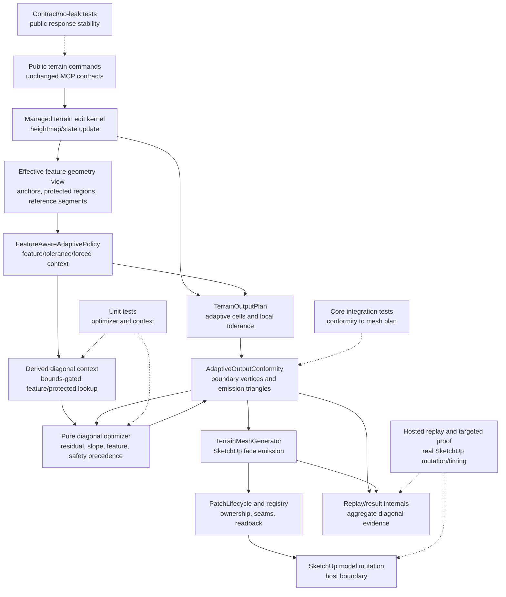

# Technical Plan: MTA-41 Add Optional Deterministic Feature-Aware Diagonal Optimization
**Task ID**: `MTA-41`
**Title**: `Add Optional Deterministic Feature-Aware Diagonal Optimization`
**Status**: `finalized`
**Date**: `2026-05-25`

## Source Task

- [Add Optional Deterministic Feature-Aware Diagonal Optimization](./task.md)

## Problem Summary

Adaptive terrain output emits triangles, and the fixed diagonal used for rectangular adaptive
cells can affect residual fit, slope continuity, feature alignment, protected-boundary ambiguity,
and visual smoothness. The backend architecture identifies deterministic diagonal optimization as
useful, but no downstream task structurally depends on it. MTA-41 therefore implements a narrow,
evidence-gated output-quality slice: choose diagonals for eligible rectangular adaptive cells only
when the implementation can prove actual emitted geometry changes and measurable quality value
without unacceptable timing or contract cost.

## Goals

- Choose rectangular adaptive-cell diagonals deterministically using safety, exact residual,
  slope-continuity, and feature-alignment precedence.
- Preserve existing adaptive cell planning, feature-aware tolerance/density, forced-subdivision,
  PatchLifecycle, seam, component, and SketchUp mutation behavior.
- Consume only the already-derived effective feature geometry view, with sparse bounds-gated
  lookup, not raw feature intent.
- Prove value through changed emitted triangles, a predeclared quality metric, repeated hosted
  determinism, timing bands, and public no-leak coverage.
- Record an adoption, deferral, or rejection verdict from evidence; do not treat green tests or
  metadata alone as completion.

## Non-Goals

- No public MCP request, response, schema, dispatcher, catalog, README, or example change.
- No regular-grid diagonal change.
- No center-fan conformance polygon triangulation change.
- No sparse local detail, composed height oracle, CDT islands, global Delaunay/TIN replacement, or
  native triangulation backend.
- No seam-contract, patch-component, PatchLifecycle, registry/readback, or SketchUp mutation
  redesign.
- No forensic normal replay artifacts, raw feature IDs, raw patch IDs, per-cell topology traces,
  or raw candidate triangle dumps.

## Related Context

- [Managed Terrain Surface Authoring HLD](specifications/hlds/hld-managed-terrain-surface-authoring.md)
- [Recommended Backend Architecture](specifications/research/managed-terrain/recommended_new_adaptive_backend_architecture.md)
- [MTA-38 task](specifications/tasks/managed-terrain-surface-authoring/MTA-38-establish-feature-aware-adaptive-baseline-policy-and-validation-harness/task.md)
- [MTA-39 summary](specifications/tasks/managed-terrain-surface-authoring/MTA-39-add-feature-aware-tolerance-and-density-fields/summary.md)
- [MTA-40 summary](specifications/tasks/managed-terrain-surface-authoring/MTA-40-add-forced-subdivision-masks-for-feature-critical-geometry/summary.md)
- [MTA-42 plan](specifications/tasks/managed-terrain-surface-authoring/MTA-42-upgrade-adaptive-seam-contracts-for-feature-driven-splits/plan.md)
- [MTA-43 plan](specifications/tasks/managed-terrain-surface-authoring/MTA-43-add-patch-component-planner-for-cross-patch-features/plan.md)
- [MTA-44 task](specifications/tasks/managed-terrain-surface-authoring/MTA-44-add-sparse-local-detail-tiles-and-composed-height-oracle/task.md)

## Research Summary

- The implemented adaptive path recursively selects cells in `TerrainOutputPlan`, then
  `AdaptiveOutputConformity` converts final cells into `emission_triangles`, and
  `TerrainMeshGenerator` consumes those triangles for full adaptive and adaptive patch output.
- Four-corner rectangular cells currently emit a fixed lower-left to upper-right diagonal through
  `AdaptiveOutputConformity.boundary_triangles_for`; cells with more than four boundary vertices
  use a center fan.
- MTA-38 provides hosted replay/result infrastructure for timing, face/vertex counts, dirty scope,
  quality evidence, and classifier verdicts. MTA-41 should reuse this surface rather than inventing
  a second validation path.
- MTA-39 and MTA-40 provide the derived feature geometry, local tolerance/density, and
  forced/protected context needed by any feature-aware diagonal decision.
- MTA-42/MTA-43 establish seam and component safety boundaries but do not make hidden diagonal or
  seam-adjacent shading behavior automatically safe. Hosted proof must inspect that behavior.
- MTA-43's planning and implementation lesson is directly applicable: metadata and green replay
  rows are not enough. Adoption must prove emitted geometry actually changes where improvement is
  claimed.
- External terrain/TIN research supports local diagonal flipping as a normal way to improve slope
  or fit, but also supports protected/breakline precedence over smoothness and does not justify
  importing global CDT/Delaunay behavior for this task.

## Technical Decisions

### Data Model

- Add internal diagonal-decision data only for final emitted rectangular adaptive cells.
- Candidate set is exactly two triangulations of the same four boundary vertices:
  lower-left to upper-right baseline and lower-right to upper-left alternate.
- Residual comparison must use the same deterministic non-corner source-sample set for both
  candidates. A sample is evaluated against the triangle plane that contains its 2D owner-local
  position under a deterministic boundary rule. If an eligible cell has no non-corner source
  samples, residual scoring cannot justify a diagonal change.
- The existing diagonal is the deterministic fallback and tie winner.
- Internal aggregate evidence may include eligible rectangular count, changed count, decision
  reason counts, safety/fallback/unsupported counts, residual/slope summaries, feature-entry check
  counts, seam-adjacent changed count, timing, and adoption/defer/reject verdict.
- No durable terrain source state is added. Diagonal decisions are derived output metadata.

### API and Interface Design

- Public MCP tools and response shapes remain unchanged.
- Add or extend internal interfaces only:
  - an emission-time optimizer that compares two candidate triangulations for one rectangular cell;
  - a derived diagonal context that exposes sparse feature/protected hints from the effective
    feature geometry view;
  - a compact replay/result evidence carrier for aggregate diagonal outcome fields.
- `AdaptiveOutputConformity` orchestrates candidate construction and applies chosen
  `emission_triangles`.
- `FeatureAwareAdaptivePolicy` may expose a narrow diagonal-context factory or accessor, but it
  should not absorb raw scoring, indexing, or per-cell optimizer logic.
- Final names and signatures may adapt to local code, but the ownership split must hold:
  conformity orchestrates, pure optimizer scores, derived context owns feature/protected lookup,
  generator mutates unchanged.

### Public Contract Updates

Not applicable by design.

- Request shape delta: none.
- Response shape delta: none.
- Tool schema or catalog delta: none.
- Dispatcher/routing delta: none.
- README/docs/example delta: none.
- Required contract coverage: public responses must not expose diagonal diagnostic vocabulary,
  candidate triangles, raw topology, raw feature IDs, patch IDs, seam internals, or optimizer
  scores.

If implementation discovers a necessary public shape change, stop and replan the coordinated
runtime behavior, loader schema, dispatcher, contract fixtures, docs, and examples before shipping.

### Error Handling

- Exact ties, near-threshold residual ties, unsupported geometry, or ambiguous safety checks keep
  the existing diagonal.
- If one candidate crosses a protected or forced boundary in an unsupported way and the other does
  not, choose the safer candidate before considering residual, slope, or feature alignment.
- If both candidates are unsafe or ambiguous, keep the existing diagonal and record aggregate
  internal evidence rather than adding a new public refusal.
- Existing command-level validity refusals remain valid. MTA-41 must not convert a valid heightmap
  into a refused mesh solely because optional diagonal evidence is inconclusive.
- No-delete behavior remains downstream-owned: old output should not be erased because optional
  diagonal optimization failed to produce evidence.

### State Management

- Feature intent remains durable domain state.
- Effective feature geometry and diagonal context are derived planning views.
- Generated mesh topology remains disposable output.
- Diagonal evidence lives in internal replay/result artifacts and task evidence, not in public
  command contracts or source-state payloads.

### Integration Points

- `TerrainOutputPlan`: remains responsible for adaptive cells, split/stop decisions, and local
  tolerance/forced context; it should not optimize emitted diagonals during recursive splitting.
- `AdaptiveOutputConformity`: owned insertion point for rectangular-cell diagonal selection because
  it has final cell boundaries and emits `emission_triangles`.
- `TerrainMeshGenerator`: consumes already-decided triangles and preserves face creation, hidden
  edges, orientation normalization, patch metadata, ownership, registry, and no-delete sequencing.
- `FeatureAwareAdaptivePolicy` and derived feature geometry: provide sparse context for
  feature/protected tie-breakers without raw-feature scans.
- Replay/result/classifier internals: record aggregate diagonal evidence and adoption/defer/reject
  verdicts.
- Hosted SketchUp replay: proves real face output, repeated determinism, timing bands, and
  seam-adjacent visual/metric behavior.

### Configuration

- No public configuration is planned.
- Internal constants should be named, deterministic, and covered by tests:
  residual improvement epsilon scaled by base/local tolerance, slope tie epsilon, feature alignment
  angle/distance tolerance, and any high-count threshold that triggers a simple feature-context
  bucket/index.
- Defaults should prefer the existing diagonal unless the alternate clearly wins by the precedence
  ladder.
- Phase 0 must declare the adoption metric thresholds before broader wiring: minimum residual
  improvement above epsilon, acceptable timing band, and any feature-check-count budget. These
  thresholds can be tuned during implementation only with a documented plan update, not after
  looking at hosted proof results.

## Architecture Context

## Key Relationships

- Diagonal optimization is an output-emission decision, not a terrain edit, source-state, or public
  tool behavior.
- `AdaptiveOutputConformity` is the only planned integration point for changing
  `emission_triangles`.
- The optimizer is pure and deterministic so threshold behavior can be tested before host wiring.
- Feature/protected lookup is precomputed and bounds-gated from the effective feature geometry
  view; raw feature intent remains upstream.
- `TerrainMeshGenerator`, PatchLifecycle, seams, components, and SketchUp mutation consume the
  selected triangles and should not know why a diagonal was chosen.
- Replay evidence is adoption evidence only when it proves changed emitted geometry plus metric
  effect.

## Acceptance Criteria

- Repeated evaluation of the same adaptive output context produces the same diagonal decisions, and
  exact or near-threshold ties keep the existing fixed diagonal.
- At least one targeted proof uses a cell or terrain region where the alternate diagonal has lower
  predeclared exact source-sample triangle-plane residual than the baseline fixed diagonal, and the
  emitted triangle set actually changes.
- The targeted proof isolates the diagonal decision: it includes at least one rectangular adaptive
  cell with non-corner source samples where the only expected topology difference is the chosen
  diagonal. If a larger `x >= 50m` hosted terrain is needed, it must still identify this isolated
  proof cell or proof region internally.
- The hosted proof records a fixture-scoped proof-cell identifier in internal result evidence so the
  changed emitted diagonal can be traced to the isolated proof cell without adding normal
  per-cell/forensic replay capture.
- Protected/forced-boundary safety can veto a candidate before residual scoring; residual can
  change the diagonal only above a named tolerance-scaled threshold; slope and feature alignment
  are deterministic tie-breakers only.
- Diagonal evaluation consumes the already-derived effective feature geometry view, normalizes
  lookup data once per output context, bounds-gates exact checks, and does not scan raw feature
  intent or all feature entries for every emitted quad.
- Only rectangular four-vertex adaptive cells are eligible; center-fan conformance cells,
  regular-grid output, sparse local detail, CDT islands, seam contracts, patch component planning,
  and PatchLifecycle behavior remain unchanged.
- Optimized decisions are reflected in generated `emission_triangles` before SketchUp face
  creation, with expected rectangular-cell face and vertex counts unchanged for pure diagonal
  swaps.
- Unsupported or ambiguous protected/forced geometry keeps the safer existing diagonal unless an
  existing command-level validity rule already requires refusal; MTA-41 introduces no new public
  refusal contract.
- Replay/result artifacts record aggregate eligibility, changed count, decision reason counts,
  safety/fallback counts, feature-check counts, seam-adjacent changed count, metric deltas, timing,
  and an adoption/defer/reject verdict.
- Internal replay/result document shape changes are covered by tests so future consumers can
  distinguish missing diagonal evidence, aggregate no-change evidence, and adoptable changed
  evidence without relying on public MCP response fields.
- Public MCP command responses, schemas, dispatcher contracts, and user-facing examples remain
  unchanged; contract/no-leak coverage blocks diagonal diagnostic vocabulary and raw
  topology/candidate details from public responses.
- Hosted validation includes repeated runs, a targeted `x >= 50m` changed-diagonal proof if the
  existing replay corpus does not naturally change emitted diagonals, timing bands, and
  seam-adjacent visual/metric review. If any seam-adjacent diagonal changes occur, their residual
  and slope/dihedral summaries must not regress beyond the predeclared tolerance band.
- The task may claim adoption only when evidence shows actual changed emitted diagonals, positive
  predeclared quality or residual effect, deterministic repeated output, no public contract leak,
  and acceptable timing cost; otherwise the verdict is defer or reject.

## Test Strategy

### TDD Approach

Start with the smallest proof that can falsify the task: a pure optimizer test where the current
fixed diagonal loses under exact triangle-plane residual on a constructed four-corner cell. Then
integrate outward into feature/protected context, conformity emission, replay evidence, public
no-leak coverage, and hosted proof.

Do not start by wiring replay diagnostics. Diagnostics without a changed emitted diagonal are not
evidence of implementation value.

### Required Test Coverage

Use this provisional coverage-matrix seed during `task-implementation` Step 03:

| Provisional queue order | AC / requirement | Behavior or risk | Candidate implementation slice | Likely owner | Unit/core coverage | Integration/runtime coverage | Contract/schema coverage | Error/refusal coverage | Hosted/manual validation | Likely fixtures/helpers | Integration points | Suggested focused command | Suggested broader command | Blocker or explicit gap |
|---|---|---|---|---|---|---|---|---|---|---|---|---|---|---|
| 1 | Deterministic fallback and real quality decision | Fixed diagonal loses only when alternate has meaningful exact residual advantage | Pure optimizer | New terrain output optimizer helper | Tie, near-tie, alternate-wins, baseline-wins residual tests using the same non-corner sample set for both candidates | n/a | n/a | Unsupported or corner-only metric input keeps baseline | n/a | Constructed rectangular cell spanning enough source intervals to include non-corner samples | Optimizer only | `bundle exec ruby -Itest test/terrain/output/terrain_output_plan_test.rb` or new focused optimizer test | `bundle exec rake ruby:test` | Exact helper location is provisional |
| 2 | Safe score precedence | Safety veto outranks residual; residual outranks slope; slope outranks feature; baseline wins remaining ties | Optimizer and decision reason model | Optimizer helper | Precedence table tests and reason counts | n/a | n/a | One unsafe candidate chooses safe; both unsafe/ambiguous keep baseline | n/a | Protected/forced segment fixtures | Optimizer and context contract | `bundle exec ruby -Itest test/terrain/output/feature_aware_adaptive_policy_test.rb` | `bundle exec rake ruby:test` | Constants need final naming during implementation |
| 3 | Feature lookup discipline | Derived-view-only, sparse feature/protected lookup | Derived diagonal context | New context helper near feature-aware output policy | Aggregate-bounds miss returns empty; per-entry bounds filter; predeclared high-count threshold behavior | Replay-like fixture shows exact feature-entry checks stay within the declared budget | n/a | Unsupported feature primitive records aggregate skip/fallback | Timing review later | Effective feature geometry fixture with many raw features but few derived entries | Feature geometry to optimizer context | `bundle exec ruby -Itest test/terrain/output/feature_aware_adaptive_policy_test.rb` | `bundle exec rake ruby:test` | Add bucket/index only if derived counts exceed the declared budget; do not implement it preemptively |
| 4 | Scope containment | Only rectangular adaptive cells change | Conformity integration | `AdaptiveOutputConformity` | Center-fan bypass and regular-grid unchanged tests | Rectangular cell emits alternate diagonal and unchanged counts | n/a | Degenerate/unsupported cell keeps existing emission | n/a | Rectangular and center-fan adaptive cells | Conformity to mesh plan | `bundle exec ruby -Itest test/terrain/output/terrain_output_plan_test.rb` | `bundle exec rake ruby:test` | Existing tests may need small fixture extraction |
| 5 | Geometry integration | Chosen diagonal becomes actual emitted triangle set before mutation | Mesh output integration | Conformity plus `TerrainMeshGenerator` consumer path | n/a | Assertion that the chosen diagonal appears in final `emission_triangles` before generator consumption; generated faces consume optimized triangles; face/vertex counts stable | n/a | Invalid output follows existing no-delete path | Hosted proof verifies real faces and carries fixture-scoped proof-cell identifier | Targeted `x >= 50m` terrain row or fixture | Conformity to generator to SketchUp | `bundle exec ruby -Itest test/terrain/output/terrain_mesh_generator_test.rb` | `bundle exec rake ruby:test` | Hosted proof may be required to see real face topology |
| 6 | Internal evidence and adoption gate | Changed count and metric effect drive verdict; counters alone do not | Replay/result/classifier internals | Result document/classifier | No-changed => neutral/defer; changed-no-metric => neutral/defer; changed-plus-metric/timing => adoptable | Replay document carries aggregate fields only and tests missing/no-change/adoptable shapes | No public shape change | Missing metric evidence cannot adopt | Hosted repeated capture supports verdict | MTA-38 replay result fixture plus targeted proof row | Replay to result classifier | `bundle exec ruby -Itest test/terrain/probes/feature_aware_adaptive_baseline_result_document_test.rb` | `bundle exec rake ruby:test` | Existing replay corpus may not naturally change diagonals |
| 7 | Public no-leak | Public contracts unchanged despite internal diagnostics | Contract/no-leak coverage | Public command serializers/tests | n/a | Command success still serializes old public shape | No diagonal/topology vocabulary in public responses | Existing refusals unchanged | n/a | Contract stability fixtures | Public command boundary | `bundle exec ruby -Itest test/terrain/contracts/terrain_contract_stability_test.rb` | `bundle exec rake ruby:test` | Add vocabulary only if internal fields are added |
| 8 | Hosted determinism, timing, seam-adjacent safety | Real SketchUp output is stable and not too expensive | Hosted replay and targeted proof | Replay probes and manual hosted checks | n/a | n/a | Public output inspected through commands only | Existing no-delete/refusal paths remain intact | Three repeated runs; targeted changed-diagonal proof; seam-adjacent changed count plus residual and slope/dihedral non-regression band | `test/terrain/replay/feature_aware_adaptive_baseline.json` plus targeted row | SketchUp host boundary | Hosted replay command used by MTA-38 harness | `bundle exec rake package:verify` plus hosted run | Timing and visual evidence cannot be fully proven by unit tests |

Likely first failing target: a pure optimizer test proving that a constructed rectangular cell
selects the alternate diagonal because its exact source-sample triangle-plane residual is lower
than the fixed baseline by more than the named epsilon, using identical non-corner source samples
for both candidates. The first integration failure should then assert that the selected diagonal
appears in final `emission_triangles` before `TerrainMeshGenerator` consumes the plan.

Suggested focused validation commands:

- `bundle exec ruby -Itest test/terrain/output/terrain_output_plan_test.rb`
- `bundle exec ruby -Itest test/terrain/output/feature_aware_adaptive_policy_test.rb`
- `bundle exec ruby -Itest test/terrain/output/terrain_mesh_generator_test.rb`
- `bundle exec ruby -Itest test/terrain/probes/feature_aware_adaptive_baseline_result_document_test.rb`
- `bundle exec ruby -Itest test/terrain/probes/feature_aware_adaptive_baseline_result_classifier_test.rb`
- `bundle exec ruby -Itest test/terrain/contracts/terrain_contract_stability_test.rb`

Suggested broad validation:

- `bundle exec rake ruby:test`
- `bundle exec rake ruby:lint`
- `bundle exec rake package:verify`

## Instrumentation and Operational Signals

- Aggregate diagonal eligibility count.
- Changed diagonal count and changed ratio.
- Decision reason counts: baseline tie, residual win, slope tie-break, feature tie-break, safety
  veto, unsupported/ambiguous fallback.
- Residual delta summary for changed and unchanged eligible cells.
- Slope/dihedral delta summary for changed cells.
- Feature/protected aggregate bounds hits, exact entry checks, and skipped/unsupported counts.
- Seam-adjacent changed count.
- Seam-adjacent residual and slope/dihedral delta summaries when seam-adjacent changes occur.
- Timing buckets for diagonal context construction, scoring, conformity emission, and total replay
  row timing where practical.
- Adoption/defer/reject verdict reason.

Normal replay artifacts must keep these aggregate. Fixture-scoped proof may include the minimum
detail needed to prove one changed emitted diagonal, but should not become normal forensic capture.

## Implementation Phases

1. Proof fixture, pure scorer, and emission assertion
   - Freeze the exact residual metric, deterministic sample-set rule, named residual epsilon, and
     adoption threshold before writing production scorer code.
   - Declare adoption thresholds for residual improvement, timing band, seam-adjacent
     non-regression, and feature-check-count budget.
   - Add the first failing optimizer test where the fixed diagonal loses.
   - Add the first integration assertion that the selected diagonal appears in final
     `emission_triangles`.
   - Implement pure two-candidate scoring and deterministic reason reporting.
2. Derived diagonal context
   - Add sparse context derived from effective feature geometry.
   - Normalize supported segments/protected boundaries once.
   - Add aggregate/per-entry bounds gating and instrumentation for exact checks.
   - Add a simple bucket/index only if fixture counts show bounds filtering is not enough.
3. Conformity integration
   - Integrate optimizer into rectangular adaptive-cell emission.
   - Keep center-fan conformance cells and regular-grid output unchanged.
   - Prove changed `emission_triangles` and stable face/vertex counts in core tests.
4. Internal evidence and no-leak coverage
   - Extend replay/result/classifier internals with aggregate diagonal evidence and verdict logic.
   - Add no-leak/contract tests for public response stability and diagnostic vocabulary.
5. Hosted validation and verdict
   - Run repeated hosted replay.
   - Add or run a targeted `x >= 50m` proof if the existing corpus does not naturally change
     diagonals.
   - Ensure the targeted proof identifies an isolated rectangular proof cell or proof region whose
     only expected topology difference is the diagonal.
   - Record the fixture-scoped proof-cell identifier in internal hosted result evidence.
   - Inspect seam-adjacent changed counts and visual/metric behavior.
   - Record adopt, defer, or reject from evidence.

## Rollout Approach

- Keep the optimization internally evidence-gated until Phase 5 proves value.
- Existing fixed diagonal remains fallback for ties, unsupported/ambiguous cases, and any disabled
  or non-adopted verdict path.
- If evidence is weak, ship the internal proof/verdict as deferred or rejected rather than forcing
  adoption.
- Do not add public controls. Future toggles or public reporting would require separate planning.

## Risks and Controls

- False-positive completion: require a targeted changed-emission proof and positive metric effect
  before adoption.
- Wrong metric: use exact source-sample residual against candidate triangle planes, not existing
  bilinear split residual, as the primary quality metric.
- Performance regression: score only final rectangular emitted cells, not recursive split
  candidates; bounds-gate feature checks; compare repeated hosted timing bands and declared
  feature-check budgets.
- Feature lookup scaling: consume the effective feature view only, normalize once, and add a
  bucket/index only if high derived counts make per-entry bounds filtering material.
- Protected/forced ambiguity: safety veto precedes residual, slope, and feature scoring; ambiguous
  cases keep the existing diagonal.
- Seam-adjacent visual regression: record seam-adjacent changed count and use hosted visual/metric
  review plus residual and slope/dihedral non-regression bands before adoption.
- Host mutation assumption wrong: preserve generator/PatchLifecycle mutation code and verify real
  SketchUp output in hosted replay.
- Diagnostic leak: keep diagonal evidence internal and extend no-leak tests.
- Diagnostic sprawl: keep normal artifacts aggregate-only; fixture-scoped proof details must stay
  minimal.
- Scope creep into MTA-44/CDT: reject local-detail, composed height oracle, CDT island, or global
  triangulation work in MTA-41.
- Public contract drift: any required public shape change is a stop-and-replan condition.

## Dependencies

- Implemented MTA-38 hosted replay/result infrastructure.
- Implemented MTA-39 feature-aware output policy.
- Implemented MTA-40 forced/protected feature context for safety decisions.
- Implemented MTA-42 seam contract behavior and MTA-43 component/no-delete behavior as downstream
  constraints to preserve.
- Ruby test/lint/package tooling.
- Hosted SketchUp environment for final replay, timing, emitted geometry, and seam-adjacent visual
  checks.

## Premortem Gate

Status: PASS

### Unresolved Tigers

- None.

### Plan Changes Caused By Premortem

- Phase 0 now freezes the residual sample-set rule, named residual epsilon, and adoption threshold
  before production scorer code is written.
- The test strategy now requires an integration assertion that the selected diagonal appears in
  final `emission_triangles` before `TerrainMeshGenerator` consumes the output plan.
- Hosted proof now requires a fixture-scoped proof-cell identifier in internal result evidence so a
  changed emitted diagonal cannot be claimed from aggregate counters alone.

### Accepted Residual Risks

- Risk: Derived feature geometry cardinality may still require a simple bucket/index.
  - Class: Paper Tiger
  - Why accepted: The plan declares feature-check-count budgets and only adds indexing if measured
    derived-view counts exceed the budget.
  - Required validation: Context tests and hosted/replay evidence must report exact feature-entry
    checks against the declared budget.
- Risk: Seam-adjacent visual regression can occur even when seam contracts pass.
  - Class: Paper Tiger
  - Why accepted: Boundary vertices are unchanged by a pure diagonal swap, and the plan requires
    seam-adjacent changed counts plus residual and slope/dihedral non-regression bands.
  - Required validation: Hosted proof must inspect seam-adjacent changed cells when any occur.
- Risk: Internal result fields may become de facto stable for future consumers.
  - Class: Paper Tiger
  - Why accepted: The task has no public contract change, but internal result-document shape tests
    are required in the same phase as new aggregate fields.
  - Required validation: Missing/no-change/adoptable diagonal evidence shapes must be covered by
    result-document and classifier tests.

### Carried Validation Items

- Prove at least one isolated rectangular proof cell changes emitted diagonal with a positive
  predeclared residual effect.
- Run repeated hosted validation and compare timing bands before adoption.
- Record seam-adjacent changed count and non-regression metrics when seam-adjacent changes occur.
- Run public contract/no-leak checks when internal diagonal evidence is added.
- Record adopt, defer, or reject; do not silently treat weak evidence as adoption.

### Implementation Guardrails

- Do not change public MCP contracts, dispatcher wiring, schemas, README examples, or public
  refusal behavior for MTA-41.
- Do not optimize regular-grid output or center-fan conformance polygons.
- Do not implement sparse local detail, composed height oracle, CDT islands, global Delaunay/TIN,
  seam-contract upgrades, patch-component behavior, or PatchLifecycle redesign.
- Do not score recursive split candidates; score only final eligible rectangular emitted cells.
- Do not claim completion from diagnostics, counters, or green unit tests without changed
  `emission_triangles` and metric evidence.

## Quality Checks

- [x] All required inputs validated
- [x] Problem statement documented
- [x] Goals and non-goals documented
- [x] Research summary documented
- [x] Technical decisions included
- [x] Architecture context included
- [x] Acceptance criteria included
- [x] Test requirements specified as a provisional coverage-matrix seed
- [x] Instrumentation and operational signals defined when needed
- [x] Risks and dependencies documented
- [x] Rollout approach documented when needed
- [x] Small reversible phases defined
- [x] Premortem completed with falsifiable failure paths and mitigations
- [x] Planning-stage size estimate considered before premortem finalization
