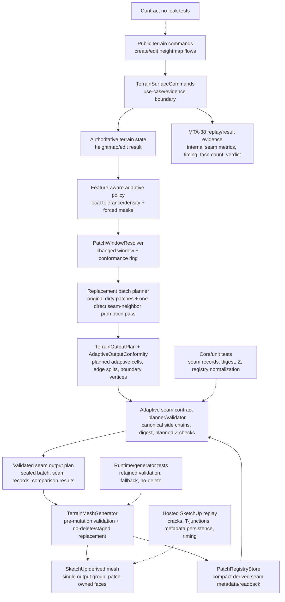

# Technical Plan: MTA-42 Upgrade Adaptive Seam Contracts For Feature-Driven Splits
**Task ID**: `MTA-42`
**Title**: `Upgrade Adaptive Seam Contracts For Feature-Driven Splits`
**Status**: `finalized`
**Date**: `2026-05-22`

## Source Task

- [Upgrade Adaptive Seam Contracts For Feature-Driven Splits](./task.md)

## Problem Summary

Feature-aware tolerance, density, and forced subdivision can create boundary split pressure at adaptive patch edges. The current adaptive path has conformity behavior, but it does not persist or validate explicit seam contracts, so a local replacement can accept one-sided boundary splits, stale retained-neighbor assumptions, cracks, T-junction regressions, or ownership ambiguity.

MTA-42 adds deterministic adaptive seam contracts to the existing patch/cell output path. It does not introduce CDT, stitch strips, a public seam API, or the full MTA-43 component planner.

## Goals

- Define deterministic seam lattice behavior for adaptive patch boundaries under feature-driven subdivision.
- Preserve retained neighbor spans when only one side of a seam is regenerated.
- Detect seam changes that require bounded direct-neighbor promotion or safe refusal/fallback instead of one-sided replacement.
- Persist compact seam digest/span metadata as derived patch output state for readback and repeated edits.
- Preserve adaptive mesh generation for valid heightmap create and edit flows.
- Prove seam correctness with local tests and hosted replay evidence covering cracks, T-junctions, timing, face count, patch scope, promotion, and fallback/no-delete behavior.

## Non-Goals

- No global CDT backend, local CDT islands, or CDT patch internals.
- No stitch or mortar strips as the production seam strategy.
- No public MCP request/response/schema changes.
- No full recursive patch component planner for arbitrary cross-patch features; that remains MTA-43.
- No sparse local detail tiles or composed height oracle changes; those remain MTA-44.
- No terrain source-state storage of generated mesh topology, SketchUp entity IDs, or raw triangles.

## Related Context

- `specifications/hlds/hld-managed-terrain-surface-authoring.md`
- `specifications/research/managed-terrain/recommended_new_adaptive_backend_architecture.md`
- `specifications/tasks/managed-terrain-surface-authoring/MTA-36-productize-windowed-adaptive-patch-output-lifecycle-for-fast-local-terrain-edits/task.md`
- `specifications/tasks/managed-terrain-surface-authoring/MTA-38-establish-feature-aware-adaptive-baseline-policy-and-validation-harness/task.md`
- `specifications/tasks/managed-terrain-surface-authoring/MTA-39-add-feature-aware-tolerance-and-density-fields/task.md`
- `specifications/tasks/managed-terrain-surface-authoring/MTA-40-add-forced-subdivision-masks-for-feature-critical-geometry/task.md`
- `specifications/tasks/managed-terrain-surface-authoring/MTA-43-add-patch-component-planner-for-cross-patch-features/task.md`
- `specifications/tasks/managed-terrain-surface-authoring/MTA-37-implement-cdt-patch-residual-frontier-batching/summary.md` as negative context only.

## Research Summary

- The backend architecture note recommends feature-aware adaptive patch/cell terrain output over replacing the current path with global CDT/TIN. MTA-42 implements the seam-contract slice of that architecture.
- MTA-36 is the closest lifecycle analog: single derived mesh, logical patch ownership, dirty-window replacement, registry/readback, and no-delete mutation sequencing must remain intact.
- MTA-38 provides the replay and evidence harness. MTA-42 should extend that corpus rather than inventing a separate validation surface.
- MTA-39 and MTA-40 are the direct feature-pressure and forced-subdivision inputs. MTA-42 consumes their adaptive split pressure; it does not redefine feature policy.
- MTA-43 is downstream. MTA-42 may do one direct seam-neighbor promotion pass, but recursive component planning remains out of scope.
- External terrain LOD/restricted-quadtree research supports an edge-first seam compatibility model: boundary split choices must be shared, propagated within budget, or refused/fallback before mutation. It does not justify CDT, stitch strips, or a new production triangulator.

## Technical Decisions

### Data Model

- Add compact per-patch-side seam records to derived adaptive patch registry metadata.
- A side record contains `schemaVersion`, `side`, `patchId`, `neighborPatchId` or `boundaryKind: world_edge`, `edgeAxis`, `edgeIndex`, canonical ordered lattice `positions`, `segmentCount`, `endpoints`, and `chainDigest`.
- The persisted payload contract is "losslessly reconstructable canonical ordered lattice positions." Implementation may store positions directly or use a compact span/range encoding, but count/endpoints/digest without reconstructable interior positions is not sufficient.
- Canonical orientation is south-to-north for vertical seams and west-to-east for horizontal seams, independent of patch owner side.
- `chainDigest` is computed from schema version, absolute owner-local edge identity, and canonical positions only.
- `chainDigest` excludes `patchId`, side label, neighbor ID, SketchUp entity IDs, floating SketchUp coordinates, and Z.
- Z validation is separate from topology digesting. Planned seam Z comparison starts with `1e-9` in planned terrain-elevation units and records internal `maxZGap`. Any live SketchUp/readback tolerance must be separately justified by hosted evidence.
- World-edge boundaries are explicit valid seam records, not missing-neighbor failures. They participate in schema/persistence validation, but they do not require neighbor comparison, promotion, retained-neighbor lookup, or counterpart Z comparison.
- Retained seam validation treats the registry seam record as the planning source of truth after existing owner, registry, and patch-policy consistency checks have passed. Live geometry/readback may prove persistence and ownership consistency, but it must not silently override registry seam records.
- Seam metadata compatibility requires current seam schema/contract version, compatible patch-grid/output policy fingerprint, matching owner-local edge identity, and reconstructable canonical positions. Existing registry-level state digest/revision invalidation remains responsible for broader terrain-state freshness.

### API and Interface Design

- Public terrain commands remain unchanged.
- Internal adaptive output planning gains seam record generation, same-batch seam comparison, retained-neighbor registry comparison, and sealed validated seam output plan creation.
- The sealed validated seam output plan contains the final replacement batch, planned cells/faces, seam side records, comparison results, and summary evidence. `TerrainMeshGenerator` consumes it as a required precondition for seam-sensitive adaptive replacement.
- Promotion is a deterministic direct-neighbor expansion from seam failures on the original replacement boundary. Promoted patches do not recursively promote more patches.
- Second-order dependency is operationally defined as any retained-boundary seam mismatch discovered after the single direct-neighbor promotion recompute that would require adding a patch not in the final promoted batch, including new failures introduced on promoted patch outer boundaries.

### Public Contract Updates

Not applicable. MTA-42 has no public MCP request/response/schema changes.

Required public-surface controls:

- Keep public `seamCheck` compact and unchanged if it remains present.
- Do not expose seam digest, patch side chains, raw seam vertices, replacement patch IDs, retained spans, promotion reasons, fallback categories, or raw timing buckets in public command responses.
- Extend no-leak tests for adaptive seam vocabulary.

### Error Handling

- Missing, malformed, seam-schema-incompatible, policy-incompatible, or mismatched retained seam metadata must not silently pass one-sided replacement.
- For otherwise valid heightmap output, local replacement should route to safe full adaptive rebuild fallback when retained seam metadata is unavailable or incompatible.
- Full rebuild fallback safety comes from a concrete two-stage path: build the full output plan, face data, seam metadata, and registry update payload before erase; then perform erase/emit/write inside a SketchUp operation that can abort on mutation failure. If either stage cannot be implemented or proven for the current host path, fallback must refuse with old output intact.
- The two-stage fallback path is a hard generator-integration precondition. If the implementation cannot prove pre-erase planning plus abortable erase/emit/write for full rebuild fallback, the implementation must keep fallback disabled and return sanitized refusal before mutation.
- Promotion exhaustion or second-order dependency beyond the one direct-neighbor pass routes to full rebuild fallback or sanitized refusal.
- Refusal/fallback reasons remain internal or sanitized; public contract shape stays stable.

### State Management

- Authoritative terrain state remains the heightmap/edit state.
- Seam metadata is derived output/readback state in the adaptive patch registry.
- Registry seam metadata must be compact, JSON/string-persistence safe, and sufficient for repeated retained-neighbor validation.
- Existing registry-level state digest and revision invalidation should not be duplicated as broad seam staleness. Seam staleness is narrowly side-record schema/version/contract incompatibility, incompatible patch-grid/output policy fingerprint, malformed/missing side records, non-reconstructable canonical positions, or retained chain mismatch.

### Integration Points

- `PatchGridPolicy` remains the stable owner-local patch identity source.
- `PatchWindowResolver` remains the initial dirty/conformance scope source.
- The replacement batch planner adds at most one direct seam-neighbor promotion pass after the initial scope is known and before final output planning.
- `TerrainOutputPlan` and `AdaptiveOutputConformity` provide planned adaptive cells, edge splits, and boundary vertices used for seam records.
- Same-batch neighbors compare planned seam record to planned seam record.
- Retained neighbors compare planned seam record to the retained neighbor's registry seam record after existing registry/readback and ownership consistency checks have passed.
- Create and full rebuild paths have no retained-neighbor dependency for internal seams. They validate all internal patch seams planned-vs-planned, validate world-edge records structurally, then write fresh registry seam metadata.
- `TerrainMeshGenerator` is the mutation gate and must validate the sealed seam output plan before partial erase. At mutation time it should verify the sealed plan identity, replacement scope, face ownership/classification inputs, registry compatibility, and old-output ownership; it should not rederive seam chains, promotion scope, or seam-critical topology from emitted geometry.
- Before committing a SketchUp mutation, retained-neighbor seams touched by the replacement must be read back or otherwise re-derived from emitted/retained output and compared against the sealed plan. A post-mutation digest or planned-Z mismatch aborts the operation so old output is preserved.
- Replay/result evidence extends the MTA-38 harness with internal seam metrics.

### Configuration

- No new user-facing configuration.
- Seam schema version and planned-Z tolerance are internal constants or policy values. Host/readback tolerance must remain separate if introduced.

## Architecture Context

## Key Relationships

- Public terrain command shape remains stable; seam details are internal/replay-only.
- Adaptive output planning owns planned cell/boundary material, but not SketchUp mutation.
- Registry metadata is derived output state and must not become terrain source state.
- The sealed validated seam output plan is the explicit handoff from pure planning/validation to SketchUp mutation.
- Hosted replay is required because live SketchUp face/edge lifecycle, persistence, and visible crack behavior cannot be proven by pure tests alone.

## Acceptance Criteria

- Adaptive planning produces deterministic patch-side seam records for full output, dirty replacement, and world-edge boundaries, with canonical side ordering independent of patch owner orientation.
- Full create and full rebuild flows validate all internal seams planned-vs-planned and validate world-edge records structurally without requiring retained-neighbor registry metadata.
- Neighboring planned patches that share a boundary produce matching canonical topology digests when regenerated in the same batch.
- Digest inputs exclude patch IDs, side labels, neighbor IDs, SketchUp entity IDs, floating SketchUp coordinates, and Z values.
- Planned seam Z validation records internal `maxZGap` and rejects synthetic planned-Z mismatches at the chosen planned terrain-elevation tolerance without changing public response shape.
- Dirty replacement validates planned replacement seams against retained-neighbor registry/readback seam metadata before any partial erase.
- Missing, malformed, schema-incompatible, policy-incompatible, or mismatched retained seam metadata never silently passes one-sided replacement.
- Valid heightmap create and edit flows still generate adaptive mesh output when seam conformance is available or safe full adaptive rebuild fallback can plan and validate before mutation.
- If safe conformance or fallback is unavailable, the command refuses or aborts before deleting old output, and old derived geometry plus registry/readback state remain intact.
- The generator consumes a sealed validated seam output plan and rejects post-validation scope or seam-chain mutation before emission.
- Replacement mutation verifies touched retained-neighbor seams after emit/write but before commit; any post-mutation seam mismatch aborts with old output preserved.
- One-pass promotion adds only direct neighbor patches across seam failures on the original replacement boundary, uses the same feature-aware context, and does not recursively promote from promoted patches.
- Promotion exhaustion or unsafe second-order dependency routes to safe full rebuild fallback or sanitized refusal; hosted evidence records which path occurred.
- Accepted output persists compact derived seam metadata sufficient for repeated retained-neighbor validation.
- Persisted seam metadata is either direct canonical lattice positions or a lossless compact span/range encoding that reconstructs those positions; count/endpoints/digest alone is rejected as insufficient.
- Public MCP request/response contracts remain unchanged and do not leak seam internals.
- Internal replay evidence records seam validation status, comparison mode, mismatch category, `maxZGap`, promotion count, fallback/refusal reason, timing, face count, patch scope, and verdict.
- Hosted replay rows show zero accepted visible cracks, T-junction regressions, one-sided extra boundary splits, duplicate seam ownership, or stale retained-neighbor metadata use.

## Test Strategy

### TDD Approach

Start at the pure seam data contract before touching mutation. The likely first failing target is seam contract generation and canonical digest unit coverage. Then move outward through planned seam extraction, same-batch validation, registry round-trip, retained-neighbor validation, generator pre-mutation integration, fallback/promotion, contract no-leak, replay evidence, and hosted proof.

### Required Test Coverage

| Provisional queue order | AC / requirement | Behavior or risk | Candidate implementation slice | Likely owner | Unit/core coverage | Integration/runtime coverage | Contract/schema coverage | Error/refusal coverage | Hosted/manual validation | Likely fixtures/helpers | Integration points | Suggested focused command | Suggested broader command | Blocker or explicit gap |
|---|---|---|---|---|---|---|---|---|---|---|---|---|---|---|
| 1 | Deterministic seam records | Side records are stable and world edges are valid | Seam record data object/helper | adaptive output planning | Field, orientation, endpoint, segment, world-edge tests | TerrainOutputPlan emits records for full and dirty plans | n/a | malformed side record cases later | Indirect through replay | synthetic patch/cell grids | TerrainOutputPlan, AdaptiveOutputConformity | `bundle exec ruby -Itest test/terrain/output/terrain_output_plan_test.rb` | `bundle exec rake ruby:test` | none |
| 2 | Canonical digest | Counterpart sides hash identically; digest excludes unstable fields | Digest canonicalization | adaptive seam helper | east/west and north/south reversed cases; exclusion tests | planned-vs-planned comparison passes | no public digest | digest mismatch category | internal replay digest status only | side-record fixtures | seam planner/validator | `bundle exec ruby -Itest test/terrain/output/terrain_output_plan_test.rb` | `bundle exec rake ruby:test` | none |
| 3 | Planned Z validation | Z check separate from topology digest | Seam validator | adaptive seam helper | pass/fail at planned tolerance; `maxZGap` | validator evidence in output plan | no raw Z chains public | synthetic Z mismatch refusal | hosted records `maxZGap`; separate host tolerance if needed | planned-chain fixtures | seam validator, replay evidence | `bundle exec ruby -Itest test/terrain/output/terrain_output_plan_test.rb` | `bundle exec rake ruby:test` | host/readback tolerance not assumed |
| 4 | Registry metadata | Compact seam metadata round-trips | Registry normalization | PatchRegistryStore | nested JSON/string round-trip; schema mismatch | repeated edit reads new metadata | registry internals hidden | missing/malformed side invalidates local replacement | reload/readback-style row | registry fixtures | PatchRegistryStore, TerrainMeshGenerator | `bundle exec ruby -Itest test/terrain/output/patch_lifecycle/patch_registry_store_test.rb` | `bundle exec rake ruby:test` | none |
| 5 | Retained validation | One-sided replacement conforms to retained neighbor | planned-vs-registry validator | adaptive seam validator | matching retained passes; mismatch fails | dirty replacement validates before erase and verifies touched retained seams before commit | sanitized public refusal | pre-mutation or post-mutation mismatch leaves old faces/registry intact | one-sided retained row | retained registry fixture | registry, generator | `bundle exec ruby -Itest test/terrain/output/terrain_mesh_generator_test.rb` | focused terrain output subset | none |
| 6 | Same-batch validation | Adjacent replacement patches agree | planned-vs-planned validator | adaptive seam validator | feature-driven boundary split canonicalizes | adjacent dirty patches validate before mutation | no public seam internals | mismatch path classified | both-sides-regenerated row | adjacent patch fixture | TerrainOutputPlan, generator | `bundle exec ruby -Itest test/terrain/output/terrain_output_plan_test.rb` | `bundle exec rake ruby:test` | none |
| 7 | Valid heightmap output | Mesh still generated for valid create/edit | fallback routing and full rebuild planning | TerrainMeshGenerator | missing metadata selects fallback when valid | full rebuild plans faces/seams before erase and proves abortable erase/emit/write | public response stable | unsafe fallback refuses before erase | valid create/edit rows still mesh | valid heightmap fixtures | command, generator, registry | `bundle exec ruby -Itest test/terrain/output/terrain_mesh_generator_test.rb` | `bundle exec rake ruby:test` | fallback stays disabled/refusal-only until two-stage safety is proven |
| 8 | Sealed plan handoff | Generator cannot emit changed post-validation plan | validated seam output plan | seam planner + generator | immutable/sealed artifact tests | generator rejects missing/stale/modified plan | n/a | post-validation mutation refusal | covered by hosted fallback/no-delete row | sealed-plan fixture | seam validator, generator | `bundle exec ruby -Itest test/terrain/output/terrain_mesh_generator_test.rb` | focused terrain output subset | exact Ruby class name tactical |
| 9 | One-pass promotion | Direct-neighbor only, no recursion | promotion expansion step | replacement batch planner | sorted direct neighbor expansion; promoted patches do not promote | dirty scope records promoted count and promoted-patch outer-boundary exhaustion path | promotion internals hidden | second-order dependency fallback/refusal | promotion and exhaustion rows | patch grid fixture | window resolver, plan, generator | `bundle exec ruby -Itest test/terrain/output/terrain_mesh_generator_test.rb` | `bundle exec rake ruby:test` | none |
| 10 | Public stability | No public seam internal leak | no-leak contract guards | command/contract tests | n/a | command result remains compact | block seam digest/span/chain/patch IDs/reasons | sanitized refusal shape | replay artifacts internal only | public response fixtures | TerrainSurfaceCommands | `bundle exec ruby -Itest test/terrain/contracts/terrain_contract_stability_test.rb` | `bundle exec rake ruby:test` | none |
| 11 | Replay evidence | Correctness and performance are measured | replay result extensions | replay probes/classifier | result classifier evidence parsing | replay captures timing/face/patch/promote/fallback | internal artifact only | failure verdict categories | hosted seam-sensitive corpus | MTA-38 replay rows | commands, probes | `bundle exec ruby -Itest test/terrain/replay/feature_aware_adaptive_baseline_replay_test.rb` | hosted SketchUp replay + `bundle exec rake ruby:lint` | hosted environment required |

Likely first failing target: seam contract generation and canonical digest unit tests.

Suggested focused commands:

- `bundle exec ruby -Itest test/terrain/output/terrain_output_plan_test.rb`
- `bundle exec ruby -Itest test/terrain/output/terrain_mesh_generator_test.rb`
- `bundle exec ruby -Itest test/terrain/output/patch_lifecycle/patch_registry_store_test.rb`
- `bundle exec ruby -Itest test/terrain/contracts/terrain_contract_stability_test.rb`
- `bundle exec ruby -Itest test/terrain/replay/feature_aware_adaptive_baseline_replay_test.rb`

Suggested broader commands:

- `bundle exec rake ruby:lint`
- `bundle exec rake ruby:test`
- Hosted SketchUp replay capture for valid create/edit, planned-vs-planned split, one-sided retained neighbor, direct-neighbor promotion, and one-pass exhaustion/fallback/refusal rows.

## Instrumentation and Operational Signals

- Internal seam validation status.
- Comparison mode: planned-vs-planned or planned-vs-registry.
- Seam mismatch category.
- `maxZGap`.
- Promotion count and final replacement patch count.
- Full rebuild fallback count and reason.
- Refusal/fallback/no-delete outcome.
- Timing, face count, vertex count, and patch scope per replay row.
- Hosted verdict: improved, neutral, regressed, or failed.

## Implementation Phases

1. Add adaptive seam record and digest helpers with pure tests for canonical orientation, digest inputs, world-edge records, and planned Z comparison.
2. Generate seam records from planned adaptive cells and conformity output, then validate same-batch planned seams.
3. Extend adaptive patch registry normalization to persist compact per-side seam metadata and prove round-trip/readback behavior.
4. Add retained-neighbor planned-vs-registry validation and the sealed validated seam output plan handoff.
5. Integrate seam-plan validation into `TerrainMeshGenerator` before any partial erase, including mismatch refusal with old output intact and post-mutation retained seam verification before commit.
6. Add safe full adaptive rebuild fallback for missing/incompatible retained seam metadata where valid heightmap output can be planned and validated before mutation; keep fallback refusal-only until the two-stage pre-erase plus abortable mutation path is proven.
7. Add deterministic one-pass direct-neighbor promotion and exhaustion fallback/refusal handling.
8. Extend internal replay evidence, result classification, and public no-leak coverage.
9. Run focused local tests, broader Ruby validation, and hosted SketchUp replay; adjust only where evidence shows a real seam, host, or performance defect.

## Rollout Approach

- Keep behavior internal to adaptive output and registry/readback.
- Preserve current public command contracts and normal valid heightmap create/edit behavior.
- Gate acceptance on local tests plus hosted replay evidence.
- Do not enable broader recursive promotion or local detail seam behavior in this task.

## Risks and Controls

- Scope drift into MTA-43 component planning: enforce one direct-neighbor promotion pass and route exhaustion to full rebuild/fallback/refusal.
- Seam digest instability: canonicalize orientation and test digest exclusions.
- False-positive refusal on valid heightmap output: use safe full rebuild fallback for otherwise valid output when retained metadata is missing/incompatible.
- Unsafe full rebuild fallback: implement or prove the two-stage fallback path, with full plan/face/seam/registry payload prepared before erase and erase/emit/write wrapped in an abortable SketchUp operation; otherwise fallback refuses before mutation.
- Post-validation plan mutation: introduce a sealed validated seam output plan and reject changed scope/chains after validation.
- Post-mutation seam drift: verify touched retained-neighbor seams after emit/write but before commit; abort the operation if digest or planned-Z comparison no longer matches the sealed plan.
- Retained-neighbor stale metadata: fail local retained comparison closed, then safe full rebuild/fallback/refusal; prove repeated edit/readback behavior.
- Feature-context mismatch for promoted patches: promoted patches use the same feature-aware context and must pass planned-vs-planned seam checks.
- Ambiguous retained source of truth: treat registry seam metadata as authoritative for seam planning only after existing ownership/readback checks pass; live readback can invalidate or prove persistence but cannot override a retained seam record.
- SketchUp geometry lifecycle mismatch: hosted replay checks cracks, T-junctions, duplicate/orphan edges, persistence, and old-output preservation.
- Public contract drift: no public schema changes and no-leak tests for seam internals.
- Performance regression: replay records timing, face count, patch count, promotion count, fallback frequency, and verdict.
- Planned vs live tolerance mismatch: `1e-9` applies only to planned terrain-elevation comparison; host/readback tolerance requires separate evidence.

## Premortem Gate

Status: WARN

### Unresolved Tigers

- None. Premortem findings were converted into implementation guardrails and validation gates.

### Plan Changes Caused By Premortem

- Added post-mutation retained seam verification before SketchUp operation commit, with abort on digest or planned-Z mismatch.
- Made two-stage full rebuild fallback a hard generator-integration precondition; fallback remains refusal-only until pre-erase planning plus abortable mutation is proven.
- Strengthened one-pass promotion exhaustion to include promoted-patch outer-boundary mismatches under the same feature-aware context.

### Accepted Residual Risks

- Risk: Hosted SketchUp geometry can still expose edge lifecycle behavior that pure tests miss.
  - Class: Paper Tiger
  - Why accepted: The plan carries hosted replay and post-mutation verification as acceptance gates.
  - Required validation: Hosted seam-sensitive rows covering retained replacement, promotion, fallback/refusal, and no-delete outcomes.
- Risk: Some valid feature-heavy edits may fall back or refuse until MTA-43 component planning exists.
  - Class: Elephant
  - Why accepted: Recursive component planning is explicitly out of MTA-42 scope, and refusal before mutation is safer than one-sided seams.
  - Required validation: Replay evidence must record fallback/refusal frequency and identify cases that should become MTA-43 inputs.

### Carried Validation Items

- Prove full rebuild fallback two-stage safety before enabling it as a mesh-generation fallback.
- Prove post-mutation retained seam verification can run before operation commit and abort cleanly on mismatch.
- Hosted replay must include valid create/edit, planned-vs-planned split, one-sided retained replacement, direct-neighbor promotion, and promoted-patch outer-boundary exhaustion rows.
- Contract no-leak tests must run after internal seam evidence is added.

### Implementation Guardrails

- Do not use CDT, stitch strips, or global/local triangulation replacement for MTA-42.
- Do not let missing retained seam metadata silently pass local replacement.
- Do not erase old output until planning, seam validation, ownership checks, and fallback safety preconditions are satisfied.
- Do not recursively promote from promoted patches; route second-order dependency to full rebuild fallback or sanitized refusal.
- Do not expose seam digests, patch side chains, raw vertices, promotion reasons, or fallback categories through public MCP responses.

## Dependencies

- MTA-36 patch lifecycle, no-delete mutation sequencing, registry/readback, and repeated edit behavior.
- MTA-38 replay harness, result document, classifier, and hosted capture workflow.
- MTA-39 feature-aware tolerance/density behavior.
- MTA-40 forced subdivision masks.
- Managed Terrain Surface Authoring HLD and recommended adaptive backend architecture note.
- Ruby terrain output tests, contract stability tests, replay tests, RuboCop/rake validation, and hosted SketchUp replay environment.

## Quality Checks

- [x] All required inputs validated
- [x] Problem statement documented
- [x] Goals and non-goals documented
- [x] Research summary documented
- [x] Technical decisions included
- [x] Architecture context included
- [x] Acceptance criteria included
- [x] Test requirements specified as a provisional coverage-matrix seed
- [x] Instrumentation and operational signals defined when needed
- [x] Risks and dependencies documented
- [x] Rollout approach documented when needed
- [x] Small reversible phases defined
- [x] Premortem completed with falsifiable failure paths and mitigations
- [x] Planning-stage size estimate considered before premortem finalization
