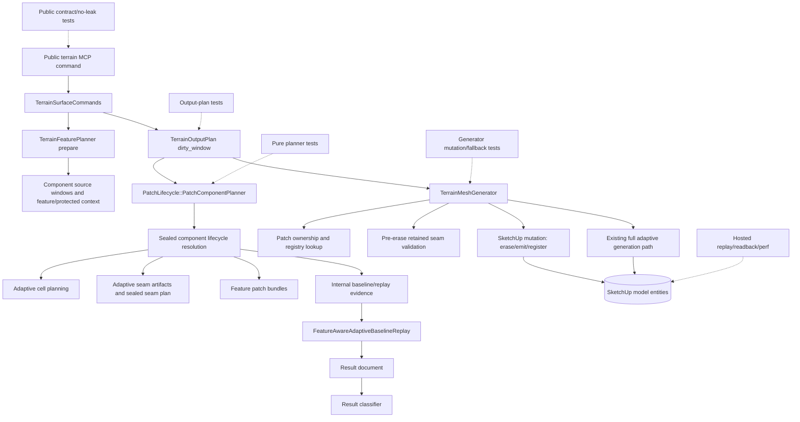

# Technical Plan: MTA-43 Add Patch Component Planner For Cross-Patch Features
**Task ID**: `MTA-43`
**Title**: `Add Patch Component Planner For Cross-Patch Features`
**Status**: `finalized`
**Date**: `2026-05-22`

## Source Task

- [Add Patch Component Planner For Cross-Patch Features](./task.md)

## Problem Summary

Feature geometry, protected regions, retained seams, and future local-detail boundaries can cross
patch boundaries. The current adaptive dirty path derives patch scope in multiple places, which can
let evidence, seam artifacts, adaptive cells, mutation, and registry writes disagree. MTA-43 adds a
bounded component planner above adaptive cell planning so required cross-patch replacement is
explicit, budgeted, and reusable while preserving PatchLifecycle ownership and valid-heightmap mesh
generation.

## Goals

- Add a reusable internal patch component planner for dirty-window, feature/protected crossing,
  retained seam dependency, conformance, and budget decisions.
- Produce one sealed component lifecycle resolution consumed by adaptive cells, seam artifacts,
  feature patch bundles, command evidence, mesh mutation, and registry/readback.
- Preserve current local dirty-window behavior when no cross-patch dependency requires promotion.
- Promote connected patches only when correctness or seam contracts require it.
- Route over-budget local component scope to the existing full adaptive generation path instead of
  refusing a valid heightmap solely because local replacement exceeded budget.
- Extend internal replay/result/classifier evidence for component summaries, expected promotion,
  expected fallback, timing, face/vertex counts, and no-leak checks.

## Non-Goals

- No public MCP request, response, schema, dispatcher, catalog, or docs contract change.
- No sparse local detail state, composed height oracle, local CDT islands, native acceleration, or
  public backend selection.
- No global CDT/TIN replacement and no stitch/mortar strips as a normal seam strategy.
- No new durable terrain source-state model for components.
- No safety-margin-driven replacement expansion in MTA-43.
- No mutation-time component replan/retry after retained seam validation fails.

## Related Context

- `specifications/research/managed-terrain/recommended_new_adaptive_backend_architecture.md`
  identifies patch component planning as the high-risk M2 hard/protected topology slice, after seam
  contracts and before sparse local detail.
- `specifications/tasks/managed-terrain-surface-authoring/MTA-36-productize-windowed-adaptive-patch-output-lifecycle-for-fast-local-terrain-edits/summary.md`
  is the PatchLifecycle baseline for dirty replacement, registry/readback, and no-delete behavior.
- `specifications/tasks/managed-terrain-surface-authoring/MTA-38-establish-feature-aware-adaptive-baseline-policy-and-validation-harness/summary.md`
  provides the hosted replay/result evidence baseline.
- `specifications/tasks/managed-terrain-surface-authoring/MTA-40-add-forced-subdivision-masks-for-feature-critical-geometry/summary.md`
  provides the feature-pressure and forced-subdivision substrate.
- `specifications/tasks/managed-terrain-surface-authoring/MTA-42-upgrade-adaptive-seam-contracts-for-feature-driven-splits/task.md`
  is the seam-contract foundation. Direct promotion, safe fallback policy, and retained-Z hard
  gating were not delivered there.
- `specifications/tasks/managed-terrain-surface-authoring/MTA-44-add-sparse-local-detail-tiles-and-composed-height-oracle/task.md`
  depends on MTA-43, but owns actual local-detail state and composed height-oracle behavior.
- `specifications/tasks/semantic-scene-modeling/README.md` is a planning-pattern analog: deferred
  roadmap ideas do not need speculative task shells until selected.

## Research Summary

- Current code recomputes `PatchLifecycle::PatchWindowResolver` scope in command evidence,
  `TerrainOutputPlan`, and `TerrainMeshGenerator`. MTA-43 must remove successful-path drift by
  carrying one sealed lifecycle resolution.
- `TerrainFeaturePlanner#patch_feature_bundles` already expects role vocabulary for `affected`,
  `replacement`, `conformance`, `retained_boundary`, and `safety_margin`; MTA-43 should reuse that
  shape instead of inventing unrelated role names.
- `TerrainOutputPlan` currently builds adaptive cells and seam artifacts from resolver-derived
  replacement patches; component resolution must drive those before mutation.
- `TerrainMeshGenerator` already has an existing full adaptive generation path used for valid
  terrain when dirty patch replacement cannot proceed. Over-budget component scope should select
  that path before dirty partial mutation.
- Seam pre-erase validation currently strips Z values. MTA-43 should handle topology/digest
  promotion-or-refusal and carry retained-Z hard gating with hosted/post-emit evidence unless a
  small safe hook is found during implementation.
- External research was not needed. The task is governed by repository-owned PatchLifecycle,
  feature planning, SketchUp mutation, and replay evidence semantics.

## Technical Decisions

### Data Model

- Add an internal component-planned lifecycle resolution that preserves existing resolver keys:
  `affectedPatchIds`, `replacementPatchIds`, `affectedPatches`, `replacementPatches`, and
  `conformanceRing`.
- Add internal fields for `retainedBoundaryPatchIds`, `retainedBoundaryPatches`,
  `safetyMarginPatchIds`, `safetyMarginPatches`, `componentPlanSummary`, `componentBudget`, and a
  fallback/promotion verdict.
- Include graph reasons from the bounded set: `dirty_window`, `feature_boundary_crossing`,
  `protected_boundary_crossing`, `retained_seam_dependency`, and `conformance`.
- Include local-detail boundary input as a shape-compatible future source that defaults empty and
  does not implement local-detail behavior. Non-empty local-detail sources are unsupported in
  MTA-43 and must not be populated by current flows.
- Treat safety-margin patches as evaluation metadata, not replacement graph edges.

### API and Interface Design

- Add a focused internal planner near `src/su_mcp/terrain/output/patch_lifecycle/`.
- Thread compact component-planning inputs into `TerrainOutputPlan.dirty_window`: dirty cell
  window, individual feature/protected affected windows from `feature_plan`, optional empty
  local-detail boundary windows, patch policy, dimensions, and component budget.
- Carry the sealed resolution on `TerrainOutputPlan` through an internal reader such as
  `adaptive_lifecycle_resolution`.
- Make successful-path consumers use the sealed resolution instead of recomputing resolver scope:
  adaptive cell domains, seam plan replacement IDs, command evidence, feature patch bundles,
  mutation ownership lookup, erased patch scope, and registry writes.
- Keep class names and final method signatures tactical as long as they preserve the sealed
  ownership and no-successful-path-recompute rule.

### Public Contract Updates

Not applicable by design.

- Request shape delta: none.
- Response shape delta: none.
- Tool schema or catalog delta: none.
- Dispatcher/routing delta: none.
- README/docs/example delta: none unless implementation deliberately introduces a new public
  refusal code, which this plan rejects.
- Required contract coverage: public command responses must not expose component roles, raw patch
  IDs, seam records, registry records, budget internals, fallback internals, or raw SketchUp
  entities.

### Error Handling

- Over-budget local component scope is not a public refusal when the heightmap is valid. It exits
  dirty partial replacement and uses the existing full adaptive generation path, recording internal
  `fallbackCategory: over_budget_component`.
- Registry invalidity, ownership mismatch, unsupported child entities, seam topology/digest
  mismatch, invalid output, or independent full-generation failure may still refuse before erase
  through existing sanitized public refusal behavior.
- Retained seam validation failure should not trigger mutation-time component replan/retry.
- Internal diagnostics should include counts, radius, reason, role counts, and fallback/promotion
  verdicts without raw patch IDs in public-facing result summaries.

### State Management

- Component plans are derived output-planning metadata, not durable terrain source state.
- Patch identity and SketchUp mutation remain owned by PatchLifecycle and `TerrainMeshGenerator`.
- Registry writes must reflect the final replacement path: component-planned dirty replacement or
  full adaptive fallback.
- Old output must remain until the selected replacement path has enough validated output to mutate
  safely.

### Integration Points

- `TerrainSurfaceCommands` extracts feature context, builds output plans, records internal
  evidence, and preserves public command shape.
- `TerrainOutputPlan` builds component-aware adaptive cells and seam artifacts from the sealed
  resolution.
- `TerrainFeaturePlanner#prepare_patch_batch` consumes the sealed lifecycle resolution for role
  bundles.
- `TerrainMeshGenerator` consumes the sealed replacement set for dirty mutation or routes
  over-budget scope to full adaptive generation.
- `FeatureAwareAdaptiveBaselineReplay`, result document, and classifier consume component evidence
  and expected promotion/fallback semantics.

### Configuration

- Use hard local-replacement budget defaults in code-local policy/constants:
  `maxReplacementPatchCount: 25` and `maxPromotionRadius: 2` patch steps from initially affected
  patches.
- Record replacement-to-affected ratio and full-grid proximity as evidence only, not hard gates.
- Do not expose user-facing budget controls in MTA-43.

## Architecture Context

## Key Relationships

- Component planning sits above adaptive cell planning and below command feature preparation.
- `TerrainOutputPlan` is the internal carrier that prevents evidence, seams, cells, and mutation
  from deriving different replacement scopes.
- `TerrainMeshGenerator` remains the only SketchUp mutation owner.
- Replay evidence validates concrete behavior; it does not substitute for deciding behavior.
- MTA-44 and later CDT/native work may feed future sources into the planner, but those capabilities
  are not implemented in MTA-43.

## Acceptance Criteria

- Local dirty adaptive edits that do not intersect a component-promoting source preserve current
  dirty-window semantics: affected/replacement/conformance scope remains local, far patches are not
  included, and no component promotion verdict is recorded.
- Feature or protected-region sources that cross patch boundaries create bounded component
  promotion when correctness requires it, and the promoted replacement scope is reflected in
  adaptive cells, sealed seam plan, feature patch bundles, mutation ownership lookup, erased faces,
  emitted registry records, and replay evidence.
- Retained seam dependencies are handled deterministically: planned dependency sources can promote
  retained neighbors, while registry/seam topology or digest mismatches discovered before erase
  refuse through the existing sanitized no-delete path and leave old output intact.
- Component scope that exceeds the local replacement budget does not refuse a valid heightmap. It
  exits dirty partial replacement and uses the existing full adaptive generation path, while
  recording an internal over-budget fallback verdict with counts/radius/reason and no raw patch IDs.
- The component-planned lifecycle resolution is the successful-path source of truth for dirty
  adaptive output; evidence, seam artifacts, feature bundles, mutation, and registry writes do not
  recompute divergent patch resolution. Implementation must include a structural or behavioral
  invariant that fails if successful component-planned paths call the old resolver independently.
- The lifecycle resolution preserves existing keys consumed by current feature and patch code while
  adding component summary, retained-boundary role, safety-margin role metadata, budget verdict,
  and fallback/promotion diagnostics.
- Safety-margin patches do not expand replacement scope in MTA-43. Future local-detail boundary
  inputs are accepted as empty shape-compatible placeholders only; non-empty local-detail sources
  remain unsupported, and no local-detail state, composed height oracle, CDT island, or native
  acceleration behavior is introduced.
- Public MCP request schemas, tool registration, dispatcher behavior, response shapes, and normal
  success payloads remain unchanged. Public responses do not expose component roles, raw patch IDs,
  seam records, registry records, budget internals, or fallback internals.
- Internal replay/result evidence records component role counts, component count, maximum component
  size, promoted count, budget status, fallback category, expected-promotion/fallback status,
  dirty-window scope, patch scope, face/vertex counts, and timing buckets.
- Replay classification treats expected bounded promotion and expected over-budget full fallback as
  non-regression outcomes, while broad unexplained patch-scope expansion, unexpected fallback, seam
  validation failure, missing mesh evidence, or public leakage are failures/regressions.
- MTA-46 residual-probe reuse remains intact: component planning and promoted adaptive domains do
  not add duplicate residual/error probes for the same split decision.
- Hosted validation covers local no-promotion, cross-patch feature/protected promotion, retained
  seam promotion-or-refusal, over-budget full adaptive fallback, repeated edit/readback, and timing
  comparison. Hosted seam evidence either covers z-inclusive validation through a small safe hook
  or explicitly records the retained-Z limitation.

## Test Strategy

### TDD Approach

Start with pure planner tests because they define component graph behavior, role classification,
budget verdicts, and fallback decisions without SketchUp. Then wire the sealed resolution into
`TerrainOutputPlan`, evidence/feature bundles, and `TerrainMeshGenerator` in dependency order.
Replay/result/classifier changes should land before hosted closeout so expected promotion/fallback
can be distinguished from regressions.

Likely first failing target: `test/terrain/output/patch_lifecycle/patch_component_planner_test.rb`
covering local no-promotion, feature crossing promotion, retained seam dependency, placeholder
local-detail source, and over-budget fallback verdict.

### Required Test Coverage

| Provisional queue order | AC / requirement | Behavior or risk | Candidate implementation slice | Likely owner | Unit/core coverage | Integration/runtime coverage | Contract/schema coverage | Error/refusal coverage | Hosted/manual validation | Likely fixtures/helpers | Integration points | Suggested focused command | Suggested broader command | Blocker or explicit gap |
|---|---|---|---|---|---|---|---|---|---|---|---|---|---|---|
| 1 | Local dirty edit stays local | Avoid scope inflation | Planner core | PatchLifecycle | Single dirty window resolves current affected/replacement/conformance scope and no promotion | Output plan uses sealed scope without far-patch expansion | Public response unchanged | n/a | Existing local rows remain local | Synthetic patch domains | Planner to output plan | `bundle exec ruby -Itest test/terrain/output/patch_lifecycle/patch_component_planner_test.rb` | `bundle exec rake ruby:test` | Planner file does not exist yet |
| 2 | Feature/protected boundary crossing promotes | Core product behavior | Planner core | PatchLifecycle | Feature/protected window crossing graph reasons and role counts | Output plan cells, seam plan, and feature bundles consume promoted scope | No component data in public response | n/a | Targeted cross-patch corridor/protected row | Synthetic feature windows; hosted replay row | Feature planner to output plan | planner test plus `test/terrain/output/terrain_output_plan_test.rb` | `bundle exec rake ruby:test` | Hosted row construction deferred to implementation |
| 3 | Retained seam dependency promotes/refuses safely | Seam safety | Planner plus mutation gate | PatchLifecycle / TerrainMeshGenerator | Retained seam dependency source adds promotion candidate | Generator uses sealed scope; promotion plus registry mismatch fails before erase and preserves old output/registry | Existing sanitized refusal shape | Registry/seam invalidity no-delete refusal | Targeted retained seam row proves promotion/refusal and old-output survival | Seam registry fixtures | Seam plan to generator | `bundle exec ruby -Itest test/terrain/output/terrain_mesh_generator_test.rb` | `bundle exec rake ruby:test` | Retained-Z hard gate carried with hosted evidence |
| 4 | Over-budget uses full adaptive fallback | Valid mesh still generated | Budget/fallback slice | TerrainOutputPlan / TerrainMeshGenerator | Budget breach returns full-generation fallback verdict | Dirty edit routes to existing full adaptive generation before partial erase; test asserts dirty erase path is not reached and old output/registry survive until full generation succeeds | Public command succeeds if full generation succeeds | Full generation failure uses existing refusal | Hosted over-budget row records fallback, timing/face impact, and topology comparison against clean full adaptive baseline | Synthetic broad component; hosted broad row | Planner to generator fallback | output plan/generator tests | `bundle exec rake ruby:test` | none |
| 5 | Sealed scope is source of truth | Prevent drift | Output-plan integration | TerrainOutputPlan / commands / generator | Resolution preserves old keys plus component summaries | Evidence, seams, feature bundles, mutation, registry consume same resolution; structural or behavioral invariant fails on successful-path resolver recompute | No leak | n/a | Replay component summary matches emitted registry/readback | Existing patch lifecycle fixtures | Commands, output plan, generator | output plan, command, generator tests | `bundle exec rake ruby:test` | none |
| 6 | Future local detail shape only | Avoid MTA-44 scope bleed | Planner core | PatchLifecycle | Empty placeholder input accepted without behavior; non-empty local-detail source is unsupported in MTA-43 | No local-detail state/oracle introduced | No public controls | Non-empty local-detail source fails fast in tests rather than activating behavior | No behavior change required | Synthetic empty and non-empty source | Planner interface | planner test | `bundle exec rake ruby:test` | none |
| 7 | MTA-46 residual-probe guard | Performance regression | Output-plan integration | TerrainOutputPlan | Existing duplicate-probe guard remains | Promoted domains do not duplicate split probes | n/a | n/a | Timing evidence separates component planning from residual cost | Existing MTA-46 tests | Output plan adaptive split path | `bundle exec ruby -Itest test/terrain/output/terrain_output_plan_test.rb` | `bundle exec rake ruby:test` | none |
| 8 | Replay/classifier handles promotion/fallback | Evidence must not misclassify expected behavior | Replay artifact slice | Probes | Result document fields omit raw IDs | Command evidence includes component summary; classifier treats expected promotion/fallback as non-regression | No-leak tests | Unexpected fallback/expansion is regression | Annotated MTA-43 result pack | Replay result fixtures | Replay/result/classifier | probe result document/classifier tests | `bundle exec rake ruby:test` | Hosted result rows added during implementation |
| 9 | Retained-Z limitation explicit | Avoid false seam safety claim | Hosted validation | Generator/probes | No required unit unless small hook found | Pre-erase validation remains z-stripped or hook is covered | No seam-Z leak | n/a | Hosted seam evidence states z-inclusive coverage or limitation | Hosted seam row | Generator to hosted replay | generator/probe tests | hosted replay plus `bundle exec rake ruby:test` | Carried-with-gate |

Suggested focused commands:

- `bundle exec ruby -Itest test/terrain/output/patch_lifecycle/patch_component_planner_test.rb`
- `bundle exec ruby -Itest test/terrain/output/terrain_output_plan_test.rb`
- `bundle exec ruby -Itest test/terrain/output/terrain_mesh_generator_test.rb`
- `bundle exec ruby -Itest test/terrain/commands/terrain_surface_commands_test.rb`
- `bundle exec ruby -Itest test/terrain/probes/feature_aware_adaptive_baseline_result_document_test.rb`
- `bundle exec ruby -Itest test/terrain/probes/feature_aware_adaptive_baseline_result_classifier_test.rb`
- `bundle exec ruby -Itest test/terrain/contracts/terrain_contract_stability_test.rb`

Suggested broader commands:

- `bundle exec rake ruby:test`
- `bundle exec rake ruby:lint`
- `bundle exec rake package:verify`

## Instrumentation and Operational Signals

- Internal `componentPlanSummary`: component count, max component size, role counts, promoted count,
  graph reasons, budget status, fallback category, expected promotion/fallback.
- Internal timing bucket for component planning, while retaining comparable command-output,
  dirty-window, adaptive-planning, mutation, and total timing buckets.
- Replay/result fields for component summaries and expected promotion/fallback verdicts.
- Classifier comparison fields for dirty-window changed, patch-scope changed, component fallback,
  and expected promotion.
- Hosted evidence rows for local no-promotion, cross-patch promotion, retained seam behavior,
  over-budget full fallback, and repeated edit/readback.

## Implementation Phases

1. Introduce component plan data shape, graph reasons, budget verdicts, and pure planner tests.
2. Wire planner into `TerrainOutputPlan` before adaptive cells and seam artifact creation.
3. Make command evidence, feature patch bundles, and timing evidence consume the sealed resolution
   without successful-path resolver recomputes.
4. Make mesh mutation use the sealed component resolution; route over-budget component scope to the
   existing full adaptive generation path before dirty partial mutation; keep registry/seam
   invalidity as pre-erase refusal.
5. Extend replay/result/classifier artifacts and no-leak coverage for component summaries,
   expected promotion, and over-budget full fallback.
6. Run hosted replay, targeted no-delete/refusal/fallback smoke, readback/reload, and performance
   evidence.

## Rollout Approach

- Keep behavior internal to the adaptive output path with no public selector.
- Default-enable within the current adaptive path only after local tests, replay artifacts, no-leak
  checks, and hosted rows pass.
- Treat over-budget full fallback as an explicit internal verdict, not a public failure.
- Preserve existing full adaptive fallback for missing ownership.
- Do not enable any local-detail/CDT/native source behavior in this task.

## Risks and Controls

- Resolver drift: prevent by making the sealed resolution the only successful-path source and
  testing all consumers against it.
- Over-broad promotion: prevent with max replacement count and max promotion radius gates; detect
  through component evidence and classifier rules.
- Full fallback mutation safety: route fallback before dirty partial erase; add a test that proves
  the dirty erase path is not reached on over-budget fallback; validate with hosted no-delete,
  full-baseline comparison, and readback rows.
- Seam safety gap: promote planned retained dependencies; refuse registry/seam mismatch before
  erase; carry retained-Z with explicit hosted evidence.
- Feature source over-union: use individual source windows and graph reasons, not only the unioned
  feature dirty window.
- Public contract drift: no public surface changes; add no-leak contract coverage for public
  responses and checked-in result summaries. Component summaries may appear in internal replay
  artifacts, but raw patch IDs, seam records, registry records, and budget internals must not leak.
- Replay false regressions: update result document/classifier before final hosted comparison.
- Residual/performance regression: preserve MTA-46 duplicate-probe guard and add component timing.
- Scope expansion: keep local detail shape-only; keep CDT/native deferred.
- Host persistence mismatch: require hosted replay/readback for registry and entity lifecycle.

## Dependencies

- MTA-36 PatchLifecycle dirty replacement and registry/readback.
- MTA-38 hosted replay/capture/result infrastructure.
- MTA-39 and MTA-40 feature-aware tolerance/density and forced subdivision substrate.
- MTA-42 seam metadata, sealed seam plan checks, retained seam pre-mutation guard, and no-delete
  refusal evidence.
- MTA-46 residual-aware fairing behavior and duplicate residual-probe guard.
- SketchUp hosted runtime for mutation, attributes, save/reload, and readback validation.

## Premortem Gate

Status: WARN

### Unresolved Tigers

- None.

### Plan Changes Caused By Premortem

- Added a hard invariant that successful component-planned paths must not independently recompute
  old resolver scope.
- Strengthened over-budget fallback coverage to prove dirty partial erase is not reached before the
  existing full adaptive generation path is selected.
- Added retained seam promotion-plus-mismatch ordering coverage to prove clean no-delete refusal and
  old registry/output survival.
- Tightened local-detail placeholder handling: non-empty local-detail sources are unsupported in
  MTA-43 and must not silently activate future behavior.
- Strengthened no-leak guidance for public responses and checked-in result summaries while allowing
  compact internal replay component summaries.

### Accepted Residual Risks

- Risk: Retained-Z hard gating remains outside the component planner.
  - Class: Elephant
  - Why accepted: Current pre-erase retained seam validation is topology/digest focused and strips
    Z. Absorbing z-inclusive validation would expand MTA-43 into a seam-validation rewrite.
  - Required validation: Hosted/post-emit seam evidence must either cover a small safe z-inclusive
    hook found during implementation or explicitly record the retained-Z limitation.
- Risk: Over-budget fallback may be slower than dirty replacement.
  - Class: Paper Tiger
  - Why accepted: The product constraint is that valid heightmaps must still generate meshes; the
    full adaptive path already exists and is semantically safer than refusing budget overflow.
  - Required validation: Replay evidence must tag the fallback, compare timing/face impact, and
    keep unexplained fallback or topology divergence as a regression.

### Carried Validation Items

- Structural or behavioral invariant that successful component-planned paths do not call the old
  resolver independently.
- Over-budget fallback test proving dirty partial erase is not reached and full adaptive generation
  is selected before mutation.
- Hosted retained seam row covering promotion-or-refusal and old-output survival.
- Hosted over-budget fallback row comparing output against a clean full adaptive baseline.
- Contract/no-leak checks for public responses and checked-in result summaries.

### Implementation Guardrails

- Do not refuse valid heightmap mesh generation solely because component promotion exceeds local
  replacement budget.
- Do not perform mutation-time component replan/retry after retained seam validation fails.
- Do not let safety-margin or non-empty local-detail sources expand replacement scope in MTA-43.
- Do not leave successful-path resolver recomputes in evidence, feature bundles, seam planning, or
  mutation once a component-planned resolution exists.
- Do not expose component roles, raw patch IDs, seam records, registry records, budget internals,
  or fallback internals through public MCP responses.

## Quality Checks

- [x] All required inputs validated
- [x] Problem statement documented
- [x] Goals and non-goals documented
- [x] Research summary documented
- [x] Technical decisions included
- [x] Architecture context included
- [x] Acceptance criteria included
- [x] Test requirements specified as a provisional coverage-matrix seed
- [x] Instrumentation and operational signals defined when needed
- [x] Risks and dependencies documented
- [x] Rollout approach documented when needed
- [x] Small reversible phases defined
- [x] Premortem completed with falsifiable failure paths and mitigations
- [x] Planning-stage size estimate considered before premortem finalization
