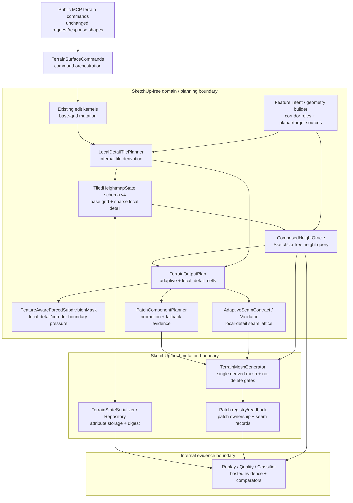

# Technical Plan: MTA-44 Add Sparse Local Detail Tiles And Composed Height Oracle
**Task ID**: `MTA-44`
**Title**: `Add Sparse Local Detail Tiles And Composed Height Oracle`
**Status**: `closed-superseded`
**Date**: `2026-05-26`

## Source Task

- [MTA-44 Add Sparse Local Detail Tiles And Composed Height Oracle](./task.md)

## Supersession Note

This technical plan is closed as superseded. It remains useful background and risk evidence, but it
is no longer the execution plan. The replacement sequence is:

- [MTA-44A Establish Effective Feature Composed Height Oracle](../MTA-44A-establish-effective-feature-composed-height-oracle/task.md)
- [MTA-44B Add Contained Production Feature Cut Graph Output](../MTA-44B-add-contained-production-feature-cut-graph-output/task.md)
- [MTA-44C Harden Feature Cuts Across Seams And Patch Lifecycle](../MTA-44C-harden-feature-cuts-across-seams-and-patch-lifecycle/task.md)

Planning for the replacement tasks should treat this document's sparse local-detail tile/window
framing as superseded by the effective-feature oracle and production feature-cut graph model.

## Problem Summary

The current feature-aware adaptive output can allocate triangles near important terrain features,
but it cannot add true sub-grid terrain state where the authoritative base heightmap is too coarse.
Increasing the whole base grid for one pad, corridor, local target, or grading detail would break
large-terrain scalability. MTA-44 adds sparse local-detail state and a composed height oracle so
bounded regions can carry higher-resolution terrain without global source-grid refinement.

## Goals

- Add durable sparse local-detail tiles inside terrain state/storage, not generated SketchUp mesh.
- Add one SketchUp-free composed height oracle shared by planning, mesh emission, seam Z,
  validation/readback, and hosted quality sampling.
- Emit true sub-grid output with bounded `local_detail_cells`, not only oracle Z values on base
  adaptive cells.
- Derive local detail internally from existing public edit semantics for target/local, planar, and
  corridor role-filtered rows while preserving public MCP command shapes.
- Keep valid heightmap edits successful even when local-detail enhancement falls back.
- Prove local-detail rows against current output and equivalent-global-refinement comparators with
  hosted replay, face-count, timing, seam/component, no-delete, and readback evidence.

## Non-Goals

- Globally refining base heightmap spacing as the implementation mechanism.
- Adding local CDT islands, native acceleration, public backend selection, or global TIN/CDT output.
- Rewriting every edit kernel to mutate local-detail tiles as its primary surface.
- Making generated SketchUp triangles or derived mesh topology the source of truth.
- Exposing local-detail tiles, oracle internals, patch IDs, seams, component graph reasons, raw mesh
  topology, or equivalent-global comparator data in public command responses.
- Treating retaining-wall/cutline hard-edge alignment as the default acceptance bar for every
  local-detail row.

## Related Context

- [Managed Terrain Surface Authoring HLD](../../../hlds/hld-managed-terrain-surface-authoring.md)
- [Recommended Backend Architecture for Feature-Aware Adaptive Terrain Output](../../../research/managed-terrain/recommended_new_adaptive_backend_architecture.md)
- [MTA-36 summary](../MTA-36-productize-windowed-adaptive-patch-output-lifecycle-for-fast-local-terrain-edits/summary.md)
- [MTA-38 summary](../MTA-38-establish-feature-aware-adaptive-baseline-policy-and-validation-harness/summary.md)
- [MTA-39 summary](../MTA-39-add-feature-aware-tolerance-and-density-fields/summary.md)
- [MTA-40 summary](../MTA-40-add-forced-subdivision-masks-for-feature-critical-geometry/summary.md)
- [MTA-42 summary](../MTA-42-upgrade-adaptive-seam-contracts-for-feature-driven-splits/summary.md)
- [MTA-43 summary](../MTA-43-add-patch-component-planner-for-cross-patch-features/summary.md)
- [MTA-45 summary](../MTA-45-reduce-unnecessary-planar-region-output-tessellation/summary.md)
- [MTA-46 summary](../MTA-46-make-fairing-output-pressure-residual-aware/summary.md)

## Research Summary

- The backend architecture identifies MTA-44 as Phase D / Slice 8: sparse local-detail tiles and a
  composed height oracle inside the existing feature-aware adaptive patch/cell backend.
- Existing terrain state is `TiledHeightmapState` schema v3 and has no local-detail payload.
  `TerrainStateSerializer` owns canonical JSON, migration, digest, and readback summaries.
- `TerrainOutputPlan`, `TerrainMeshGenerator`, seam records, and hosted quality sampling currently
  read base elevations directly in multiple places. A planner-local oracle is insufficient.
- Adaptive subdivision currently stops at one base cell. True sub-grid detail requires a bounded
  tile-local output lattice or equivalent local-cell emission path.
- `component_source_args` already carries `local_detail_windows`, but MTA-43's component planner
  rejects non-empty sources. MTA-44 must replace that guard with bounded graph reasons and fallback
  behavior.
- MTA-40 established the precedent that unsupported output pressure should be skipped or degraded,
  not turned into a new refusal for valid heightmap edits.
- Corridor has enough local implementation surface for first-class local detail: corridor feature
  intent, side/cap roles, forced-mask corridor-detail roles, and role-aware quality summaries already
  exist.

## Technical Decisions

### Data Model

- Bump terrain state to schema v4 with sparse local-detail tiles.
- A local-detail tile must carry, at minimum:
  stable tile identity, owner-local bounded extent, local spacing finer than base spacing, local
  dimensions, ordered elevation/no-data values, source/provenance summary, and deterministic
  ordering.
- Generated mesh remains derived output. Local-detail tiles are durable terrain state or
  terrain-owned overlay state, never SketchUp face topology.
- Feature-critical driver geometry is optional row-specific metadata only when existing edit
  semantics provide real off-grid geometry.

### API and Interface Design

- Public MCP terrain request and response shapes remain unchanged.
- Add internal `LocalDetailTilePlanner` after successful supported edits. Initial supported creation
  families are:
  target-height/local bounded edits, planar-region fit, and corridor-transition side/cap/falloff/
  overlap roles.
- Survey-point constraint, fairing, and no-falloff corridor interior/crossfall rows are neutral by
  default unless implementation proves bounded local-detail derivation without broad over-refinement.
- Add internal `local_detail_cells` to the output plan and merge them with adaptive cells before
  mesh emission.

### Public Contract Updates

Not applicable by default. If implementation proves a public surface is unavoidable, the same change
must update `src/su_mcp/runtime/native/native_tool_catalog.rb`, dispatcher routing, request
validators, contract fixtures, README/user docs, and examples.

Contract tests must explicitly block public leaks for local detail, tile IDs, composed oracle,
local spacing, seam lattice, component graph reasons, global-refinement comparator, raw triangles,
and patch/registry internals.

### Error Handling

- Valid heightmap edits must not be refused solely because local-detail output cannot meet a
  precision, seam, component, or budget target.
- Local-detail precision misses, over-budget chunks, or unsafe enhancement seams downgrade or skip
  local-detail enhancement, trigger broader safe regeneration, or preserve old output until a safe
  replacement exists.
- Local-detail enhancement failures must use a distinct internal category such as
  `local_detail_enhancement_failed`. That category is evidence/fallback only and must not flow to
  the public refusal path for otherwise valid heightmap edits.
- Refusals remain valid for invalid requests, corrupt terrain state, unsupported hard validation
  cases, storage integrity failures, and unsafe existing ownership/registry/seam preconditions.

### State Management

- Existing edit kernels remain base-grid mutators for MTA-44. Tile derivation uses public request
  semantics, edit diagnostics, feature intent, and command-local pre-edit snapshots where needed.
- Preserve-old-value precedence is transient command-local behavior for tile generation and
  validation only. Save/reopen/readback must rely on persisted base state plus persisted
  local-detail state.
- Storage summaries and digest behavior must stay deterministic and JSON-safe.

### Integration Points

- `TerrainStateSerializer`: schema v4 migration, digest, summary, storage-size validation.
- `ComposedHeightOracle`: shared query path for local detail, analytic feature surfaces, preserve
  snapshots, and base interpolation.
- `TerrainOutputPlan`: adaptive residuals, seam records, forced masks, component sources, and
  `local_detail_cells`.
- `TerrainMeshGenerator`: local-cell emission, base-cell suppression, oracle-backed vertex Z,
  no-delete mutation gates, registry writes.
- `PatchComponentPlanner`: local-detail graph reasons, promotion, budget evidence, fallback.
- `AdaptiveSeamContract` / validator: deterministic local-detail seam positions and oracle-backed
  seam Z.
- Seam-lattice ordering: normalize local-detail seam positions in owner-local coordinates and order
  by edge parameter, owner-local X, owner-local Y, then source key. Deduplicate with the existing
  seam tolerance and prohibit one-sided extra splits on touched seams.
- Replay/result/classifier/quality sampler: row classes, quality gates, equivalent-global
  comparator, no-leak evidence.

### Configuration

- Default local-detail quality gate: local spacing must be at least `2x` finer than base spacing.
- Corridor chunks must not exceed one default adaptive patch span, currently `16` base cells, along
  the corridor dominant axis before conformance expansion. Implementation may choose smaller chunks.
- Corridor rows must record chunk-level evidence. Representative must-improve corridor rows require
  every eligible chunk to emit local-detail cells. Large timing corridor rows may report chunk-level
  fallback, but at least `80%` of eligible side/cap/falloff/overlap detail length must emit
  local-detail cells or the row cannot be classified as improved.
- Equivalent-global comparator is harness-only and must not become production terrain state.

## Architecture Context

## Key Relationships

- `TerrainSurfaceCommands` remains the public command orchestrator.
- `LocalDetailTilePlanner` derives durable local-detail state from supported edit semantics after
  the edit succeeds.
- `ComposedHeightOracle` prevents separate height rules in output planning, mesh emission, seams,
  readback, and hosted quality.
- Forced masks, seam contracts, and component planning consume explicit local-detail sources instead
  of synthetic feature geometry.
- `TerrainMeshGenerator` remains the SketchUp mutation boundary and must preserve old output until
  the chosen replacement path validates.

## Acceptance Criteria

- Sparse local-detail state is durable, deterministic, migrated from v3, storage-size validated, and
  save/reopen/readback safe.
- Public terrain command contracts remain unchanged and no public response leaks local-detail
  internals.
- Target/local, planar, and corridor side/cap/falloff/overlap rows can create local-detail state
  internally through existing public edit commands.
- Survey, fairing, and no-falloff corridor interior/crossfall rows remain neutral unless explicitly
  promoted by evidence.
- Output planning, tile-local cells, mesh Z, seam Z, validation/readback, and hosted quality use the
  same composed height oracle.
- Must-improve rows emit tile-local output at finer-than-base spacing, suppress overlapped base
  adaptive cells, preserve non-local output, and avoid gaps or duplicate overlapping faces.
- Must-improve rows pass local fidelity, equivalent-global fidelity, face-count, and timing gates.
- Corridor local detail is role-filtered and chunked; broad centerline/interior pressure alone does
  not create local-detail tiles. Corridor result evidence includes eligible chunk count, improved
  chunk count, fallback chunk count, and eligible length coverage.
- Local-detail seam/component failure degrades or falls back before mutation without refusing valid
  heightmap edits.
- Hosted replay evidence covers target/local, planar, corridor, cross-patch, fallback/no-delete,
  save/reopen/readback, no-leak, and repeated timing rows.

## Test Strategy

### TDD Approach

Start with state/schema and oracle tests because every later slice depends on deterministic storage
and one height-query contract. Then add local-detail planner tests for target/local, planar, and
corridor role-filtered sources. Only after those are stable should implementation add tile-local
output cells, seam/component fallback, replay/classifier evidence, and hosted validation.

Likely first failing target: a serializer/state test proving schema v4 round-trips a sparse
local-detail tile with deterministic digest and no public contract changes.

### Required Test Coverage

| Provisional queue order | AC / requirement | Behavior or risk | Candidate implementation slice | Likely owner | Unit/core coverage | Integration/runtime coverage | Contract/schema coverage | Error/refusal coverage | Hosted/manual validation | Likely fixtures/helpers | Integration points | Suggested focused command | Suggested broader command | Blocker or explicit gap |
|---:|---|---|---|---|---|---|---|---|---|---|---|---|---|---|
| 1 | Schema v4 stores sparse local-detail tiles | bad migration or digest breaks readback | Phase 1 | state/storage | tile normalization, ordering, overlap/conflict, size cap | repository round-trip | no public response delta | invalid/corrupt payload | save/reopen later | v3 payload, sparse tile payload | `TiledHeightmapState`, serializer, repository | `bundle exec ruby -Itest test/terrain/storage/terrain_state_serializer_test.rb` | `bundle exec rake ruby:test` | exact field names are tactical |
| 2 | Shared oracle precedence | duplicated height rules | Phase 2 | terrain domain | hard/control, preserve snapshot, local tile, analytic feature, base interpolation | sampler/readback fixture | n/a | nil/no-data/out-of-bounds | n/a | oracle fixture state | `ComposedHeightOracle`, sampler | focused oracle test file once added | terrain output tests | new class path |
| 3 | Mesh/planner/sampler use same oracle | output looks right but evidence reads base grid | Phase 2 | output/mesh/probes | oracle-backed residual/seam Z plus direct-height-read guard | mesh generator local tile Z | n/a | no-data declared path | hosted quality later | local tile with Z differing from base | `TerrainOutputPlan`, mesh generator, quality sampler | `bundle exec ruby -Itest test/terrain/output/terrain_output_plan_test.rb` | `bundle exec rake ruby:test` | mesh has many direct `state.elevations` reads |
| 4 | Supported edits create tiles internally | local detail never reaches state | Phase 3 | commands/tile planner | target/local, planar, corridor role-filtering | command edit round-trip | public no-leak | unsupported trigger stays neutral | hosted public-command rows | existing public edit payloads | `TerrainSurfaceCommands`, feature intent | `bundle exec ruby -Itest test/terrain/commands/terrain_surface_commands_test.rb` | contract + full tests | exact trigger thresholds are tactical |
| 5 | Corridor role filtering and chunking | broad corridor over-refines terrain or silently falls back | Phase 3 | tile planner/features | side/cap/falloff/overlap eligible; centerline/no-falloff neutral; chunk coverage | replay row evidence | internal summaries only | per-chunk enhancement fallback | corridor hosted row | corridor feature-intent fixture | geometry builder, forced mask | feature/output focused tests | replay tests | chunk threshold fixed at max one default patch span; large timing row needs coverage threshold |
| 6 | Tile-local output topology | gaps, duplicate faces, stale base cells | Phase 4 | output/mesh | `local_detail_cells`, base suppression | mesh emission + topology | n/a | no-data local tile | visual/hosted later | tile inside one base cell; tile crossing cells | output plan, conformity, mesh | output/mesh focused tests | terrain suite | no CDT/arbitrary rotated cells |
| 7 | Seam/component fallback | cracks or invalid refusals | Phase 5 | seam/component/mesh | graph reasons, seam positions, deterministic seam ordering | no-delete mutation tests | no public leak | over-budget, retained mismatch, corrupt state, enhancement-only fallback | hosted boundary/no-delete | cross-patch tile fixture | forced mask, component planner, seam validator, mesh | component/seam/mesh tests | full tests + hosted | retained-Z pre-erase gap remains known |
| 8 | Equivalent-global comparator | improvement claim without cost proof | Phase 6 | probes/classifier | comparator fields, deltas, and verdicts | replay result document | no public leak | missing quality/comparator evidence fails improved verdict | hosted three-run timing | target/local, planar, corridor timing rows | replay, quality, classifier | replay/classifier tests | hosted replay capture | comparator is harness-only |
| 9 | Neutral/safety rows stay stable | unrelated rows regress | Phase 6 | probes/hosted | classifier thresholds | replay comparison | contract no-leak | fallback rows preserve valid edit | hosted save/reopen/readback | create, fairing, survey, no-falloff corridor | replay and storage | contract/replay tests | hosted capture | timing is noisy; use repeated runs |

## Instrumentation and Operational Signals

- Internal local-detail summary: tile count, local spacing/base spacing ratio, local extent, source
  family, source roles, and fallback category.
- Local-detail enhancement failure summary: distinct enhancement failure category, affected source
  family, affected chunk/tile, and chosen fallback path.
- Oracle provenance summary for hosted evidence, kept out of public responses.
- `local_detail_cells` counts, suppressed base adaptive cell counts, and non-local neutrality
  summary.
- Direct-height-read guard signal: test or static scan confirming output planning, mesh emission,
  seam Z, and quality sampling do not bypass `ComposedHeightOracle` for local-detail-capable paths.
- Seam/component evidence: graph reasons, promoted count, over-budget status, fallback category,
  seam record count, and max Z gap.
- Replay/classifier fields: row class, must-improve/neutral/fallback verdict, equivalent-global
  comparator face/timing/fidelity fields, comparator delta fields, chunk-level corridor evidence,
  and quality capture status.

## Implementation Phases

1. Add schema v4 sparse local-detail state, serializer migration, digest/readback summaries, and
   storage-size tests, including a large sparse-tile payload corpus near production-scale tile
   counts.
2. Add `ComposedHeightOracle` and route output planning, mesh Z, seam Z, validation/readback, and
   hosted quality sampling through it. Add a direct-height-read guard for local-detail-capable
   output/quality paths.
3. Add `LocalDetailTilePlanner` for target/local, planar, and corridor role-filtered local-detail
   sources with internal evidence, chunk-level corridor summaries, and fallback summaries.
4. Add `local_detail_cells`, base adaptive cell suppression inside local extents, and merged mesh
   emission through the composed oracle.
5. Wire local-detail sources into forced masks, seam lattice, component planning, promotion/fallback
   behavior, deterministic seam-position ordering, and no-delete mutation gates.
6. Extend replay, classifier, quality sampler, equivalent-global comparator, contract no-leak tests,
   save/reopen/readback, hosted three-run timing, comparator delta fields, and final artifacts.

## Rollout Approach

- Keep behavior internal and public-contract stable.
- Land state/oracle slices before enabling local-cell mesh behavior.
- Treat local-detail enhancement as evidence-gated: rows without captured quality remain neutral,
  not improved.
- Keep equivalent global refinement harness-only.
- Do not default-claim must-improve rows until hosted replay confirms row-level quality, face count,
  timing, seam/component, no-delete, readback, and no-leak evidence.

## Risks and Controls

- State migration/storage cap failure:
  schema v4 migration, digest, payload summary, and production-scale sparse-tile storage-size tests
  land before mesh changes.
- Divergent height rules:
  one `ComposedHeightOracle` is threaded through planner, mesh, seam, readback, and quality, with a
  direct-read guard for local-detail-capable output and evidence paths.
- Tile-local topology gaps or duplicate faces:
  tile-local output tests must prove suppression/merge behavior before seam/component wiring.
- Corridor over-refinement:
  only side/cap/falloff/overlap roles trigger tiles; long corridors chunk by changed region, patch
  boundaries, and maximum one default patch span; large corridor rows record chunk coverage and
  cannot claim improvement below the coverage threshold.
- Seam/component gaps:
  deterministic touched-seam chains use an explicit owner-local ordering/deduplication rule and
  bounded promotion; unsafe local-detail enhancement falls back before mutation.
- Over-refusal:
  valid edits succeed with `local_detail_enhancement_failed` fallback evidence when local-detail
  enhancement fails; only invalid or unsafe state/request conditions refuse.
- Comparator blind spot:
  every must-improve row records harness-only equivalent-global face/timing/fidelity deltas in the
  result document even though the comparator is not production state.
- Public contract drift:
  no-leak tests must cover local-detail/oracle/seam/component/comparator vocabulary.

## Dependencies

- MTA-36 single-mesh patch lifecycle and no-delete mutation behavior.
- MTA-38 reusable hosted replay/capture infrastructure.
- MTA-40 forced subdivision masks and corridor detail roles.
- MTA-42 seam contracts and retained seam validation.
- MTA-43 patch component planner and bounded promotion evidence.
- `specifications/research/managed-terrain/recommended_new_adaptive_backend_architecture.md` as the
  controlling backend architecture.
- Live SketchUp hosted validation for mutation, registry, save/reopen, no-delete, public no-leak,
  and timing evidence.

## Premortem Gate

Status: PASS

### Unresolved Tigers

- None.

### Plan Changes Caused By Premortem

- Added an explicit seam-lattice ordering/deduplication rule for local-detail seam positions.
- Added a direct-height-read guard so local-detail-capable output and evidence paths cannot bypass
  `ComposedHeightOracle`.
- Added distinct `local_detail_enhancement_failed` fallback evidence that must not become a refusal
  for otherwise valid heightmap edits.
- Added corridor chunk-level evidence and an `80%` eligible-length coverage threshold for large
  corridor improvement claims.
- Added production-scale sparse-tile storage-size coverage.
- Required equivalent-global comparator deltas to be recorded in internal result documents.

### Accepted Residual Risks

- Risk: feature-critical retaining-wall/cutline alignment may exceed the bounded cell model.
  - Class: Paper Tiger
  - Why accepted: it is a row-specific enhancement and CDT/arbitrary geometry remains out of scope.
  - Required validation: feature-critical fixture records either alignment within tolerance or
    local-detail enhancement fallback while the valid edit succeeds.
- Risk: retained-Z hard pre-erase gating remains incomplete from MTA-42/MTA-43.
  - Class: Elephant
  - Why accepted: MTA-44 does not depend on making new retained-Z claims; hosted seam summaries and
    fallback/no-delete gates cover MTA-44 behavior.
  - Required validation: hosted boundary rows record seam summaries and old-output survival.
- Risk: equivalent-global comparator is harness-only.
  - Class: Paper Tiger
  - Why accepted: production should not carry global-refinement state; comparator deltas are required
    in internal result documents for every must-improve row.
  - Required validation: replay/classifier tests fail improved verdicts when comparator fields are
    missing.

### Carried Validation Items

- Hosted save/reopen/readback for schema v4 local-detail payloads.
- Hosted cross-patch local-detail seam/component row with no-delete fallback evidence.
- Hosted target/local, planar, and corridor must-improve rows with captured quality and comparator
  deltas.
- Contract no-leak tests for local-detail, oracle, seam, component, and comparator vocabulary.

### Implementation Guardrails

- Do not add public MCP request/response fields unless the whole public contract surface is updated.
- Do not use generated SketchUp mesh topology as durable local-detail state.
- Do not classify a row as improved without captured quality evidence and comparator fields.
- Do not turn `local_detail_enhancement_failed` into a public command refusal for valid edits.
- Do not use broad corridor centerline/interior pressure as a local-detail trigger.

## Quality Checks

- [x] All required inputs validated
- [x] Problem statement documented
- [x] Goals and non-goals documented
- [x] Research summary documented
- [x] Technical decisions included
- [x] Architecture context included
- [x] Acceptance criteria included
- [x] Test requirements specified as a provisional coverage-matrix seed
- [x] Instrumentation and operational signals defined when needed
- [x] Risks and dependencies documented
- [x] Rollout approach documented when needed
- [x] Small reversible phases defined
- [x] Premortem completed with falsifiable failure paths and mitigations
- [x] Planning-stage size estimate considered before premortem finalization
