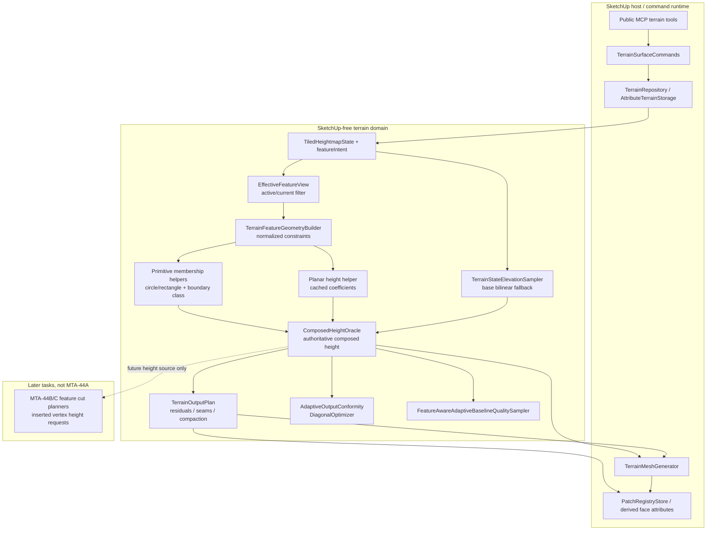

# Technical Plan: MTA-44A Establish Effective Feature Composed Height Oracle
**Task ID**: `MTA-44A`
**Title**: `Establish Effective Feature Composed Height Oracle`
**Status**: `finalized`
**Date**: `2026-06-01`

## Source Task

- [Establish Effective Feature Composed Height Oracle](./task.md)

## Problem Summary

Feature-aware terrain output already records durable feature intent and can derive effective feature geometry, but composed height reads are still split across raw base-grid reads, output planning, mesh emission, validation, seam/readback, and quality sampling. MTA-44A establishes one authoritative composed height oracle for current active feature geometry and base terrain state, without changing mesh topology.

The work has two implementation workstreams:

- Effective feature primitive completeness: circular primitive semantics are first-class constraint data through active feature selection, normalized feature geometry, coarse pruning, diagnostics, and oracle input construction. Rectangular bounds remain indexing metadata, not semantic shape.
- Authoritative composed height oracle: output, validation, seam/readback, quality sampling, and later cut-vertex height requests use the same composed height source.

## Goals

- Provide a deterministic SketchUp-free composed height oracle for current terrain state and normalized effective feature geometry.
- Make circular primitive semantics explicit for oracle-relevant feature constraints instead of reducing final semantics to rectangular bounds.
- Preserve base-only behavior against existing bilinear interpolation and no-data handling.
- Define deterministic source precedence for fixed/control, preserve/protected, planar, target, support/context, and base fallback.
- Route all composed/derived production height reads through the oracle, with audited direct-base exceptions.
- Preserve public MCP contracts, registry/readback safety, and no-delete mutation behavior.

## Non-Goals

- Add feature cut graph output, mesh cuts, circular boundary topology, inserted off-grid vertices, local-detail state, schema v4, or cross-patch cut hardening.
- Make generated mesh topology the terrain source of truth.
- Replace edit kernels wholesale or force base-raster mutation logic through composed feature semantics.
- Expose oracle traces, raw feature geometry, patch ids, seam graphs, cut vocabulary, or inserted-vertex concepts in public command responses.
- Add target-height-only or softening-only circular code paths.

## Related Context

- `specifications/hlds/hld-managed-terrain-surface-authoring.md`
- `specifications/research/managed-terrain/recommended_new_adaptive_backend_architecture.md`
- `specifications/tasks/managed-terrain-surface-authoring/MTA-44-add-sparse-local-detail-tiles-and-composed-height-oracle/plan.md`
- `specifications/tasks/managed-terrain-surface-authoring/MTA-44B-add-contained-production-feature-cut-graph-output/task.md`
- `specifications/tasks/managed-terrain-surface-authoring/MTA-44C-harden-feature-cuts-across-seams-and-patch-lifecycle/task.md`
- `specifications/tasks/managed-terrain-surface-authoring/MTA-12-add-circular-terrain-regions-and-preserve-zones/task.md`
- `specifications/tasks/managed-terrain-surface-authoring/MTA-33-implement-patch-relevant-terrain-feature-constraints/task.md`
- `specifications/tasks/managed-terrain-surface-authoring/MTA-40-add-hosted-validation-for-feature-aware-adaptive-output/task.md`
- `specifications/tasks/managed-terrain-surface-authoring/MTA-42-add-adaptive-output-seam-contracts/task.md`
- `specifications/tasks/managed-terrain-surface-authoring/MTA-43-connect-feature-aware-adaptive-output-to-patch-lifecycle/task.md`
- `specifications/tasks/managed-terrain-surface-authoring/MTA-45-tighten-feature-aware-planar-and-circular-output-behavior/task.md`

## Research Summary

- Superseded `MTA-44` is useful for the oracle rationale, but its sparse local-detail tile/window model is not part of MTA-44A.
- `MTA-33` and `MTA-43` show that constructing internal feature context is insufficient; tests must prove the same context reaches production output and mutation/readback paths.
- `MTA-40` and `MTA-45` show hosted replay can expose feature-aware output gaps missed by local unit tests.
- `MTA-12` proves circular terrain inputs are real public contract shapes; MTA-44A must treat circular semantics as required height behavior.
- `MTA-44B` owns contained cut graph output, inserted vertices, and topology forcing. `MTA-44C` owns seam-aware and patch-lifecycle-safe feature cuts. MTA-44A only supplies authoritative height semantics and normalized primitive inputs for later consumers.
- Local implementation research found the right substrates: `EffectiveFeatureView`, `TerrainFeatureGeometryBuilder`, `PlanarOcclusionClipper`, `TerrainStateElevationSampler`, `TerrainOutputPlan`, `TerrainMeshGenerator`, `PatchRegistryStore`, and the feature-aware baseline quality sampler.
- External research was not used; repository code and specs already contain the relevant domain math and constraints, and external geometry research would risk drifting into topology work.

## Technical Decisions

### Data Model

- Do not add durable terrain schema fields, local-detail state, or oracle cache state.
- Oracle inputs are rebuilt from `TiledHeightmapState`, persisted `featureIntent`, `EffectiveFeatureView`, and `TerrainFeatureGeometryBuilder`.
- Circular primitive semantics are first-class constraint data. Rectangular `relevanceWindow` and patch bounds remain coarse pruning/indexing metadata.
- Oracle diagnostics, when serialized internally, must remain JSON-safe and compact: source categories, limitation counts, route coverage, semantic version, and relevant digest/fingerprint evidence.

### API and Interface Design

- Add a SketchUp-free composed height oracle domain service/object.
- Keep `EffectiveFeatureView` responsible for active/current filtering only. It must not become the final point-membership or height-precedence engine.
- Keep `TerrainFeatureGeometryBuilder` responsible for normalized feature constraints and explicit primitive data.
- Use shared primitive membership helpers for circle/rectangle membership and boundary classification.
- Use one deterministic planar height helper with per-oracle/per-feature cached coefficients. The oracle must not solve planar controls independently at every point query.
- All composed/derived production height readers consume the oracle:
  - `TerrainOutputPlan` height probes, residual checks, seam `zValues`, and compaction checks.
  - `TerrainMeshGenerator` emitted regular/adaptive vertex Z.
  - `AdaptiveOutputConformity` and `FeatureAwareDiagonalOptimizer`.
  - `FeatureAwareAdaptiveBaselineQualitySampler`.
  - Later `MTA-44B/C` cut planners for inserted vertex/seam heights.

### Public Contract Updates

Not applicable. Public MCP tool names, request schemas, dispatcher routes, response shapes, docs, and examples are expected to remain unchanged.

If implementation discovers an unavoidable public contract change, it must update `src/su_mcp/runtime/native/native_tool_catalog.rb`, dispatcher or argument passthrough, validators, contract fixtures/tests, docs, and examples in the same change.

### Error Handling

- Degenerate or unsupported planar controls should produce compact internal limitation/fallback evidence unless existing validation already refuses the request.
- Unsupported geometry-normalization gaps must not leak as public response detail.
- Existing storage, stale effective index, owner-transform, and unsafe ownership/readback refusals remain unchanged.
- Oracle integration must not introduce public refusal solely because an internal feature enhancement is unavailable.

### State Management

- Persisted terrain source of truth remains schema-v3 terrain state plus `featureIntent`.
- Generated mesh remains derived output and never becomes height truth.
- Registry/readback state validates derived output ownership and consistency; it does not reconstruct composed height truth.
- Oracle semantics that can change emitted Z must contribute a compact internal semantic token to output policy fingerprinting so stale registry/readback does not validate incorrectly.

### Integration Points

- Command/output planning builds oracle inputs from the same persisted state and effective geometry used by output planning.
- Output plan residuals, seam `zValues`, emitted mesh vertices, conformance checks, and quality sampler expected Z must agree through the same oracle.
- Serializer/save-reload evidence must prove rebuilt oracle inputs produce deterministic answers.
- Direct base-grid reads that remain after routing must be audited as base-raster mutation, storage/no-data normalization, coarse pruning, or explicitly non-production prototype logic.

### Configuration

No new user-facing configuration is planned. Any oracle semantic version or fingerprint contribution is internal and deterministic.

## Architecture Context

## Key Relationships

- `EffectiveFeatureView` filters active/current feature intent. It does not decide point membership or height precedence.
- `TerrainFeatureGeometryBuilder` produces normalized feature constraints and explicit primitive data for the oracle.
- `ComposedHeightOracle` owns composed height semantics and consumes base sampling, primitive membership, planar coefficients, and normalized effective geometry.
- Output planning, mesh generation, conformance, quality sampling, seam/readback, and later cut planners consume the oracle for composed height.
- Edit kernels and storage paths remain base-raster owners when mutating or serializing terrain state.

## Acceptance Criteria

- Base-only composed-height queries match current `TerrainStateElevationSampler` bilinear interpolation, edge handling, and no-data behavior within existing terrain tolerance.
- The effective-feature model carries circular primitive semantics as first-class constraint data for oracle input; rectangular `relevanceWindow` and patch bounds remain coarse pruning/indexing metadata only.
- Shared primitive membership distinguishes circle inside, outside, outside-but-inside-bounding-box, and boundary-band points deterministically for every circular feature kind that exposes circular geometry.
- The composed height oracle uses current effective feature geometry, not raw edit history; retired and superseded features do not affect oracle answers.
- Composed height source precedence is deterministic and test-covered: explicit fixed/control height, preserve/protected base-preserve, newer authoritative planar, target height, support/fairing/survey-support context classification, and base bilinear fallback.
- Support/fairing/survey-support regions do not invent emitted height values unless their existing feature payload supplies a deterministic height rule.
- Planar oracle height is derived through one deterministic shared domain helper with per-oracle/per-feature cached coefficients; oracle planar answers are proven equivalent to existing planar edit semantics or both paths share the helper.
- Newer authoritative planar primitives suppress older circular target/support semantics at query points inside the planar primitive; outside the planar primitive, remaining circular semantics still apply according to primitive membership.
- Partial circular planar overlap does not require geometry clipping, cut cells, or inserted topology in MTA-44A; any geometry-normalization limitation is compact, internal, and does not permit stale circular height inside newer planar authority.
- Production output, validation, seam/readback Z, quality sampling, and future cut-vertex height requests use the composed oracle for composed/derived terrain height.
- Remaining direct base-grid height reads are documented and test-audited as base-raster mutation, storage/no-data normalization, coarse pruning, or explicitly non-production prototype logic.
- Adaptive seam `zValues`, emitted vertex Z, output-plan height checks, and readback/registry validation are generated from consistent oracle semantics.
- Internal output fingerprinting changes when oracle semantics can change emitted Z values, preventing stale registry/readback validation without adding public response fields.
- Serializer round-trip or save/reload validation proves feature intent, effective geometry inputs, and oracle answers remain deterministic after persistence.
- Public MCP tool names, request schemas, dispatcher routes, response shapes, and user-facing docs remain unchanged unless an explicit contract change is discovered and updated across the full public surface.
- Public command responses do not expose oracle traces, raw feature geometry, per-point diagnostic dumps, patch ids, seam graphs, cut graph/cut-cell vocabulary, or inserted-vertex concepts.
- Oracle diagnostics and limitations are JSON-safe, compact, and internal/replay-only.
- Existing no-delete mutation and ownership safety are preserved; oracle integration must not erase old derived output before replacement planning/readback validation succeeds.
- Hosted or manual validation covers at least base-only parity, circular target/support membership, planar-over-circular suppression, readback/seam consistency, and timing bands where the hosted harness is available.
- Implementation does not add feature cut graph output, mesh cuts, circular boundary topology, inserted off-grid vertices, local-detail state, schema v4, or cross-patch cut hardening.

## Test Strategy

### TDD Approach

Start with a failing base-only oracle parity test against `TerrainStateElevationSampler`. Build outward through shared primitive membership, effective feature input construction, precedence, planar helper parity, output/readback routing, registry/fingerprint validation, persistence, no-leak tests, and hosted replay/performance checks.

Likely first failing target: base-only composed oracle parity against `TerrainStateElevationSampler`.

### Required Test Coverage

| Provisional queue order | AC / requirement | Behavior or risk | Candidate implementation slice | Likely owner | Unit/core coverage | Integration/runtime coverage | Contract/schema coverage | Error/refusal coverage | Hosted/manual validation | Likely fixtures/helpers | Integration points | Suggested focused command | Suggested broader command | Blocker or explicit gap |
|---|---|---|---|---|---|---|---|---|---|---|---|---|---|---|
| 1 | Base-only parity | Oracle replaces direct reads without feature behavior change | Base oracle wrapper | Terrain domain | Compare oracle to `TerrainStateElevationSampler` for in-bounds, edge, fractional, and no-data points | Base-only output plan/mesh parity remains unchanged | No public field | No new refusal | Optional base-only replay row | Small tiled heightmap fixtures | Base sampler to oracle | `ruby -Itest test/terrain/regions/terrain_state_elevation_sampler_test.rb`; new oracle test once added | `ruby -Itest test/terrain/output/terrain_output_plan_test.rb` | None |
| 2 | Circular primitive membership | Bbox leakage and boundary ambiguity | Primitive membership helpers | Terrain domain | Circle/rectangle membership, outside-bbox-interior, boundary band, numeric tolerance | Geometry builder feeds `ownerLocalCenterRadius` unchanged | No public circle diagnostics | N/A | Circular target/support replay row | Circular feature fixtures | Geometry builder to oracle | New oracle/primitive membership test | Terrain output + commands tests | Hosted replay may be unavailable locally |
| 3 | Effective current truth | Retired/superseded features affect answers | Oracle input builder | Terrain features/domain | Active/retired/superseded feature fixtures | Command/output planning uses same geometry digest as oracle | Existing stale-index behavior unchanged | Existing stale effective index refusal if applicable | Save/reopen row if available | FeatureIntentSet fixtures | EffectiveFeatureView to geometry builder | New oracle input builder test | `ruby -Itest test/terrain/commands/terrain_surface_commands_test.rb` | None |
| 4 | Precedence lattice | Ad hoc source ordering | Composed oracle semantics | Terrain domain | Fixed/control, preserve/protected, planar, target, support-context, base table tests | Combined feature geometry fixture proves deterministic order | Limitation diagnostics internal only | N/A | Overlap replay row where practical | Overlapping feature fixtures | Geometry to oracle | New composed oracle test | Terrain output tests | None |
| 5 | Planar helper | Duplicated plane math drift | Planar helper extraction | Terrain domain / edits | Plane fit/evaluation; degenerate controls | Planar edit/oracle parity or shared helper evidence | No public schema change | Degenerate controls do not add public refusal unless existing validation refuses | Hosted planar-core row | Planar control fixtures | Planar edit to oracle helper | New planar helper test | Terrain commands/output tests | Exact extraction point discovered during implementation |
| 6 | Planar suppresses older circle | Stale circular target/support under newer planar authority | Point-level precedence | Terrain domain/features | Older circle + newer planar query matrix | Clipper limitation fixture does not allow stale circle inside planar | Limitation count internal only | N/A | Planar-over-circular replay row | Circular target and planar fixtures | Geometry builder, clipper, oracle | New composed oracle test | Terrain output tests | No geometry clipping in this task |
| 7 | Oracle authority | Parallel composed-height implementations remain | Output/readback routing | Output/runtime | Route/audit tests plus direct-read exception list | `TerrainOutputPlan`, `TerrainMeshGenerator`, conformance, diagonal optimizer, quality sampler use oracle | N/A | Exceptions documented as base mutation/storage/pruning/prototype | Hosted feature-aware Z replay | Oracle spy/test double where appropriate | Output plan, mesh generator, quality sampler | Output plan/mesh/quality focused tests | `ruby -Itest test/terrain/commands/terrain_surface_commands_test.rb` | Some tests may need new seams for injection |
| 8 | Registry/readback consistency | Stale registry validates wrong Z | Registry/fingerprint | Output/runtime | Oracle semantic token in fingerprint construction | Seam `zValues`, emitted Z, output plan height, registry validation agree | No public fingerprint detail | Stale/mismatched registry refuses before erase | Hosted readback/seam row | Registry fixtures | PatchRegistryStore, mesh generator | Registry/output focused tests | Terrain output suite | Hosted readback may be manual |
| 9 | Persistence | Rebuilt oracle answers drift after reload | Persistence | Storage/domain | Serializer round-trip preserves feature intent/effective inputs | Rebuild oracle after deserialize and compare source categories | No schema v4 | Existing integrity/owner-transform refusals unchanged | Save/reopen manual or hosted | Serializer feature fixtures | TerrainStateSerializer to oracle | Storage/oracle tests | Storage + commands tests | SketchUp save/reopen may be unavailable locally |
| 10 | Public no-leak | Internal oracle/cut vocabulary leaks | Contract posture | Commands/runtime | N/A | Terrain command result fixtures with internal oracle evidence | No schema/response drift; forbidden terms checked | N/A | Docs review if contract changes | Command result fixtures | TerrainSurfaceCommands | No-leak command tests | Runtime contract posture tests | None |
| 11 | Performance | Oracle query cost regresses adaptive output | Performance/hosted validation | Output/domain | Query counts or base-only fast path tests where practical | Timing buckets do not show unexplained global regression | N/A | N/A | MTA-38-style replay timing bands | Replay rows | Output planning and mesh generation | Focused output timing tests where present | Hosted replay | Hosted timing may be unavailable locally |

Suggested focused validation commands:

- `ruby -Itest test/terrain/regions/terrain_state_elevation_sampler_test.rb`
- `ruby -Itest test/terrain/output/terrain_output_plan_test.rb`
- `ruby -Itest test/terrain/output/terrain_mesh_generator_test.rb`
- `ruby -Itest test/terrain/commands/terrain_surface_commands_test.rb`
- New focused oracle, primitive membership, planar helper, and routing audit tests once files exist.

Suggested broader validation:

- Relevant `test/terrain/output`, `test/terrain/storage`, `test/terrain/features`, and `test/terrain/commands` suites.
- Hosted MTA-38-style replay rows for base parity, circular target/support, planar-over-circular, readback/seam consistency, and timing bands where available.

## Instrumentation and Operational Signals

- Internal oracle semantic version/fingerprint contribution.
- Compact internal/replay source-category counts and limitation counts.
- Route coverage summary for oracle-backed output/readback paths.
- Timing buckets for output planning, mesh generation, registry/readback, and quality sampling.
- Hosted replay verdicts and timing bands.

## Implementation Phases

1. Introduce SketchUp-free base/composed oracle shell and primitive membership helpers with unit tests.
2. Build oracle inputs from `EffectiveFeatureView` and `TerrainFeatureGeometryBuilder`; implement precedence, planar helper integration, point-level planar-over-circular suppression, and compact internal diagnostics.
3. Route all composed/derived output, validation, seam/readback, and quality-sampler height reads through the oracle; leave only base-raster mutation/storage/prototype exceptions on direct base reads.
4. Add guardrail/audit tests for remaining direct base reads, planar-helper parity/no-duplication, registry/fingerprint invalidation, persistence, and public no-leak posture.
5. Validate hosted replay/readback, save/reopen where practical, and timing bands.

## Rollout Approach

- No public feature flag or MCP contract rollout is planned.
- Keep base-only behavior parity as the first gate before production routing.
- Integrate routing incrementally by output/readback surface so regressions remain local and reversible.
- Preserve existing edit kernels as base-raster mutation owners.
- Preserve old derived output until replacement planning and validation succeed.

## Risks and Controls

- Scope drift into topology: keep cut graph, mesh cut, off-grid vertex, cut-cell, and cross-patch cut behavior in `MTA-44B/C`.
- Parallel height semantics remain: require oracle routing plus direct-read audit/exception-list tests.
- Effective feature primitive completeness is under-scoped: require first-class circular primitive semantics and outside-bbox-interior tests.
- Planar height semantics duplicate edit-kernel math: extract/reuse one deterministic helper or prove parity; no copied independent solver.
- Partial circular occlusion drifts into clipping: use query-time precedence and compact internal limitations; no clipping topology.
- Registry/readback accepts stale output: fold oracle semantic token into internal output fingerprinting.
- Hosted behavior diverges from local tests: run or explicitly gap hosted save/reopen, readback/seam, no-delete, and timing validation.
- Performance regression: pre-normalize primitives, short-circuit base-only cases, cache planar coefficients, and validate timing bands.
- Public contract drift: expected delta is none; no-leak tests must cover oracle traces, raw feature geometry, patch ids, per-point dumps, seam graphs, and cut vocabulary.

## Dependencies

- Upstream: `MTA-40`, `MTA-42`, `MTA-43`, `MTA-45`, and circular input behavior from `MTA-12`.
- Downstream: `MTA-44B` and `MTA-44C`.
- Core code: `src/su_mcp/terrain/features/effective_feature_view.rb`, `src/su_mcp/terrain/features/terrain_feature_geometry_builder.rb`, `src/su_mcp/terrain/features/planar_occlusion_clipper.rb`, `src/su_mcp/terrain/regions/terrain_state_elevation_sampler.rb`, `src/su_mcp/terrain/output/terrain_output_plan.rb`, `src/su_mcp/terrain/output/terrain_mesh_generator.rb`, `src/su_mcp/terrain/output/patch_lifecycle/patch_registry_store.rb`, and terrain serializer/storage.
- Runtime validation: Ruby unit/integration tests and hosted SketchUp replay/save-reopen where available.

## Premortem Gate

Status: PASS

### Unresolved Tigers

- None.

### Plan Changes Caused By Premortem

- Added explicit implementation guardrails against treating future cut-vertex height support as permission to implement MTA-44B/C cut planners in MTA-44A.
- Confirmed direct-read audit, planar-helper parity, registry/fingerprint invalidation, no-leak tests, and hosted/manual validation are required implementation gates rather than optional cleanup.

### Accepted Residual Risks

- Risk: Hosted SketchUp save/reopen, readback, or timing validation may not be available in the local implementation environment.
  - Class: Paper Tiger
  - Why accepted: The plan requires implementation to run hosted/manual checks where available and explicitly call out any unavailable hosted evidence.
  - Required validation: Hosted replay or manual evidence for base-only parity, circular target/support, planar-over-circular suppression, readback/seam consistency, and timing bands.
- Risk: The exact planar helper extraction point is tactical and may require local adjustment during implementation.
  - Class: Paper Tiger
  - Why accepted: The plan forbids a copied independent solver and requires parity tests or shared helper adoption.
  - Required validation: Planar edit/oracle parity test or both paths sharing the same helper.

### Carried Validation Items

- Direct-read audit or exception-list test for every remaining direct base-grid height read.
- Registry/fingerprint invalidation test proving oracle semantics affect internal output fingerprinting when emitted Z can change.
- Public no-leak tests for oracle traces, raw feature geometry, per-point dumps, patch ids, seam graphs, and cut vocabulary.
- Hosted or manual save/reopen, readback/seam, and timing-band evidence where available.

### Implementation Guardrails

- Do not implement feature cut graphs, cut cells, inserted off-grid vertices, circular boundary topology, local-detail state, schema v4, or cross-patch cut hardening in MTA-44A.
- Do not let `EffectiveFeatureView` become the point-membership or height-precedence engine.
- Do not leave alternate composed-height implementations in output, readback, validation, or quality sampling.
- Do not copy planar fit logic into a second solver; extract/reuse or prove parity.
- Do not expose oracle internals or future cut vocabulary through public MCP responses.
- Do not treat support/fairing/survey-support membership as an emitted height rule unless existing payloads define deterministic height semantics.

## Quality Checks

- [x] All required inputs validated
- [x] Problem statement documented
- [x] Goals and non-goals documented
- [x] Research summary documented
- [x] Technical decisions included
- [x] Architecture context included
- [x] Acceptance criteria included
- [x] Test requirements specified as a provisional coverage-matrix seed
- [x] Instrumentation and operational signals defined when needed
- [x] Risks and dependencies documented
- [x] Rollout approach documented when needed
- [x] Small reversible phases defined
- [x] Premortem completed with falsifiable failure paths and mitigations
- [x] Planning-stage size estimate considered before premortem finalization
