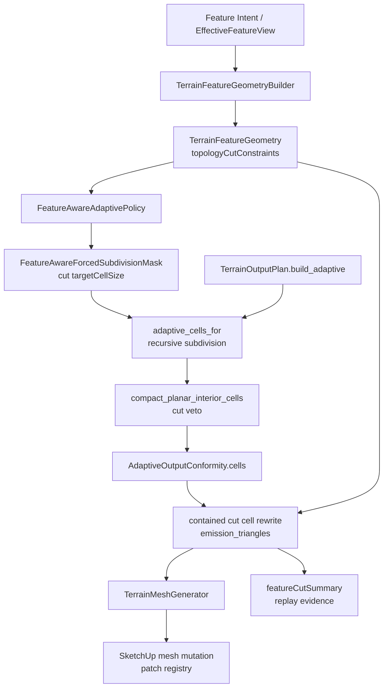

# Technical Plan: MTA-44B Add Contained Production Feature Cut Graph Output
**Task ID**: `MTA-44B`
**Title**: `Add Contained Production Feature Cut Graph Output`
**Status**: `finalized`
**Date**: `2026-06-02`

## Source Task

- [Add Contained Production Feature Cut Graph Output](./task.md)

## Problem Summary

Feature-aware adaptive output currently increases density near important features, but it does not
guarantee that off-grid feature boundaries, breaklines, or control points become actual emitted
terrain topology. `MTA-44B` adds the contained production slice: active effective feature geometry
derives internal topology cut constraints, those constraints force local adaptive subdivision inside
safe contained replacement scope, and selected final conforming cells are rewritten with
feature-aligned triangles through the normal SketchUp terrain regenerate path.

## Goals

- Derive topology cut constraints from current active effective feature geometry after
  occlusion/suppression.
- Emit production-visible contained cuts for supported planar, circular, diagonal/corridor, and
  off-grid control cases.
- Use `ComposedHeightOracle` for inserted off-grid cut vertices while preserving existing adaptive
  fan-center height behavior.
- Keep cut-driven subdivision local to active topology constraints and residual requirements, not
  broad influence/support windows.
- Skip unsupported boundary-touching, cross-patch, cross-seam, multi-origin, branching, or
  general-triangulation cases without refusing otherwise valid terrain edits.
- Preserve patch lifecycle ownership, no-delete mutation ordering, registry durability, and public
  MCP response shape.

## Non-Goals

- Cross-patch or cross-seam cut promotion; this belongs to committed follow-up `MTA-44C`.
- Local CDT islands, global triangulation, hidden renderers, public backend selectors, or native
  acceleration.
- Persisting cut graphs, cut cells, or inserted vertices in SketchUp face attributes or patch
  registry records.
- General polygon triangulation, intersecting cut graphs, unrelated multi-origin cell cuts, or
  arbitrary unsupported feature primitives. A single simple same-origin open cut chain inside one
  final cell is still supported even when it has more than two clipped fragments.
- String-vocabulary public no-leak tests for cut terms.

## Related Context

- [Managed Terrain Surface Authoring](specifications/hlds/hld-managed-terrain-surface-authoring.md)
- [Recommended Backend Architecture for Feature-Aware Adaptive Terrain Output](specifications/research/managed-terrain/recommended_new_adaptive_backend_architecture.md)
- [Superseded MTA-44 task](specifications/tasks/managed-terrain-surface-authoring/MTA-44-add-sparse-local-detail-tiles-and-composed-height-oracle/task.md)
- `MTA-44A`, `MTA-40`, `MTA-42`, `MTA-43`, `MTA-45`, and `MTA-38` are implemented prerequisites or close analogs.

## Research Summary

- `MTA-44A` established composed height oracle semantics and production oracle routing. `MTA-44B`
  must prove oracle use in production mesh emission, not only pure helper tests.
- `MTA-40` forced subdivision pressure is necessary but insufficient. Cut topology must be emitted
  as actual triangles, not inferred from density counters.
- `MTA-45` showed that pressure clipping alone can leave visible topology wrong; hosted validation
  must inspect emitted geometry.
- `MTA-42`/`MTA-43` provide seam and component lifecycle constraints. `MTA-44B` uses them for strict
  containment and safe skip decisions; cross-seam promotion is deferred.
- The current replay corpus is useful for regression, timing, skip/fallback, and stale-cut evidence
  but does not prove contained circular or diagonal cut topology. New contained 8m x 8m base-patch
  fixtures are required.
- External breakline/TIN references were used only for the domain distinction that breaklines and
  control points are explicit topology, not soft density pressure. Their constrained triangulation
  implementation models are rejected for this task.

## Technical Decisions

### Data Model

- Add an internal JSON-safe `topologyCutConstraints` collection to `TerrainFeatureGeometry`.
- `topologyCutConstraints` represents complete effective cut constraints: ordered topology origins
  as simple paths or rings, plus required off-grid control points, and the cut-local height semantics
  needed to elevate inserted cut vertices. It is derived from current effective geometry after
  occlusion/suppression, not edit history.
- Path and ring constraints keep `ownerLocalPath` as XY-only geometry. Height semantics must be
  carried in explicit cut-local fields, such as per-path-point or per-segment height anchors, rather
  than by changing the dimensionality of `ownerLocalPath`.
- `MTA-44B` uses a concrete per-point anchor shape for the reopened height-semantics queue:
  path and ring constraints carry `ownerLocalPathHeights`, a numeric array parallel to
  `ownerLocalPath`; point constraints carry `ownerLocalPointHeight`. Rewriters interpolate linearly
  between adjacent path-point heights when a segment is clipped or an interior chain vertex is
  inserted.
- Output planning must not infer cut heights from raw source primitive membership. If an effective
  circle/corridor/rectangle interaction has been composed into split path pieces, each emitted cut
  piece must carry the height ownership for that effective piece.
- Rectangle, circle, and corridor boundaries are decomposed from ordered origins into local cell
  fragments during output planning. The model must not be square-specific.
- Owner-local feature XY converts once into canonical fractional grid coordinates with a single
  grid-space epsilon of `1e-9`. Downstream containment, subdivision, and rewrite decisions operate
  in grid space.
- Equality with a patch or retained seam boundary counts as boundary-touching and skips the whole
  topology origin for `MTA-44B`.
- Rewritten cut cells may carry transient planned vertex/triangle shapes only until mesh emission.
  Patch registry and face attributes must not carry cut graph/cell/vertex details.

### API and Interface Design

- Public MCP request schemas, public response shapes, tool names, and dispatcher routing stay
  unchanged.
- Internal `TerrainFeatureGeometry` digest/fingerprint tests must update intentionally because
  `topologyCutConstraints` becomes part of deterministic feature geometry.
- Internal command/replay evidence may add compact aggregate `featureCutSummary`.

### Public Contract Updates

- Public request deltas: none.
- Public response deltas: none.
- Public schema/registration/dispatcher deltas: none expected.
- Docs/examples: only update user-facing docs if implementation unexpectedly changes setup,
  commands, request shape, response shape, or exposed examples.
- Public contract tests should continue asserting response shape and serialization behavior. Do not
  add string-vocabulary scans for cut internals.

### Error Handling

- Unsupported local cut cases skip enhancement and fall back to existing valid adaptive output.
- Skip reasons are recorded internally in aggregate `featureCutSummary` counters.
- Missing or ambiguous cut-local height semantics skip enhancement for the affected topology origin
  or cell before mutation. The output layer must not guess by querying original circle, corridor,
  rectangle, or other raw source shapes.
- Boundary-touching/cross-patch/cross-seam constraints skip the whole topology origin for `MTA-44B`.
- Replacement validation, ownership lookup, seam validation, unsupported-child checks, and registry
  validation must happen before mutation erases old output.

### State Management

- Cut topology is derived output. It is regenerated from the current effective feature view and is
  not persisted as durable cut state.
- Cut-local height anchors are also derived output. They must be regenerated with the current
  effective cut constraints so stale cuts and stale cut heights disappear together.
- Patch registry remains ownership/seam/face-count metadata only.
- Dirty full adaptive rebuild fallback must preserve feature-aware policy, diagnostics,
  `topologyCutConstraints`, and `ComposedHeightOracle` routing. It must not rebuild with only patch
  policy.

### Integration Points

- `TerrainFeatureGeometryBuilder` derives `topologyCutConstraints`.
- `FeatureAwareForcedSubdivisionMask` consumes cut constraints as another forced subdivision source.
- `FeatureAwareAdaptivePolicy.split_pressure_for` combines cut target size with existing pressure,
  anchor, protected, and corridor-detail split decisions.
- `FeatureAwareAdaptivePolicy.planar_compaction_candidate?` vetoes cut-intersecting cells.
- `TerrainOutputPlan.build_adaptive` runs subdivision, planar compaction, conformity, and then a
  contained cut rewrite pass.
- The contained cut rewrite pass interpolates explicit cut-local height anchors for inserted or
  clipped cut vertices when the constraint provides them.
- `TerrainMeshGenerator` emits final triangles and uses explicit planned heights on tagged cut
  vertices when present. It falls back to `ComposedHeightOracle` only for cut vertices without
  explicit cut-local height and preserves existing adaptive fan-center behavior.

### Configuration

- Hard topology cut constraints default to `targetCellSize: 1` for `MTA-44B`.
- No public or user-configurable backend selector is added.
- No iterative rewrite-then-subdivide configuration is added.

## Architecture Context

## Key Relationships

- Feature interpretation belongs in `TerrainFeatureGeometryBuilder`; output planning consumes
  normalized, JSON-safe topology constraints.
- Cut constraints influence subdivision before conformity. Exact cut triangles are emitted only
  after conformity so rewritten cells preserve boundary splits.
- Planar compaction remains part of adaptive planning but must not merge away cut-driven cells.
- Mesh generation owns SketchUp mutation and height sampling; it must distinguish cut vertices from
  existing fan centers.
- Registry and face attributes remain free of cut graph details.

## Acceptance Criteria

- Active planar, circular, diagonal/corridor, and off-grid control features derive internal
  `topologyCutConstraints` from current effective geometry after occlusion/suppression, including
  cut-local height semantics for emitted cut vertices.
- Superseded or occluded feature constraints do not produce stale topology cuts on regeneration.
- Superseded or occluded feature constraints do not produce stale cut-local height anchors on
  regeneration.
- Contained path/ring constraints force adaptive subdivision before conformity so supported final
  cells contain only a single same-origin simple path component.
- Cut-intersecting cells do not get planar-compacted away, even when residual flatness would
  otherwise allow compaction.
- Supported final cells are rewritten after conformity with deterministic `emission_triangles` for
  single same-origin simple open path chains and single off-grid control-point cases.
- A pre-rewrite guard classifies same-origin path fragments in each final cell; disjoint fragments,
  branching chains, closed loops, or any multi-origin conflict skip enhancement with local-complexity
  evidence before any triangles are rewritten.
- Rewritten cells preserve conforming boundary vertices/splits and do not carry stale diagonal
  optimization decisions.
- Rewrite tests prove every conformed boundary vertex remains present in final emitted triangles.
- Tagged off-grid cut vertices use explicit cut-local planned heights when present, fall back to
  `ComposedHeightOracle` only when no explicit cut-local height exists, and existing adaptive fan
  centers keep their fitted elevation behavior.
- For constraints that require explicit cut-local height ownership, missing or ambiguous anchors
  skip enhancement before rewrite. Mesh-generator oracle fallback remains available only for legacy
  or explicitly fallback-allowed cut vertices; it must not hide missing required corridor/path/ring
  height semantics.
- Output planning does not infer cut-vertex heights by testing membership in original raw source
  shapes. If effective cut height ownership is missing or ambiguous, enhancement skips with
  evidence.
- Boundary-touching, cross-patch, cross-seam, multi-origin, branching, intersecting, and
  general-triangulation cases skip cut enhancement and continue through existing valid adaptive
  output.
- Dirty full-rebuild fallback preserves feature-aware policy, diagnostics, cut constraints, and
  composed-height oracle behavior.
- Cut graph details are not persisted to face attributes or patch registry records.
- Internal replay evidence includes aggregate `featureCutSummary` counts and proof-cell samples per
  supported template without exposing raw cut graphs, segments, or vertices in public responses.
- Existing broad replay rows continue to pass as regression/skip/fallback evidence, while new
  contained rows prove visible topology for circle, diagonal/corridor, planar/path, and off-grid
  control cases.
- Full hosted validation proves visible topology, stale-cut removal, dirty full-rebuild preservation,
  no-delete safety, registry freshness, and performance/timing acceptability, including a timing row
  that is not limited to the smallest contained fixture.

## Test Strategy

### TDD Approach

Start with pure feature-geometry derivation and deterministic cut constraints, then move outward to
subdivision pressure, compaction veto, post-conformity rewrite, mesh emission, command/replay
evidence, and full hosted validation. The likely first failing target is
`test/terrain/features/terrain_feature_geometry_builder_test.rb` for
`topologyCutConstraints` derivation and digest behavior.

### Required Test Coverage

| Provisional queue order | AC / requirement | Behavior or risk | Candidate implementation slice | Likely owner | Unit/core coverage | Integration/runtime coverage | Contract/schema coverage | Error/refusal coverage | Hosted/manual validation | Likely fixtures/helpers | Integration points | Suggested focused command | Suggested broader command | Blocker or explicit gap |
|---|---|---|---|---|---|---|---|---|---|---|---|---|---|---|
| 1 | Derive current active cut constraints | Stale/occluded cuts and cut heights must disappear | `TerrainFeatureGeometryBuilder`, `TerrainFeatureGeometry` | Feature geometry | Derivation tests for planar rect/ring, circle ring, corridor edge path, control point, occlusion, and cut-local height anchors | n/a | Internal digest/fingerprint tests include height-anchor participation without public response changes | Unsupported primitive and missing-height limitation coverage | n/a | Existing feature intent fixtures plus new contained path/ring helpers | Effective feature view to geometry | `ruby -Itest test/terrain/features/terrain_feature_geometry_builder_test.rb` | `bundle exec rake ci` | none |
| 2 | Cut-driven subdivision before conformity | Cut cells must be small enough for local templates | `FeatureAwareForcedSubdivisionMask`, `FeatureAwareAdaptivePolicy` | Output policy | Target size, owner-bounds, circle/segment intersection, forced summary | `TerrainOutputPlan` subdivision fixtures | n/a | Unsupported local complexity counters | n/a | 8m contained circle/corridor/path fixtures | Feature policy to adaptive cells | `ruby -Itest test/terrain/output/feature_aware_adaptive_policy_test.rb` | `bundle exec rake ci` | Exact helper names provisional |
| 3 | Planar compaction veto | Compaction must not erase cut subdivisions | `FeatureAwareAdaptivePolicy.planar_compaction_candidate?`, `TerrainOutputPlan` | Output plan | Cut-intersecting planar cells not compacted | Plan output comparison before/after compaction | n/a | n/a | Hosted visual planar cut proof | Planar flat fixture with cut ring | Policy to output plan | `ruby -Itest test/terrain/output/terrain_output_plan_test.rb` | `bundle exec rake ci` | none |
| 4 | Post-conformity rewrite | Final cells preserve boundary splits, emit cuts, and interpolate cut-local heights | New contained cut rewrite helper inside output plan layer | Output plan | Simple connected same-origin open path chain, control-point fan, boundary-vertex preservation, pre-rewrite chain topology guard, segment height interpolation | `TerrainOutputPlan` final cell summary, triangle counts, and exact cut-vertex height proof | n/a | Skip reasons for multi-origin, branching, closed-loop, disjoint fragments, and missing/ambiguous height anchors | Hosted visual topology and connectivity inspection | Conforming cell fixtures, circle vertex cell, corridor edge cell | Conformity to rewrite | `ruby -Itest test/terrain/output/terrain_output_plan_test.rb` | `bundle exec rake ci` | Exact file may split if helper grows |
| 5 | Explicit-height tagged vertices | Cut vertices prefer explicit planned height; fan centers unchanged | `TerrainMeshGenerator` planned vertex dispatch | Mesh generator | Tagged cut vertex with explicit height bypasses oracle; tagged cut vertex without explicit height uses oracle; raw fractional fan center remains fitted | Planned patch face emission tests | n/a | Missing-height cut vertices only fall back when allowed by constraint semantics | Hosted corridor/circle/square cut-height proof | Oracle-sensitive and explicit-height fixtures | Output plan to mesh generator | `ruby -Itest test/terrain/output/terrain_mesh_generator_test.rb` | `bundle exec rake ci` | none |
| 6 | Dirty fallback and lifecycle scope | Fallback must not drop feature policy/oracle; cut footprints must not become dirty authority | `TerrainMeshGenerator.full_adaptive_rebuild_plan`, `TerrainSurfaceCommands#component_sources_for` | Command/output integration | Fallback forwards policy/diagnostics/oracle; no cut-derived `local_detail_windows`; retained seam equality skips whole origins | Command edit output plan tests | Public response shape unchanged | Ownership/seam refusal still no-delete | Hosted dirty regenerate with fallback/ownership scenarios | Existing command fixtures plus contained cut rows | Command to output plan to mesh generator | `ruby -Itest test/terrain/commands/terrain_surface_commands_test.rb` | `bundle exec rake ci` | Hosted fallback trigger may need probe support |
| 7 | Internal evidence and replay | Prove topology without raw cut metadata | Replay result/classifier/evidence | Replay/diagnostics | `featureCutSummary` aggregate fields and proof cells per template | Replay runner rows for contained/skip cases | Public response shape/serialization only; no string scans | Skip reason counts | Full hosted replay capture with visuals/timing | New contained replay rows in `test/terrain/replay/feature_aware_adaptive_baseline.json` or companion fixture | Command path to replay docs | `ruby -Itest test/terrain/replay/feature_aware_adaptive_baseline_replay_test.rb` | `bundle exec rake ci` | Exact fixture file placement provisional |
| 8 | Full hosted validation | Unit/replay cannot prove visible topology or no-delete behavior | Hosted probes/capture docs | Hosted validation | n/a | n/a | n/a | Replacement validation failure keeps old output | Deploy/reload, visual capture, timing comparison, dirty full-rebuild row, stale-cut removal, registry freshness | Contained circle, corridor/path, planar/ring, control, skip rows, 2x patch-count timing row | SketchUp runtime | Hosted command/probe run documented during implementation | Existing replay plus hosted validation suite | Requires SketchUp host availability |

Likely first failing target: `test/terrain/features/terrain_feature_geometry_builder_test.rb` for
the first `topologyCutConstraints` derivation case.

## Instrumentation and Operational Signals

- `featureCutSummary` aggregate counts:
  `eligibleConstraintCount`, `appliedConstraintCount`, `skippedConstraintCount`,
  `skipReasonCounts`, `rewrittenCellCount`, `insertedVertexCount`, `oracleCutVertexCount`,
  `explicitCutHeightVertexCount`, `missingCutHeightSkipCount`, ambiguous cut-height skip counts,
  `triangleDelta`, proof-cell sample per supported template, and local-complexity skip counters.
- Rewrite diagnostics must distinguish applied templates from pre-rewrite local-complexity skips so
  a contained fixture cannot appear successful when every relevant cell skipped enhancement.
- Rewrite diagnostics must also distinguish topology-present-but-height-wrong failures from missing
  topology. A contained fixture cannot appear successful merely because cut vertices are present in
  XY when their planned heights are absent or wrong.
- Existing patch registry face counts and seam records remain the ownership/readback signal.
- Hosted validation captures visual topology evidence and timing comparisons against baseline rows.

## Implementation Phases

1. Add `topologyCutConstraints` to `TerrainFeatureGeometry` and derive ordered path/ring/control
   constraints from current effective geometry after occlusion/suppression, including explicit
   cut-local height anchors where the effective cut owner has known height semantics.
2. Extend `FeatureAwareForcedSubdivisionMask` and `FeatureAwareAdaptivePolicy` so topology cuts
   drive target-cell subdivision and veto planar compaction.
3. Add the contained post-conformity cut rewrite for supported local fragments and unsupported-case
   skip summaries, including segment-height interpolation for inserted cut vertices.
4. Route tagged cut vertices with explicit planned heights directly in `TerrainMeshGenerator`;
   preserve `ComposedHeightOracle` fallback for legacy/no-explicit-height cut vertices and preserve
   fan-center fitted behavior; fix dirty full-rebuild fallback input preservation.
5. Add internal `featureCutSummary`, replay fixtures/classifier updates, and response
   shape/serialization coverage.
6. Run focused unit tests, replay regression, and full hosted visual/performance validation; correct
   live topology or lifecycle issues found.

### Reopened Step 03 Addendum Queue

Live corridor verification exposed that XY cut topology can be present while inserted cut vertices
still receive the wrong height. The implementation should return narrowly to the Step 03 coverage
queue using the existing staged topology implementation as the baseline, not the original
provisional matrix.

| Addendum order | Requirement | Behavior or risk | Implementation slice | Owner | Required coverage |
|---|---|---|---|---|---|
| A1 | Complete effective cut constraints | Height ownership must be derived with topology, not guessed later | Define and derive `ownerLocalPathHeights` and `ownerLocalPointHeight` while keeping XY path/point fields unchanged | `TerrainTopologyCutConstraintBuilder`, `TerrainFeatureGeometryBuilder`, `TerrainFeatureGeometry` | Corridor/ring/path/point constraints carry anchors; digest changes with anchors; public command response shape unchanged |
| A2 | Preserve effective height semantics | Corridor/reference assembly must not lose height anchors before output planning | Preserve effective segment/point height ownership into topology constraints without raw output-layer shape membership | Feature geometry and topology cut constraint builder | Contained corridor ring built from reference segments carries the expected parallel height anchors |
| A3 | Rewrite inserts planned heights | Clipped/interior cut vertices need deterministic heights | Interpolate anchors in `ContainedFeatureCutRewriter` and tag `feature_cut_vertex` values with explicit planned height | `ContainedFeatureCutRewriter`, `TerrainOutputPlan` | Clipped vertices interpolate linearly; inserted chain vertices carry planned height; missing/ambiguous required heights skip with evidence |
| A4 | Mesh emits planned cut heights | Oracle fallback must not hide missing required heights | Prefer explicit cut-vertex height in `TerrainMeshGenerator`; keep oracle fallback only for no-height legacy/fallback-allowed cut vertices; fan centers remain fitted | `TerrainMeshGenerator` | Explicit-height vertex bypasses oracle; no-height fallback still works where allowed; fan center behavior unchanged |
| A5 | Evidence separates topology and height | XY success must not appear as full height success | Add/update `featureCutSummary` counts for explicit planned-height vertices, oracle fallback vertices, and missing/ambiguous height skips | Rewriter summary, replay evidence | Summary/replay rows distinguish topology-applied from height-complete cases without exposing raw cut graphs |
| A6 | Hosted corridor proof | Automated tests cannot prove SketchUp-hosted visual/mesh behavior alone | Redeploy/reload and create a fresh contained corridor fixture at the next increasing x position | SketchUp runtime | Verify side-line vertices are raised only after user asks for measurement; keep x positions greater than prior live fixtures |

## Rollout Approach

- Ship entirely through the existing adaptive terrain output path; no public feature flag or backend
  selector.
- Unsupported contained-local complexity and boundary cases skip enhancement and use existing
  adaptive output.
- Keep `MTA-44C` follow-up scope explicit for cross-patch/cross-seam promotion.

## Risks and Controls

- Pressure-only false positive: require emitted-triangle proof cells and hosted visual validation.
- Height false positive: require emitted cut vertices to prove intended cut-local height, not only
  XY topology. Corridor live verification specifically guards against visible side lines whose
  vertices remain at base/interpolated terrain height.
- Oracle routing regression: use explicit-height tagged cut vertices, oracle-fallback cut vertices,
  and fan-center mesh generator tests.
- Planar compaction erases cut subdivisions: veto cut-intersecting compaction candidates.
- Dirty full rebuild loses cut/oracle behavior: forward feature policy, diagnostics, and height
  oracle in fallback tests.
- Lifecycle overreach from cut windows: do not add cut-derived `local_detail_windows` in `MTA-44B`;
  use existing feature/affected windows for replacement scope.
- Patch/seam ownership errors: strict grid-space containment and whole-origin skip for boundary
  touches.
- Conformity regression from post-conformity rewrite: treat the conformed cell boundary as immutable
  input and assert all conformed boundary vertices appear in final triangles.
- Metadata churn/stale readback: do not persist cut details in face attributes or patch registry.
- Public contract drift: keep public request/response shape unchanged and verify serialization
  behavior.

## Premortem Gate

Status: PASS

### Unresolved Tigers

- None.

### Plan Changes Caused By Premortem

- Added an explicit pre-rewrite local-complexity guard: disconnected chains, branching chains,
  closed loops, and multi-origin conflicts must skip before triangle rewrite.
- Added boundary-vertex preservation as a required rewrite assertion so post-conformity cuts cannot
  create invisible T-junction or seam regressions.
- Strengthened hosted validation to include dirty full-rebuild preservation and a timing row beyond
  the smallest contained fixture.
- Made rewrite diagnostics distinguish applied cut templates from local-complexity skips.

### Accepted Residual Risks

- Risk: Some contained circle or corridor cases may still skip because `targetCellSize: 1` does not
  simplify them into one simple same-origin open chain inside each final cell.
  - Class: Paper Tiger
  - Why accepted: `MTA-44B` only promises the first contained production slice; unsupported local
    complexity is explicitly classified and leaves valid adaptive output intact.
  - Required validation: Contained positive fixtures must prove at least one circle, corridor/path,
    planar/path, and control case applies cuts with exact cut vertices, while dense/local-complexity
    fixtures prove skip counters and fallback behavior.
- Risk: Cross-patch and retained-seam promotion remains unsolved.
  - Class: Elephant
  - Why accepted: This is explicitly assigned to committed follow-up `MTA-44C`; `MTA-44B` must not
    ship partial boundary cuts.
  - Required validation: Boundary equality and retained-seam fixtures must prove whole-origin skips
    and zero partial cut emission.

### Carried Validation Items

- Unit and output-plan tests must prove every conformed boundary vertex remains in rewritten
  `emission_triangles`.
- Oracle-sensitive mesh tests and hosted evidence must prove tagged cut vertices use
  `ComposedHeightOracle` while fan centers keep fitted elevation.
- Hosted replay must include contained positive fixtures, boundary skip fixtures, stale-cut removal,
  dirty full-rebuild preservation, no-delete failure-path proof, registry/readback freshness, and
  performance timing comparison.

### Implementation Guardrails

- Do not use CDT, constrained triangulation, or broad pressure-only densification as the feature-cut
  implementation.
- Do not add cut-derived `local_detail_windows`; existing feature/affected windows remain the
  lifecycle dirty-scope authority for `MTA-44B`.
- Do not persist cut graph, cut cell, or inserted-vertex details in SketchUp face attributes or patch
  registry records.
- Do not treat every fractional planned point as a cut point; only explicit cut vertex tags can use
  cut-local planned heights or `ComposedHeightOracle` fallback.
- Do not add shape-specific height membership checks to the output layer. Cut-vertex heights must
  come from effective cut constraints or the existing composed-oracle fallback, not from re-testing
  original circle, corridor, rectangle, or other source primitives in mesh emission.
- Do not expose public MCP request/response/schema changes unless the task is replanned with
  matching catalog, dispatcher, tests, and docs updates.

## Dependencies

- `MTA-44A`: composed height oracle and production oracle routing.
- `MTA-40`: forced subdivision mask infrastructure.
- `MTA-42`: seam records and validation.
- `MTA-43`: component planning and no-delete lifecycle proof.
- `MTA-45`: planar compaction and occlusion behavior.
- `MTA-38`: replay harness and hosted replay conventions.
- SketchUp hosted runtime for full visual/performance validation.

## Quality Checks

- [x] All required inputs validated
- [x] Problem statement documented
- [x] Goals and non-goals documented
- [x] Research summary documented
- [x] Technical decisions included
- [x] Architecture context included
- [x] Acceptance criteria included
- [x] Test requirements specified as a provisional coverage-matrix seed
- [x] Instrumentation and operational signals defined when needed
- [x] Risks and dependencies documented
- [x] Rollout approach documented when needed
- [x] Small reversible phases defined
- [x] Premortem completed with falsifiable failure paths and mitigations
- [x] Planning-stage size estimate considered before premortem finalization
