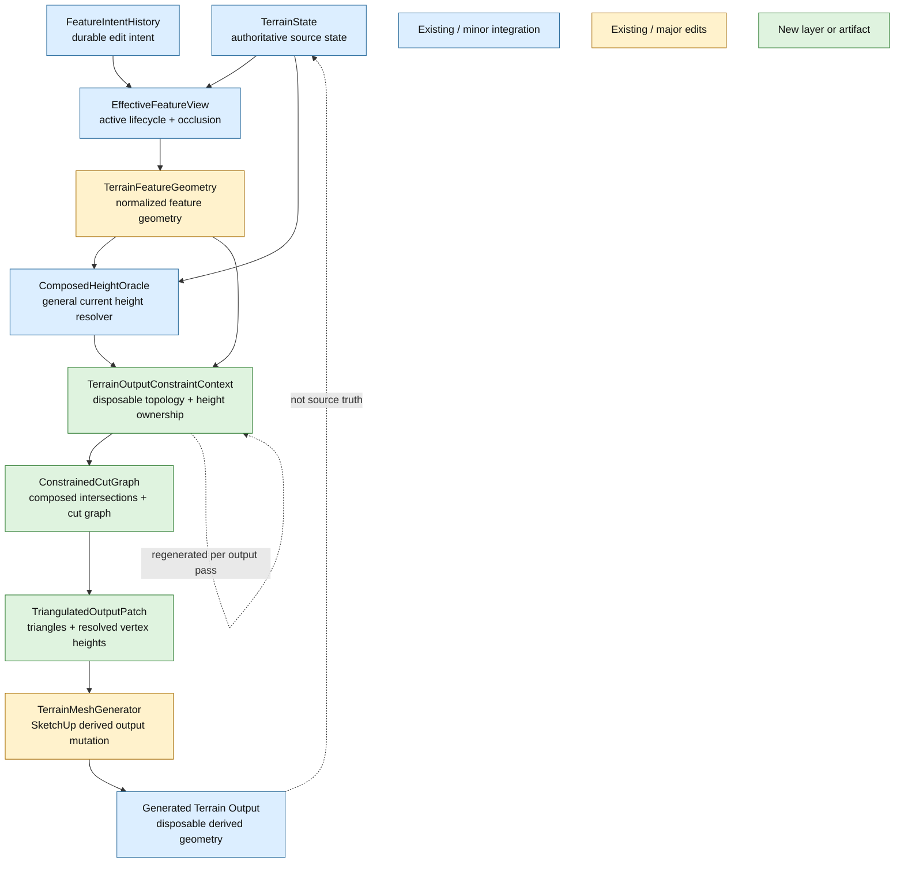

# MTA-44B1 Technical Discovery Notes

These notes are planning input for `MTA-44B1`. They capture what the failed `MTA-44B`
implementation taught us and convert those lessons into requirements, rejected patterns,
architecture context, and validation inputs for the next plan.

They are planning input only; the durable value is the recorded lesson, not the failed
implementation path.

## Original Capability Still Needed

`MTA-44B` did not change the business premise. It failed to deliver it.

Current production terrain output still needs to represent supported off-grid feature edits as real
terrain topology:

- target/circle boundaries
- diagonal corridor edges
- non-grid-aligned planar or rectangle boundaries
- breaklines
- required off-grid control points

The output must contain feature-coincident vertices and edges where the case is supported. Broad
adaptive pressure, denser local triangles, or good-looking interpolation are not enough if the mesh
does not actually encode the intended off-grid feature geometry.

## Why MTA-44B Failed

The main failure was the plan assumption that a contained adaptive/local-template rewrite could be
the production answer for this slice.

Live validation showed otherwise:

- Some simple contained cases improved, but the approach was not robust enough for the full off-grid
  feature-cut requirement.
- Circle/corridor composition could be manifold while still visually and semantically wrong.
- XY-visible cuts could still have wrong heights on inserted or adjacent vertices.
- The attempted implementation drifted toward shape-specific fixes for circle, corridor, square, and
  polygon behavior.
- A later live-fix path accidentally treated height-imposing feature domains as durable constraints,
  which blocked later terrain edits. That was an implementation bug introduced by the failed path,
  not the original product problem.

The conclusion for `MTA-44B1`: do not replan around adaptive-only/local templates as the general
solution. Start from a constrained cut-generation model. Existing CDT work is relevant prior art and
possible reusable input, but it is not assumed to be directly production-ready.

## Planning Requirements From The Failure

The next plan should treat these lessons as requirements or validation gates:

- The original product gap is missing production topology for supported off-grid feature edits.
- Terrain state remains authoritative; generated terrain output and cut-generation metadata remain
  disposable derived geometry.
- Cut requirements must come from current active effective feature geometry after
  occlusion/suppression, not from accumulated cut history.
- Topology-forcing constraints are distinct from soft influence/support pressure.
- Cut-local height semantics must travel with cut geometry. XY-correct topology is not sufficient.
- The output layer must not infer cut heights by retesting raw source primitives such as original
  circles, corridors, rectangles, or polygons.
- Composed/intersecting off-grid features need a real composed cut graph or constrained
  triangulation path.
- Unsupported or unsafe cut generation must skip or fall back before old derived output is erased.
- Public MCP terrain request/response contracts should remain unchanged unless a separate contract
  task is created.
- Hosted validation must inspect actual geometry, not only local counters: visual boundary fidelity,
  height correctness, manifoldness, stale-cut disappearance, no-delete behavior, output integrity,
  and timing.

The live observations below are evidence for planning, not acceptance evidence:

- Corridor-only output became mostly acceptable after conservative fixes, but this did not prove the
  general approach.
- Circle output improved in simple off-grid cases, but composed cells remained the hard case.
- Circle plus corridor could be manifold and still wrong because composed height/topology ownership
  was not solved.
- Polygon/oracle experiments fixed one height symptom but used the wrong lifetime model when treated
  as durable feature-domain behavior.

## Rejected Implementation Patterns

These patterns from the failed implementation should not be reintroduced as production behavior:

- Always running a contained feature-cut rewriter from `TerrainOutputPlan`.
- Treating adaptive templates as the general production solution for off-grid feature cuts.
- Persisting cut vertices, cut cells, cut height anchors, or generated cut domains as authoritative
  terrain state or edit history.
- Wiring target/corridor/planar output domains into a durable oracle path that can constrain later
  terrain edits.
- Shape-specific output-layer patching for circle, corridor, square, or polygon cases.
- Aggressive near-corner snapping as a topology-quality strategy.
- Mesh generator behavior that depends on stale feature-intent oracle domains being correct.
- Replay/baseline mutations that make experimental cut rows part of the like-for-like baseline.
  Feature-cut replay additions need to be separately invokable or explicitly documented as a new
  baseline set.
- Carrying implementation artifacts forward without a new plan. Useful ideas should be reintroduced
  through `MTA-44B1` requirements, architecture, and tests.

## Requirements And Design Inputs

These requirements, guardrails, and design inputs remain valid for `MTA-44B1` planning.

### Requirements And Guardrails

- Preserve the original `MTA-44B` business capability: supported off-grid features must read as real
  terrain geometry in production output.
- Maintain generated terrain output as disposable derived geometry.
- Maintain cut-generation metadata as disposable and internal.
- Preserve public MCP contract stability.
- Preserve no-delete safety and fallback-before-mutation behavior.
- Preserve stale/obsolete cut disappearance as an output regeneration requirement.
- Validate simple contained off-grid cases separately from composed/intersecting cases.

### Useful Design Ideas

Cut constraints need height ownership in addition to XY geometry. A useful internal shape was:

```ruby
{
  'primitive' => 'ring',
  'ownerLocalPath' => [[x0, y0], [x1, y1], ...],
  'ownerLocalPathHeights' => [z0, z1, ...]
}
```

For required off-grid points:

```ruby
{
  'primitive' => 'point',
  'ownerLocalPoint' => [x, y],
  'ownerLocalPointHeight' => z
}
```

These anchors should be treated as disposable output-generation metadata, not durable terrain state.

Generic polygon/ring membership remains useful as an input primitive for current-output domains or
CDT input construction. It should not become shape-specific output patching, and it should not be
used to persist corridor or target domains as durable height constraints.

Boundary split propagation was useful evidence that feature-cut vertices must be reflected in
adjacent topology; otherwise T-junctions or one-face edges appear. That idea may still be relevant,
but it does not solve composed/intersecting cut graphs by itself.

Compact internal diagnostics remain useful if they distinguish:

- topology applied vs skipped
- explicit planned-height vertices vs oracle fallback
- missing or ambiguous height ownership
- local-complexity fallback
- composed/intersection fallback
- face/vertex growth and timing

Diagnostics must stay internal and aggregate; do not expose raw cut graphs in public responses.

## Implementation Lessons From The Failed Patch

The failed `MTA-44B` implementation and tests contain useful planning input even though the code path
is not the next production design.

### Normalized Cut Inputs Were Useful

The `topologyCutConstraints` shape is a useful concept: JSON-safe, derived from effective feature
geometry, and normalized before output planning. The next plan should use the idea of a normalized
cut-input layer, while renaming or reshaping it as needed for constrained cut generation.

Useful properties from the diff:

- constraints are derived after occlusion/suppression
- constraints include `featureId`, `primitive`, role/kind, target cell size or detail intent, and
  owner-local XY geometry
- rings, paths, and points can use one common input vocabulary
- digest/fingerprint participation is useful so output policy changes when cut-relevant inputs
  change

Planning caution:

- digest participation should not imply durable source truth
- raw cut graph details should remain internal
- circle segment count and tolerance choices must be planned from boundary fidelity requirements,
  not copied mechanically from the failed implementation

### Height Semantics Must Survive Clipping

Several implementation diffs converged on the same lesson: height ownership must survive the entire
pipeline, including occlusion clipping and segment fragmentation.

Useful ideas:

- path/ring constraints can carry `ownerLocalPathHeights` parallel to `ownerLocalPath`
- point constraints can carry `ownerLocalPointHeight`
- clipped segments should interpolate endpoint heights
- corridor side/cap segments need height anchors from their source controls
- missing or ambiguous required cut heights should be a skip/fallback reason, not silently guessed

Planning caution:

- the mesh-generator code and tests were not fully settled on explicit-height versus composed
  oracle precedence
- `MTA-44B1` must explicitly define the height source order for inserted vertices
- the output layer must not recover missing heights by retesting raw source shapes

### Subdivision And Compaction Signals Still Matter

The failed plan used forced subdivision as part of the adaptive template path. That was not enough,
but it still produced useful signals for constrained output planning:

- topology-forcing cuts should select affected cells or cut domains
- planar compaction must not erase cells or domains needed for explicit off-grid topology
- broad influence/support windows are not a valid replacement for cut-driven selection

For `MTA-44B1`, these signals may become input-domain selection for constrained triangulation rather
than a promise that adaptive subdivision can solve topology by itself.

### Local Template Patching Became A Triangulation Substitute

The failed adaptive-template approach accumulated responsibilities that belong to a constrained
triangulation pipeline: clipping, chain graph classification, polygon splitting, ear clipping,
boundary split propagation, sliver handling, and skip diagnostics. That is strong evidence that
local patching was trying to recreate constrained triangulation without the right input model or
robustness guarantees.

Planning should retain these validation lessons:

- conformed boundary vertices must remain represented after cut generation
- cut endpoints on shared boundaries must propagate to adjacent topology to avoid T-junctions
- feature-cut edges should not be single-use internal edges
- near-corner slivers need explicit metrics
- connected same-origin chains are simpler than multi-origin/intersecting cells
- closed loops, disconnected fragments, branching fragments, and multi-origin conflicts need either
  constrained triangulation or safe fallback

### Generic Polygon Membership Points Toward Shape-Normalized Output Inputs

The polygon membership work was not proven end-to-end, but it points at an important architectural
direction: output generation should not grow separate mesh rules for circle, rectangle, corridor,
planar region, and future feature shapes. Feature-specific source intent should be normalized into
generic current-output geometry primitives before constrained cut generation.

Useful planning direction:

- represent oriented corridor tops as polygons instead of corridor-specific output rules
- represent non-grid-aligned rectangles and planar regions as polygons/rings
- represent circle boundaries as sampled rings with planned fidelity, not as circle-specific mesh
  emission behavior
- represent breaklines as paths and required controls as points
- allow composed/intersecting source shapes to become a composed set of generic polygons, rings,
  paths, points, and intersection vertices before triangulation

Useful geometry primitive:

- point-in-polygon with boundary inclusion can support transient current-output domain membership,
  height assignment, and constrained triangulation input construction

Important limitation:

- the failed implementation did not prove this generic primitive pipeline through production output
- polygon membership fixes height/domain classification only when used as transient current-output
  input; it does not solve topology by itself

Rejected as production architecture:

- persistent `linear_corridor` semantic regions that keep imposing heights across later edits
- using polygon oracle domains to compensate for missing cut topology
- adding per-shape output-layer mesh repair for circle, corridor, rectangle, or square cases

### Internal Evidence Needs Better Separation

The replay/test diffs showed useful evidence categories:

- applied versus skipped cut constraints
- rewritten cell count
- inserted vertex count
- explicit planned-height vertex count
- oracle fallback vertex count
- missing-height skip count
- local-complexity skip reasons
- proof-cell samples
- triangle delta and timing buckets

These categories are useful as internal diagnostics, but the existing like-for-like replay baseline
should not absorb experimental feature-cut rows unless the baseline is intentionally replaced. New
feature-cut replay rows should be separately invokable or clearly documented as a new baseline set.

### Dirty Rebuild And Fallback Must Preserve Feature Context

The mesh-generator tests exposed an important lifecycle requirement: if a dirty/local output path
falls back to full adaptive or constrained regeneration, it must preserve the feature-aware policy,
diagnostics, cut inputs, and height source context. A fallback that regenerates only generic terrain
output can lose the very constraints needed to prove correctness.

### Tests Worth Rebuilding Under MTA-44B1

These test ideas should be recreated in the new task after the new plan chooses the implementation
path:

- off-grid circle/ring emits all required boundary vertices or records a safe fallback
- diagonal corridor edges produce two readable side boundaries with correct heights
- non-grid-aligned rectangle/planar boundary produces feature-coincident topology
- off-grid control point becomes a production vertex
- composed circle-plus-corridor either triangulates correctly or falls back before mutation
- conformed/shared boundary vertices are preserved with no T-junctions
- no single-use internal feature-cut edges in accepted output
- no near-zero sliver triangles around cut/cell corners beyond planned tolerance
- stale/obsolete cut inputs disappear after effective feature occlusion/suppression changes
- dirty/full fallback preserves feature-aware cut inputs and diagnostics
- replay evidence remains internal and aggregate

## Planning Inputs For MTA-44B1

The next plan should start from these premises:

- Adaptive-only/local-template output is not the full-scope solution.
- A constrained cut-generation path is required for composed off-grid topology.
- The target is not global CDT terrain output. The intended direction is constrained
  feature-boundary cut generation inside selected output domains, with ordinary adaptive output
  preserved everywhere else.
- Existing CDT implementation should be reviewed as prior art and possible reusable infrastructure,
  but it must not become the default implementation spine without a new fit-for-purpose design.
- Heavy geometry/math work must stay SketchUp-free and data-only so it can later be offloaded to a
  native binding without changing product semantics or public contracts.
- Adaptive rewrite may remain only as a proven simple-case fast path or safe fallback after the
  constrained path is designed.
- Feature interpretation belongs upstream in effective feature geometry or a normalized cut-input
  builder, not in shape-specific output-layer tests.
- Height ownership and topology ownership must be planned together.
- Hosted validation must be part of the plan from the start.

The plan should explicitly answer:

- What is the normalized input to constrained cut generation?
- Which generic primitive vocabulary replaces per-shape output rules for circle, rectangle,
  corridor, planar, breakline, and control-point cases?
- How are composed/intersecting off-grid boundaries represented before triangulation?
- Which existing CDT pieces can be reused, adapted, or rejected?
- How are inserted vertex heights assigned without raw shape membership checks?
- What cases are supported, skipped, or deferred?
- How does fallback preserve old derived output until replacement is accepted?
- How is later terrain editability protected from stale derived output metadata?

### Boundary With MTA-44C

`MTA-44B1` should not grow into seam, component-promotion, or patch-lifecycle hardening work. Its
scope is the contained/off-grid feature-boundary cut model and the safe decision boundary around
that model.

`MTA-44B1` owns:

- normalized current-output cut inputs for supported feature-boundary cases
- explicit topology plus height ownership for contained cut domains
- simple and composed contained/off-grid proof cases
- safe skip/fallback classification when a cut domain needs cross-seam or cross-patch behavior
- compatibility requirements that `MTA-44C` can consume

`MTA-44C` owns:

- cross-seam vertex synchronization and retained-neighbor seam validation
- cross-patch component promotion and bounded patch neighborhood planning
- patch-lifecycle registry/readback hardening for feature cuts
- save/reopen and hosted proof for cross-patch feature-cut behavior
- timing, face-count, seam-status, and patch-scope evidence for cross-patch rows

The 44B1 plan may define the data that later seam work needs, but it should not implement seam
promotion or registry-heavy lifecycle behavior as a way to make contained cases pass. If a candidate
44B1 implementation requires cross-patch synchronization to be correct, that case should be
classified as out of 44B1 scope and either skipped safely or deferred to `MTA-44C`.

### Existing CDT Prior Art: Reuse Boundaries

The existing CDT surface should be mined for lessons and small infrastructure, not inherited as a
whole terrain-output architecture. The useful direction for `MTA-44B1` is CDT or constrained
triangulation on feature-boundary cut islands inside adaptive output, not global CDT and not the
private `cdt_patch` output mode as-is.

Reusable CDT ideas must be mapped into the new architecture before implementation:

- `TerrainOutputConstraintContext`
  - may reuse the CDT idea of JSON-safe primitive requests, but reshaped into generic
    feature-boundary inputs with explicit height ownership
  - may reuse digest/fingerprint participation and internal fallback classification patterns
  - should not reuse CDT residual point planning or terrain-wide seed planning
- `ConstrainedCutGraph`
  - may reuse constrained-segment diagnostics such as degenerate, intersecting, uncovered, and
    unsupported constraints
  - may use `TerrainTriangulationAdapter` as a SketchUp-free injected solver boundary for Ruby or
    future native triangulation
  - should not reuse patch/global CDT replacement or residual reconstruction as graph generation
- `TriangulatedOutputPatch`
  - may reuse accepted/fallback result envelopes, topology checks, duplicate-edge checks,
    non-manifold checks, and internal timing buckets
  - may reuse height-error measurement as validation evidence, but not as the primary source of
    inserted cut-boundary heights
- `TerrainMeshGenerator`
  - may reuse no-delete sequencing, ownership/readback safety, and public no-leak discipline
  - may reuse boundary synchronization lessons when cut-island vertices must be reflected in
    neighboring adaptive topology
  - should not inherit private `cdt_patch` routing, global CDT bootstrap, or registry-heavy patch
    lifecycle as the default 44B1 mutation path
- Native/offload boundary
  - should follow the existing CDT adapter lesson: heavy geometry/math receives data-only inputs and
    returns data-only outputs, with SketchUp mutation kept outside the solver boundary

Do not reuse these existing implementation shapes:

- Do not reuse `ResidualCdtEngine` as the core algorithm. It reconstructs terrain through residual
  refinement and repeated triangulation; `MTA-44B1` needs boundary-constrained local cuts with
  explicit topology and height ownership.
- Do not reuse `CdtTerrainPointPlanner` as the input model. It seeds terrain CDT points from
  anchors, protected rectangles, and reference segments; it does not represent composed
  feature-boundary cut graphs.
- Do not reuse `TerrainCdtBackend` as a drop-in 44B1 backend. Its envelopes and gates are useful,
  but its current engine and assumptions are too terrain/patch-CDT centered.
- Do not use `StableDomainCdtSolver`, `StableDomainCdtReplacementProvider`, `CdtPatchBatchPlan`, or
  private `cdt_patch` routing as the implementation spine. These are private patch-output lifecycle
  mechanisms, not a feature-boundary cut-island architecture.
- Do not import broad feature-planning machinery beyond the current active effective feature
  geometry needed to derive transient cut inputs.
- Do not treat Ruby residual-frontier optimization work as the future direction. MTA-37 showed the
  mechanics were possible but still failed representative performance gates and was reverted.
- Do not let existing CDT patch registry, retained-boundary, bootstrap, or strict-mode routing
  dictate the new design unless the new feature-cut architecture independently proves that one of
  those pieces is required.
- Do not copy CDT primitive support that is tied to specific source shapes. The new input model must
  normalize source features into generic feature-boundary primitives before constrained cut
  generation.

This separation is important because reusing the disabled CDT path too directly risks importing the
wrong center of gravity: patch/global CDT output, residual reconstruction, registry-heavy lifecycle
machinery, and historical performance problems. The next plan should design the feature-boundary
cut pipeline first, then adapt only the CDT pieces that fit that pipeline.

## Proposed Architectural And Layering Context

`MTA-44B1` should introduce or plan an explicit current-output constraint layer. The failure in
`MTA-44B` showed that neither `EffectiveFeatureView` nor `ComposedHeightOracle` alone is the right
owner for production off-grid cut output.

### Layer Responsibilities

- `TerrainState`
  - authoritative terrain source state: heightmap/patch data, revision, spacing, origin
  - does not treat generated mesh or cut topology as source truth
- `FeatureIntentHistory`
  - durable feature/edit history: target regions, corridors, planar regions, controls, preserves
- `EffectiveFeatureView`
  - resolves lifecycle, ordering, active/retired state, occlusion, and suppression
  - answers which feature intents matter now
  - does not own final emitted cut vertex heights
- `TerrainFeatureGeometry`
  - SketchUp-free normalized feature interpretation
  - owns pressure regions, planar regions, reference segments, affected windows, and semantic region
    inputs
  - should not become output triangulation
- `ComposedHeightOracle`
  - existing general current-height resolver
  - answers current terrain height at XY from base terrain plus current semantic regions
  - should not rediscover cut semantics by testing raw source shapes in mesh emission
- `TerrainOutputConstraintContext`
  - proposed missing layer
  - disposable per output generation pass
  - binds topology requirements and height ownership together
  - owns normalized rings, paths, points, breaklines, composed intersections, height anchors,
    interpolation rules, fallback classifications, and diagnostic provenance
- `ConstrainedCutGraph`
  - composes/splits cut boundaries and intersections before triangulation
  - validates unsupported cases before mutation
  - produces constrained triangulation input with resolved or resolvable height ownership
  - must remain SketchUp-free and data-only so heavy math can later move behind a native binding
- `TriangulatedOutputPatch`
  - result of CDT/adapted constrained triangulation or bounded hybrid generation
  - contains triangles, vertex height assignments, boundary/seam compatibility data, diagnostics,
    and accepted/fallback status
  - must remain SketchUp-free data returned to the SketchUp mutation layer
- `TerrainMeshGenerator`
  - emits accepted disposable derived SketchUp geometry
  - preserves no-delete gates and contained-output metadata needed for safe replacement
  - should not reinterpret raw feature shapes or invent missing cut heights

### Data Transformation Flow



### Height Ownership Conclusion

Do not create an `EffectiveFeatureViewHeight` layer. The problem is not a second feature view; it is
output-generation input.

The better separation is:

- `EffectiveFeatureView`: which features are active and relevant
- `ComposedHeightOracle`: what the current height is at an XY point
- `TerrainOutputConstraintContext`: which cut vertices/edges require which height source, anchor,
  or interpolation rule for this output pass
- `TerrainMeshGenerator`: emit already-resolved derived geometry

Inserted cut vertices should receive height ownership before mesh emission. The mesh generator
should consume resolved vertex heights or an explicit fallback policy; it should not recover missing
height semantics by retesting raw source primitives.
