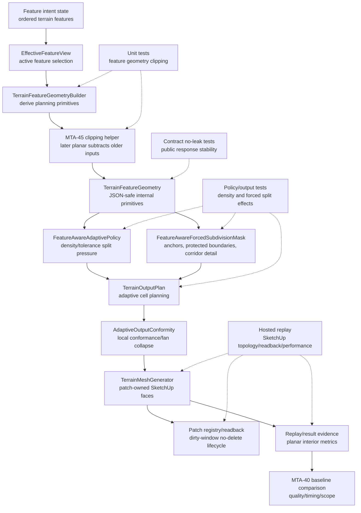

# Technical Plan: MTA-45 Reduce Unnecessary Planar Region Output Tessellation
**Task ID**: `MTA-45`
**Title**: `Reduce Unnecessary Planar Region Output Tessellation`
**Status**: `finalized`
**Date**: `2026-05-18`

## Source Task

- [Reduce Unnecessary Planar Region Output Tessellation](./task.md)

## Problem Summary

MTA-40 removed broad no-falloff planar density pressure and collapsed some coplanar fan triangles,
but older feature pressure can still leak through a later absolute planar edit when the older
feature crosses the planar footprint. A later no-falloff planar region is absolute only backward in
stack order: older corridor, target, survey, and fairing pressure must not drive planar-interior
tessellation inside the later planar footprint, while older pressure outside the footprint and newer
features above the planar edit remain valid.

The implementation must make that suppression geometric-intersection aware without introducing
detached overlay plates, cross-patch faces, post-emission face surgery, or public MCP contract
changes.

## Goals

- Remove older refinement pressure inside later rectangular no-falloff planar footprints before
  adaptive policy planning consumes it.
- Preserve older pressure and detail outside the planar footprint.
- Preserve newer corridor, target, survey, and fairing overlays inside or across the planar region.
- Keep positive planar falloff/blend as edge-transition detail, not broad planar interior pressure.
- Produce planar-specific evidence that separates interior face/vertex reduction from unrelated row
  effects.
- Preserve patch ownership, dirty-window replacement, registry/readback, no-delete behavior, and
  hosted performance comparability with MTA-40.

## Non-Goals

- Literal two-triangle planar patch emission across logical patch boundaries.
- Global CDT/TIN replacement, cross-patch polygon merging, detached overlays, stitch strips, or
  post-emission SketchUp face surgery.
- Exact clipping for every possible primitive shape in the first pass.
- Changing public MCP tool names, request schemas, dispatcher behavior, or public response shapes.
- Solving seam contracts, patch components, sparse local detail tiles, or exact hard-feature
  topology.

## Related Context

- [MTA-45 task](./task.md)
- [MTA-45 size ledger](./size.md)
- [MTA-40 summary](specifications/tasks/managed-terrain-surface-authoring/MTA-40-add-forced-subdivision-masks-for-feature-critical-geometry/summary.md)
- [MTA-39 summary](specifications/tasks/managed-terrain-surface-authoring/MTA-39-add-feature-aware-tolerance-and-density-fields/summary.md)
- [MTA-38 summary](specifications/tasks/managed-terrain-surface-authoring/MTA-38-establish-feature-aware-adaptive-baseline-policy-and-validation-harness/summary.md)
- [MTA-36 summary](specifications/tasks/managed-terrain-surface-authoring/MTA-36-productize-windowed-adaptive-patch-output-lifecycle-for-fast-local-terrain-edits/summary.md)
- [Managed Terrain Surface Authoring HLD](specifications/hlds/hld-managed-terrain-surface-authoring.md)
- [Recommended adaptive backend architecture](specifications/research/managed-terrain/recommended_new_adaptive_backend_architecture.md)

## Research Summary

- MTA-40 is the direct baseline. It removed no-falloff planar pressure, kept positive planar blend
  to edge/falloff detail, added forced subdivision summaries, preserved public contracts, and left
  literal two-triangle planar emission out of scope.
- MTA-40's forced subdivision path matters because corridor side-transition, endpoint-cap, falloff,
  and overlap reference segments can force detail independently from density pressure. Broad
  corridor pressure is skipped for forced masks, so MTA-45 must not be pressure-only.
- MTA-40 final planar rows are the before baseline:
  `planar-pad-intersect` had `1577` faces, `854` vertices, `densityHitCount=52`,
  `forcedHitCount=42`, and `100%` planar quality; `large-varied-planar-pad-timing` had `67189`
  faces, `34151` vertices, `densityHitCount=0`, `forcedHitCount=295`, and `100%` planar quality.
- MTA-40's isolated large planar rectangle reduced fully-inside triangles from `860` to `376`
  through coplanar fan collapse, but it did not implement intersection-aware suppression of older
  crossing feature pressure.
- Current `TerrainFeatureGeometryBuilder#suppress_occluded_output_geometry` handles fully contained
  older soft/firm geometry but preserves crossing geometry because suppression is containment-based.
- `FeatureAwareAdaptivePolicy` and `FeatureAwareForcedSubdivisionMask` are downstream consumers and
  should receive already-corrected feature geometry rather than each reimplementing stack-order
  planar semantics.

## Technical Decisions

### Data Model

- Keep `TerrainFeatureGeometry` as the internal JSON-safe carrier for derived primitives:
  `outputAnchorCandidates`, `protectedRegions`, `pressureRegions`, `referenceSegments`,
  `affectedWindows`, and `limitations`.
- Add or extend internal limitation/summary data only if needed for unsupported clipping or replay
  evidence. New internal data must be serializable and must not expose raw SketchUp objects.
- Required first-class clipping case: later rectangular no-falloff planar footprints subtract older
  refinement-driving primitives.

Initial clipping matrix:

- Older non-hard point anchors inside a later rectangular planar footprint are removed; outside
  anchors remain.
- Older reference/detail segments crossing the footprint are split at footprint intersections.
  Outside fragments preserve feature id, role, strength, and target cell size with deterministic
  fragment ids. Fully inside segments are removed.
- Older rectangle pressure crossing the footprint is subtracted into up to four outside rectangles.
  Fully inside pressure is removed; non-intersecting pressure remains unchanged.
- Older corridor area pressure can remain diagnostic/skipped unless implementation proves it still
  affects a planning consumer. Corridor compaction is required through corridor reference/detail
  segment clipping.
- Older circle pressure and circular planar partial intersections are conservative cases: keep the
  primitive and record an internal limitation unless a simple safe splitter is implemented. Fully
  contained circle pressure may still be removed.
- Hard fixed controls, preserve/protected regions, and protected boundary pressure remain exempt.

### API and Interface Design

- Implement a small pre-policy planning-input occlusion/clipping helper owned by feature geometry
  derivation. It runs after feature revisions and absolute planar regions are known and before
  `TerrainFeatureGeometry` is returned.
- Do not add stack-order planar filtering to `FeatureAwareAdaptivePolicy`,
  `FeatureAwareForcedSubdivisionMask`, `TerrainOutputPlan`, or mesh emission.
- Keep replay/result metrics internal. Public terrain command responses remain unchanged.

### Public Contract Updates

Not applicable. No public request fields, response fields, schema registration, dispatcher routing,
README, or example changes are planned.

If implementation discovers an unavoidable public delta, stop and reopen planning for coordinated
updates to `src/su_mcp/runtime/native/native_tool_catalog.rb`, dispatcher/command wiring, fixtures,
contract tests, docs, and examples.

### Error Handling

- Unsupported partial clipping preserves correctness over compaction. Retain the primitive and
  record an internal limitation rather than silently deleting valid outside influence.
- The required rectangular planar over older crossing corridor/detail case must not fall back.
- Valid heightmap output should not be refused merely because an optional partial-circle clipping
  case is unsupported.

### State Management

- Durable feature intent remains unchanged.
- Generated mesh topology remains derived output, not terrain source of truth.
- Patch lifecycle state remains under the existing single derived mesh and logical patch ownership
  model. No post-emission face mutation is planned.

### Integration Points

- `TerrainFeatureGeometryBuilder`: primary semantic boundary and clipping helper owner.
- `FeatureAwareAdaptivePolicy`: consumes clipped pressure and anchors for density/tolerance.
- `FeatureAwareForcedSubdivisionMask`: consumes clipped anchors, protected boundaries, and
  reference/detail segments for forced splits.
- `TerrainOutputPlan` and `AdaptiveOutputConformity`: consume corrected policy decisions and may
  remain unchanged unless metrics prove bounded local cleanup is needed.
- `TerrainMeshGenerator` and patch lifecycle: hosted validation boundary for emitted faces,
  ownership, registry/readback, dirty-window scope, and no-delete behavior.
- Replay/result probes: internal planar-interior metric and MTA-40 comparison boundary.

### Configuration

No public or user-facing configuration is planned. Any internal thresholds used for centroid
classification or boundary exclusion should be deterministic constants local to replay/metric code.

## Architecture Context

## Key Relationships

- Stack-order semantics are decided before policy planning; downstream layers consume corrected
  primitives.
- Newer overlays remain authoritative because clipping only compares older primitive revisions
  against later absolute planar revisions.
- MTA-40 forced subdivision means reference/detail segments are as important as density pressure.
- Hosted replay is required because local tests cannot prove SketchUp face ownership, visual
  topology, registry/readback, or timing behavior.

## Acceptance Criteria

- Later rectangular no-falloff planar regions remove older soft/firm refinement-driving inputs
  inside their footprints before adaptive policy planning consumes those inputs.
- Older crossing corridor reference/detail segments no longer drive forced subdivision inside the
  later planar footprint, while outside fragments remain available to drive valid outside detail.
- Older rectangular pressure regions no longer drive density or tolerance inside the later planar
  footprint, while outside remnants remain available to drive valid outside pressure.
- Newer corridor, target, survey, and fairing features remain represented and continue to drive
  their own density, tolerance, or forced subdivision behavior.
- Positive planar falloff/blend continues to emit only edge/transition detail and does not
  reintroduce broad planar interior pressure.
- Unsupported partial intersections preserve correctness over compaction and record internal
  limitations when fallback behavior is used.
- The required rectangular planar over older crossing corridor/detail case does not use fallback
  behavior.
- Relevant planar replay rows record total face/vertex deltas, planar-interior face/vertex deltas
  or an equivalent planned-face metric, planar quality, timing, dirty-window scope, patch scope,
  registry/readback, and fallback/no-delete outcomes versus MTA-40 final artifacts.
- Patch-owned output remains stitched to surrounding terrain without detached plates, holes,
  unowned cross-patch faces, or post-emission face surgery.
- Public MCP tool names, request schemas, dispatcher behavior, and public response shapes remain
  unchanged.
- Three-run hosted performance evidence for relevant planar rows shows no unacceptable timing
  regression against the MTA-40 final performance summary.

## Test Strategy

### TDD Approach

Start at the feature-geometry seam because that is the semantic source of truth. The first failing
target should replace the existing crossing-corridor expectation in
`test/terrain/features/terrain_feature_geometry_builder_test.rb`: a later rectangular no-falloff
planar region must split or suppress older crossing corridor detail inside the footprint while
preserving outside fragments. This is a hard prerequisite before policy, metric, or hosted replay
work. The same first slice must assert deterministic fragment ids and preservation of role,
strength, target cell size, and feature id for outside fragments. Then move outward to
policy/forced-mask effects, replay metrics, contract no-leak coverage, and hosted evidence.

### Required Test Coverage

| Provisional queue order | AC / requirement | Behavior or risk | Candidate implementation slice | Likely owner | Unit/core coverage | Integration/runtime coverage | Contract/schema coverage | Error/refusal coverage | Hosted/manual validation | Likely fixtures/helpers | Integration points | Suggested focused command | Suggested broader command | Blocker or explicit gap |
|---|---|---|---|---|---|---|---|---|---|---|---|---|---|---|
| 1 | Later rectangular planar suppresses older crossing pressure only inside footprint | Core stack-order bug | Feature-geometry clipping helper | `TerrainFeatureGeometryBuilder` | Replace crossing-corridor preservation test with segment-splitting assertions; assert deterministic fragment ids and role/strength/target-cell/feature-id preservation; add rectangle-pressure subtraction tests | Policy/output-plan test that inside cells no longer get older density or forced split while outside cells still do | n/a | Rectangular crossing must not fallback | Planar replay rows after metrics | Existing planar/corridor feature helpers | Feature geometry -> policy | `bundle exec ruby -Itest test/terrain/features/terrain_feature_geometry_builder_test.rb test/terrain/output/feature_aware_adaptive_policy_test.rb` | `bundle exec rake ruby:test` | Hard prerequisite; no fallback allowed |
| 2 | Newer overlays remain authoritative | Planar applied forward would erase new edits | Feature-order comparison in clipping helper | `TerrainFeatureGeometryBuilder` | Newer corridor/target/survey/fairing tests where primitives survive inside planar footprint | Policy/output-plan test that newer overlay still drives split | n/a | n/a | Existing replay may cover survey/fairing after planar; add hosted row if ambiguous | Older/planar/newer fixture sequence | Feature geometry -> forced mask -> output plan | Same focused feature/policy command | `bundle exec rake ruby:test` | Required |
| 3 | Positive planar falloff remains edge detail | Falloff could become broad interior pressure | Existing planar derivation plus clipping exclusions | `TerrainFeatureGeometryBuilder` | Retain no-falloff/no-pressure and falloff-edge tests | Forced-mask summary shows falloff detail only when applicable | n/a | n/a | Replay quality rows with planar quality | Existing planar feature helpers | Geometry -> forced mask | Focused feature/policy tests | `bundle exec rake ruby:test` | Required |
| 4 | Unsupported primitive intersections preserve correctness | Unsafe deletion can erase valid outside pressure | Clipping fallback and limitations | Feature geometry helper | Circle/circular-planar partial fallback test if no splitter; limitation recorded | Policy fallback summary remains non-refusing for valid output | No-leak if limitation vocabulary could escape | Unsupported optional cases retain primitive | Hosted evidence records limitation only if encountered | Circle pressure fixtures | Geometry -> policy fallback summaries | Focused feature/policy tests | `bundle exec rake ruby:test` | Acceptable for circle/circular partial cases; blocker if rectangular corridor case falls back |
| 5 | Planar-interior improvement is measurable | Total row count can hide unrelated effects | Replay/result metric helper | Replay/probes | Metric helper tests for centroid/vertex classification against no-falloff planar footprint | Result document/classifier tests compare planar interior deltas against MTA-40 final rows | No public response fields; exact no-leak terms for any new metric vocabulary | n/a | MTA-38 replay against MTA-40 final artifacts | MTA-40 final result pack | Replay result -> classifier/document | `bundle exec ruby -Itest test/terrain/probes/feature_aware_adaptive_baseline_result_classifier_test.rb test/terrain/replay/feature_aware_adaptive_baseline_replay_test.rb` | `bundle exec rake ruby:test` plus hosted replay | Mandatory result-pack column: planar-interior face/vertex delta or equivalent planned-cell delta |
| 6 | Patch ownership, registry/readback, dirty-window, no-delete remain intact | Topology/lifecycle regression | Existing output generation path; no post-emission surgery | Output/mesh lifecycle | n/a unless output planning changes | `TerrainMeshGenerator`/patch lifecycle tests if face counts or planned cells change | n/a | Existing no-delete fallback behavior | Hosted replay captures registry/readback, dirty-window, patch scope, fallback/no-delete | Existing replay scenes | Mesh generation -> patch registry | Existing output and patch lifecycle tests | Hosted replay | Required if downstream compaction beyond feature clipping is added |
| 7 | Public MCP contracts unchanged | Internal diagnostics leak to public response | Command/evidence sanitization | Command/contract layer | n/a | Command evidence tests if diagnostics touch command path | Contract no-leak assertions for exact new internal terms, including `planarInterior`, `planarCompaction`, `occlusion`, clipping counters, and any new `adaptivePolicySummary` or `forcedSubdivisionSummary` keys | n/a | n/a | Existing contract fixtures | Command diagnostics -> evidence builder | `bundle exec ruby -Itest test/terrain/contracts/terrain_contract_stability_test.rb` | `bundle exec rake ruby:test` | Required if diagnostics touch command path |
| 8 | Performance does not regress unacceptably | Clipping/metrics increase planning cost | Feature clipping and replay metrics | Feature/probe/runtime | n/a | Replay/perf summary tests if result format changes | n/a | n/a | Three-run hosted performance comparison for planar rows against MTA-40 final perf summary | MTA-38/MTA-40 replay harness | Hosted replay -> perf summary | Focused replay/probe tests | Hosted performance replay | Required before closeout |

Likely first failing target:
`test/terrain/features/terrain_feature_geometry_builder_test.rb`, replacing
`test_later_absolute_planar_region_preserves_crossing_corridor_edge_detail` with the corrected
intersection-aware suppression expectation.

## Instrumentation and Operational Signals

- Mandatory internal/replay-only planar-interior face and vertex deltas for the two existing MTA-40
  planar rows, or an equivalent planned-cell delta if emitted-face classification is infeasible.
- Clipping/fallback limitation counts if unsupported primitive cases are encountered.
- Existing `adaptivePolicySummary.densityHitCount` and `forcedSubdivisionSummary.hitCount` for
  relevant planar rows.
- Planar quality summaries from the existing replay quality sampler.
- Dirty-window scope, affected/replacement patch scope, registry/readback, fallback/no-delete
  outcomes, and repeated timing bands.

## Implementation Phases

1. Add failing focused tests for stack-order/intersection semantics in feature geometry derivation,
   including older crossing pressure clipped inside the later planar footprint and newer overlay
   pressure preserved. This phase is not complete until the rectangular planar over older crossing
   corridor/detail case splits outside fragments and does not fall back to retain-primitive behavior.
2. Implement intersection-aware clipping/suppression before policy planning for supported
   refinement-driving primitives; keep primitive support conservative and preserve pressure/detail
   outside the planar footprint.
3. Prove policy/output-plan effect locally: inside the planar footprint no longer splits from older
   clipped inputs, while outside pressure and newer overlays still split when expected.
4. Add planar-interior metric/diagnostic support needed for before/after evidence without changing
   public MCP responses.
5. Run integration/replay validation for face/vertex reduction, planar quality, dirty-window scope,
   patch ownership/readback, no-delete behavior, and repeated timing bands.
6. Only if metrics show unacceptable residual planar-interior tessellation after upstream clipping,
   consider bounded planned-cell/conformity compaction inside existing patch ownership; otherwise
   record a limitation rather than broadening scope.

## Rollout Approach

- Ship as an internal behavior correction in the existing managed-terrain runtime. No user opt-in,
  migration, or public contract rollout is planned.
- Keep the first release bounded to required rectangular planar/corridor/rectangle-pressure
  behavior. Unsupported partial-circle cases can remain internal limitations.
- Do not deploy downstream compaction unless upstream clipping and metrics prove it is still needed
  and ownership-local.

## Risks and Controls

- Older crossing pressure still leaks because only containment is handled: replace the existing
  crossing-corridor expectation and require segment/rectangle clipping tests before any policy or
  metric work.
- Pressure-only clipping misses forced subdivision: include anchors, reference/detail segments, and
  forced-subdivision-driving roles in the primitive taxonomy.
- Newer overlays are flattened by planar semantics: prove stack-order direction with newer
  corridor/target/survey/fairing tests.
- Valid outside pressure is erased: split/subtract required rectangular cases into outside
  fragments; unsupported cases retain primitives with limitations.
- Internal metrics misattribute improvement: add planar-interior metrics and focused automated
  semantic tests; use hosted quality/topology as authoritative evidence.
- Public contract drift: keep diagnostics internal and add no-leak contract assertions if new
  vocabulary touches command diagnostics, including exact terms introduced in `adaptivePolicySummary`
  or `forcedSubdivisionSummary`.
- SketchUp no-delete failure: hosted replay must record fallback/no-delete outcomes before old
  output is erased.
- Incomplete face ownership after face-count changes: validate mesh/patch lifecycle behavior and
  hosted registry/readback.
- Dirty-window scope broadens unexpectedly: compare dirty-window and affected/replacement patch
  scope against MTA-40 final rows.
- Visual topology differs from local assumptions: hosted replay must check for holes, detached
  plates, cracks, and registry/readback.

## Premortem Gate

Status: PASS

### Unresolved Tigers

- None.

### Plan Changes Caused By Premortem

- Made the feature-geometry crossing-corridor split test a hard prerequisite before policy, metric,
  or hosted replay work.
- Required deterministic fragment ids and preservation of role, strength, target cell size, and
  feature id for outside segment fragments.
- Made planar-interior face/vertex deltas, or an equivalent planned-cell delta, mandatory evidence
  for the two existing MTA-40 planar rows.
- Expanded public no-leak coverage to exact new metric/summary vocabulary if diagnostics touch the
  command path.

### Accepted Residual Risks

- Risk: Partial circle/circular-planar intersections may retain older primitives and leave residual
  tessellation.
  - Class: Paper Tiger
  - Why accepted: The task's required proof centers rectangular no-falloff planar regions over older
    crossing corridor/detail and rectangle pressure; correctness is safer than unsafe partial
    deletion for optional circular cases.
  - Required validation: Fallback tests must record internal limitations without deleting valid
    outside pressure or newer overlays.
- Risk: Future feature-order changes could reintroduce clipped primitives after the helper runs.
  - Class: Elephant
  - Why accepted: Current implementation can enforce one authoritative pre-policy ordering point;
    future ordering changes belong to later task/review guardrails.
  - Required validation: Current stack-order tests must cover older-under-planar and newer-over-planar
    sequences.

### Carried Validation Items

- Hosted replay must report planar-interior deltas for `planar-pad-intersect` and
  `large-varied-planar-pad-timing` or add an equivalent internal planned-cell metric.
- Hosted validation must compare planar quality, timing, dirty-window scope, affected/replacement
  patch scope, registry/readback, and fallback/no-delete outcomes against MTA-40 final artifacts.
- Add a hosted row only if the existing planar rows cannot demonstrate rectangular crossing
  suppression or newer-overlay preservation after metrics land.

### Implementation Guardrails

- Rectangular planar over older crossing corridor/detail reference segments must not fall back to
  retain-primitive behavior.
- Do not accept total-row face/vertex deltas as the only proof of planar compaction.
- Do not add stack-order planar filtering to policy, forced-mask, output-plan, or mesh-emission
  layers as the primary mechanism.
- Do not introduce public request/response/schema changes without reopening planning.
- Do not use detached overlays, cross-patch faces, stitch strips, or post-emission face surgery as
  the normal compaction strategy.

## Dependencies

- MTA-40 final replay artifacts and performance summary.
- MTA-38 replay/capture/result and quality sampler infrastructure.
- MTA-39 feature-aware density/tolerance policy behavior.
- MTA-40 forced subdivision mask behavior and summary fields.
- MTA-36 patch lifecycle ownership, dirty-window, registry/readback, and no-delete semantics.
- Ruby test suite, RuboCop, and SketchUp-hosted replay environment.

## Quality Checks

- [x] All required inputs validated
- [x] Problem statement documented
- [x] Goals and non-goals documented
- [x] Research summary documented
- [x] Technical decisions included
- [x] Architecture context included
- [x] Acceptance criteria included
- [x] Test requirements specified as a provisional coverage-matrix seed
- [x] Instrumentation and operational signals defined when needed
- [x] Risks and dependencies documented
- [x] Rollout approach documented when needed
- [x] Small reversible phases defined
- [x] Premortem completed with falsifiable failure paths and mitigations
- [x] Planning-stage size estimate considered before premortem finalization
