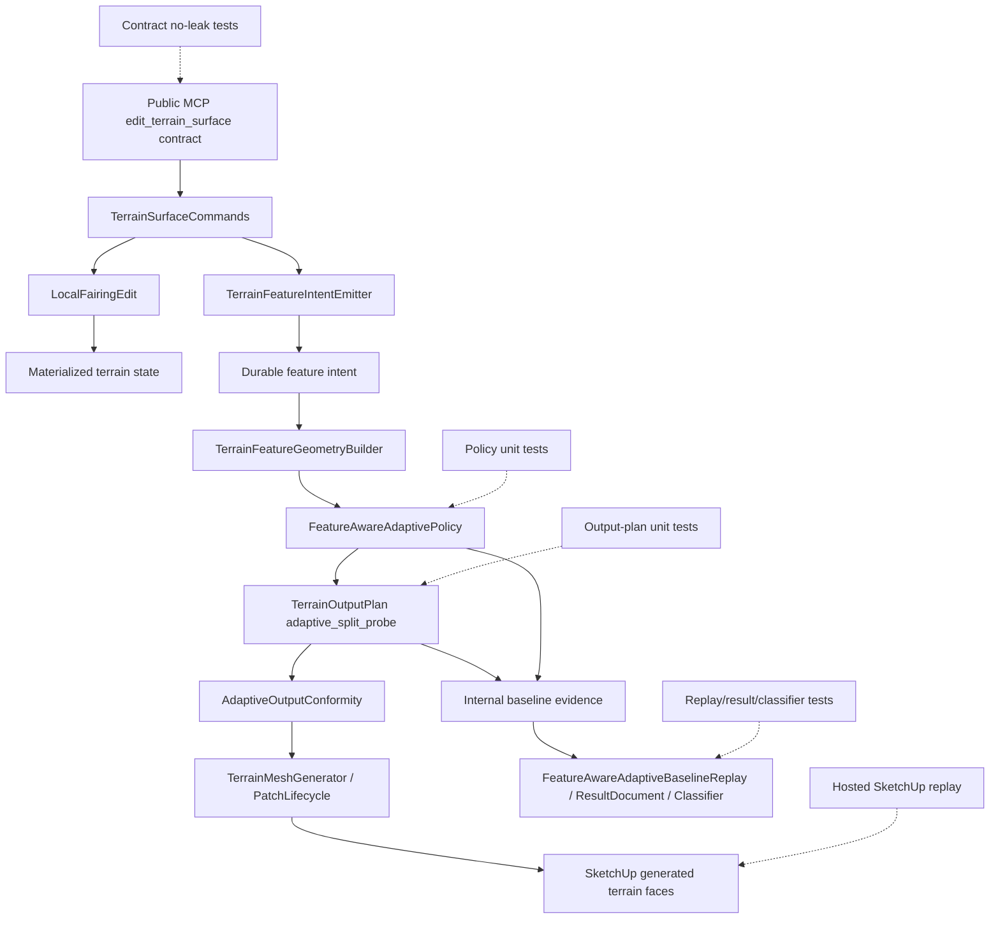

# Technical Plan: MTA-46 Make Fairing Output Pressure Residual-Aware
**Task ID**: `MTA-46`
**Title**: `Make Fairing Output Pressure Residual-Aware`
**Status**: `finalized`
**Date**: `2026-05-20`

## Source Task

- [Make Fairing Output Pressure Residual-Aware](./task.md)

## Problem Summary

MTA-45 made no-falloff planar regions compact when older output pressure is clipped and no later
feature requires detail. A later hosted inspection found a different issue: broad circular
`local_fairing` intent can still force dense adaptive output over low-error or planar terrain
because `fairing_support` currently contributes unconditional soft density pressure. The final
heightfield can pass planar or fairing quality checks while the emitted mesh remains unnecessarily
dense, so MTA-46 must separate height correctness from output compactness.

The implementation should make fairing-derived density pressure advisory and residual-aware.
Fairing should not force `targetCellSize` subdivision when the post-edit cell residual is already
within tolerance, but genuinely bumpy or high-residual fairing regions must keep adaptive detail.

## Goals

- Suppress fairing-only density subdivision for cells whose post-edit residual is within effective
  output tolerance.
- Preserve fairing detail where residual error still exceeds tolerance, including mixed circular
  fairing regions with low-error and high-error portions.
- Preserve existing authoritative behavior for hard, firm, protected, survey, corridor, target, and
  forced-subdivision pressure.
- Keep public MCP terrain command names, schemas, dispatcher routes, response shapes, docs, and
  examples unchanged.
- Prove the behavior with policy/output TDD, no-leak coverage for new internal evidence, fixture or
  replay evidence for both acceptance sides, and hosted SketchUp topology/timing validation.

## Non-Goals

- Replacing the adaptive patch/cell output path, CDT backend decisions, or mesh-generation backend.
- Globally suppressing newer fairing just because it overlaps planar output.
- Changing `LocalFairingEdit` semantics unless implementation evidence proves the post-edit
  heightfield is wrong.
- Making all soft pressure residual-aware in MTA-46.
- Solving exact circular topology or exact feature-boundary triangulation.
- Adding public terrain edit refusals for unsupported residual-aware fairing evidence.

## Related Context

- [Managed Terrain Surface Authoring](specifications/hlds/hld-managed-terrain-surface-authoring.md)
- [Recommended Backend Architecture for Feature-Aware Adaptive Terrain Output](specifications/research/managed-terrain/recommended_new_adaptive_backend_architecture.md)
- [MTA-38 task](specifications/tasks/managed-terrain-surface-authoring/MTA-38-hosted-feature-aware-adaptive-baseline/task.md)
- [MTA-39 task](specifications/tasks/managed-terrain-surface-authoring/MTA-39-apply-feature-aware-adaptive-output-policy/task.md)
- [MTA-40 task](specifications/tasks/managed-terrain-surface-authoring/MTA-40-preserve-critical-feature-detail-during-adaptive-output/task.md)
- [MTA-45 task](specifications/tasks/managed-terrain-surface-authoring/MTA-45-reduce-unnecessary-planar-region-output-tessellation/task.md)

## Research Summary

- MTA-38 provides the hosted replay/capture/result-document harness, timing buckets, face/vertex
  evidence, dirty-window and affected-patch summaries, and no-public-leak posture.
- MTA-39 introduced `FeatureAwareAdaptivePolicy`, bounded rectangle/circle pressure,
  `densityHitCount`, internal `adaptivePolicySummary`, and quality sampling. It also showed that
  allocation evidence, quality evidence, timing, and face-count reduction must remain separate.
- MTA-40 split forced subdivision from residual and density pressure. Forced masks remain
  authoritative and must not be weakened by fairing residual gates.
- MTA-45 added planar occlusion/coalescing and showed that policy tests can pass while hosted output
  topology still exposes dense emitted meshes. It also established the clean planar comparison:
  create large terrain, apply local target, apply diagonal corridor, then apply the no-falloff
  planar pad. The later full replay final state adds survey and fairing rows, so it is not clean
  proof of the planar edit itself.
- Current implementation research identified the smallest seam: `FeatureAwareAdaptivePolicy`
  should classify fairing-only density pressure, while `TerrainOutputPlan.adaptive_split_probe`
  should apply the existing residual probe before fairing-only pressure can force subdivision.

## Technical Decisions

### Data Model

- Do not change terrain state, feature intent storage, or `LocalFairingEdit` output.
- Keep fairing intent as durable `fairing_region` data emitted by
  `src/su_mcp/terrain/features/terrain_feature_intent_emitter.rb`.
- Continue deriving `fairing_support` through
  `src/su_mcp/terrain/features/terrain_feature_geometry_builder.rb`.
- Add only internal pressure-classification/evidence fields. Exact Ruby names can be chosen during
  implementation, but the semantics must distinguish fairing pressure considered, applied, and
  skipped, or an equivalent set of fairing-only residual-gate outcomes.

### API and Interface Design

- `FeatureAwareAdaptivePolicy` owns role classification. It should expose enough structured detail
  from `split_pressure_for` or an adjacent tested helper for output planning to know whether a
  density split is fairing-only, mixed with authoritative pressure, or non-fairing.
- `TerrainOutputPlan` owns residual measurement and the final split decision. It must not parse raw
  feature geometry to infer fairing roles.
- Gate every fairing-only density split by residual, not only planar-interior fairing cells. If
  residual exceeds effective tolerance, normal residual subdivision preserves needed detail. If
  residual is within tolerance, fairing-only `targetCellSize` pressure must not subdivide the cell.
- Preserve existing `target_support` and inferred `hard_break` behavior even though they share the
  soft `targetCellSize = 4` mechanism. MTA-46 stays scoped to `fairing_support`.

### Public Contract Updates

- No public MCP contract update is planned.
- No public request/response schema, native tool catalog, dispatcher route, README text, or public
  example should change.
- If implementation unexpectedly changes a public surface, update the runtime behavior, native
  catalog/schema, dispatcher, public contract fixtures, README/docs/examples, and runtime tests in
  the same change before closeout.
- Any new internal evidence vocabulary must be covered by no-leak tests so it does not appear in
  public terrain command responses.

### Error Handling

- Residual-aware fairing is best-effort internal output policy.
- Unsupported or partial feature geometry must continue through existing fallback/limitation
  summaries rather than adding public terrain edit refusals.
- If fairing classification is unavailable for a cell, preserve current conservative behavior
  rather than dropping non-fairing or authoritative pressure.

### State Management

- No migration is planned. The task changes derived output planning and internal diagnostics only.
- Existing terrain state, feature intent revisions, generated terrain containers, and registry
  readback behavior remain unchanged.

### Integration Points

- `src/su_mcp/terrain/output/feature_aware_adaptive_policy.rb`: classify density pressure roles and
  preserve current summary behavior unless internal evidence is deliberately extended.
- `src/su_mcp/terrain/output/terrain_output_plan.rb`: apply the fairing-only residual gate before
  subdivision creates child cells; keep planar compaction as a later optimization, not the primary
  fix.
- `src/su_mcp/terrain/commands/terrain_surface_commands.rb`: thread internal baseline evidence if
  new fairing-pressure evidence is needed.
- `src/su_mcp/terrain/probes/feature_aware_adaptive_baseline_replay.rb`,
  `src/su_mcp/terrain/probes/feature_aware_adaptive_baseline_result_document.rb`, and
  `src/su_mcp/terrain/probes/feature_aware_adaptive_baseline_result_classifier.rb`: serialize and
  compare internal evidence only where needed; do not treat skip counts alone as success.
- `test/terrain/replay/feature_aware_adaptive_baseline*.json`: reuse existing rows only if they
  isolate both low-error and bumpy acceptance sides; otherwise add focused fixture rows.

### Configuration

- No new user-facing configuration is planned.
- Use existing base/local tolerance and `max_cell_error_probe` behavior for residual decisions.
- Do not add a residual cache unless profiling during implementation proves duplicate scans are a
  material problem.

## Architecture Context

## Key Relationships

- `LocalFairingEdit` computes the post-edit heightfield and fairing diagnostics; MTA-46 should not
  move output-density policy into that edit kernel.
- `TerrainFeatureGeometryBuilder` is the earliest place where fairing pressure is distinct from
  other soft pressure, but residual measurement belongs later in `TerrainOutputPlan`.
- `FeatureAwareAdaptivePolicy` should expose role-aware split pressure without leaking raw feature
  geometry into the planner.
- `TerrainOutputPlan` decides whether fairing-only pressure still splits after measuring residual.
- Replay and result-document surfaces are internal evidence layers; public MCP responses remain
  stable.

## Acceptance Criteria

- Low-error circular `fairing_support` overlap does not force adaptive output toward fairing
  `targetCellSize` when cell residual is within effective tolerance.
- The residual gate acts before fairing density subdivision, not as late annotation or late
  compaction.
- Low-error fairing-over-planar output shows measurable planned/emitted compactness, not only
  passing planar quality sampling.
- Circular fairing over bumpy or high-residual terrain retains adaptive detail where residual error
  exceeds tolerance.
- Mixed circular fairing regions can contain coarsened low-error portions and refined high-error
  portions.
- Fairing overlapping hard, firm, protected, survey, corridor, target, or forced-subdivision inputs
  does not suppress those authoritative policies.
- `target_support` and inferred `hard_break` retain current behavior in MTA-46.
- Circular fixtures use circular input and record whether policy-effective bounds remain a
  limitation; exact circular topology remains out of scope.
- Internal evidence distinguishes fairing pressure considered/applied/skipped or equivalent
  semantics, and those counts are not success criteria by themselves.
- Public MCP tool names, request schemas, dispatcher routes, response shapes, and user-facing docs
  remain unchanged.
- Unsupported or partial feature geometry does not add public refusals.
- Hosted or fixture validation separately proves low-error fairing-over-planar compaction and bumpy
  circular fairing detail retention.
- Hosted evidence compares face counts, planar/fairing quality or residual error,
  `maxSimplificationError`, timing, dirty-window scope, and affected patch scope against relevant
  MTA-45/MTA-40 baselines.

## Test Strategy

### TDD Approach

Start with the smallest failing policy and output-plan seams before production edits. The first
failing target should be a `FeatureAwareAdaptivePolicy` test proving role-aware pressure
classification can identify fairing-only density pressure while preserving `target_support` and
inferred `hard_break`. The second failing target should be a `TerrainOutputPlan` test proving
low-residual fairing-only pressure does not split before child cells are created. That output-plan
test must also prove the residual used by the gate comes from the current post-edit heightfield and
that a skipped fairing-only density split does not leave stale `fairing_support` / `targetCellSize`
state that later compaction refuses to merge.

After the core behavior is green, add internal evidence/no-leak coverage, then replay/result or
classifier coverage only if implementation threads new evidence through those surfaces. Hosted
SketchUp replay is the final acceptance gate because the defect is emitted topology, not only a
policy counter.

### Required Test Coverage

| Provisional queue order | AC / requirement | Behavior or risk | Candidate implementation slice | Likely owner | Unit/core coverage | Integration/runtime coverage | Contract/schema coverage | Error/refusal coverage | Hosted/manual validation | Likely fixtures/helpers | Integration points | Suggested focused command | Suggested broader command | Blocker or explicit gap |
|---|---|---|---|---|---|---|---|---|---|---|---|---|---|---|
| 1 | Fairing pressure is advisory/conditional | Policy cannot distinguish fairing-only from other density pressure | Role-aware pressure classification | `FeatureAwareAdaptivePolicy` | Add assertions for `fairing_support` classification and current density behavior | n/a | n/a | n/a | n/a | Existing pressure fixtures or small inline circle/rectangle pressures | Feature geometry -> policy | `bundle exec ruby -Itest test/terrain/output/feature_aware_adaptive_policy_test.rb` | `bundle exec rake ruby:test` | Required first failing target |
| 2 | Non-fairing soft pressure unchanged | Shared `targetCellSize = 4` mechanism broadens MTA-46 scope | Policy regression | `FeatureAwareAdaptivePolicy` | Assert `target_support` and inferred `hard_break` still trigger current target-cell density behavior in the first policy red-test slice | n/a | n/a | n/a | Hosted comparison only if existing rows isolate these roles | Existing target and hard-break fixtures | Policy classification | Same policy test command | `bundle exec rake ruby:test` | Required in Phase 1, not a late regression |
| 3 | Residual gate acts before subdivision | Gate happens after dense leaves already exist, or reads a stale/pre-fairing residual | Output split probe | `TerrainOutputPlan` | Direct `adaptive_split_probe` or observable output-plan test must assert low-residual fairing-only cell returns no split before child bounds or recursive subdivision are created; fixture residual used by the gate must match the current post-edit heightfield, and fairing diagnostics if exposed | n/a | n/a | n/a | n/a | Low-error circular fairing over planar cell | Policy -> output plan | `bundle exec ruby -Itest test/terrain/output/terrain_output_plan_test.rb` | `bundle exec rake ruby:test` | Required |
| 4 | Low-error fairing-over-planar compacts | Quality passes while topology remains dense, or stale fairing target markers block coalescing | Output residual gate and planar compaction interaction | `TerrainOutputPlan` | Verify coarse/merged planned cells or face-count proxy, not only `density_split: false`; assert skipped fairing-only pressure does not leave `fairing_support` / `targetCellSize=4` state that planar compaction refuses to merge | Command baseline evidence if summary changes | Public no-leak if evidence changes | n/a | Hosted isolated planar sequence plus later circular fairing-over-planar evidence | Large planar plus circular fairing fixture | Output plan -> mesh | Output-plan focused command plus policy tests | Full Ruby tests plus hosted replay | Required |
| 5 | Bumpy fairing preserves detail | Fairing detail is under-preserved | Output residual gate | `TerrainOutputPlan` | Bumpy/high-residual circular fairing fixture expects residual subdivision where error exceeds tolerance | Replay/quality evidence if fixture added | n/a | n/a | Separate hosted or fixture bumpy circular fairing case | Bumpy circle fixture, preferably with mixed low/high residual regions | Residual probe -> output plan | Output-plan focused command | Full Ruby tests plus hosted replay | Required |
| 6 | Mixed fairing regions diverge locally | Gate treats entire fairing envelope uniformly | Output residual gate | `TerrainOutputPlan` | Fixture with one low-error portion and one high-error portion verifies different split outcomes | n/a | n/a | n/a | Optional hosted proof if local fixture is not convincing | Mixed circular fairing helper | Output split probe | Output-plan focused command | Full Ruby tests | Required if practical locally; otherwise hosted gap |
| 7 | Authoritative pressure remains authoritative | Fairing gate suppresses hard/survey/corridor/protected/forced detail | Mixed-pressure regression | Policy and output plan | Fixture where fairing overlaps hard/firm/protected/forced pressure and authoritative split/tolerance remains | Existing replay rows should stay stable | n/a | n/a | Hosted replay should not show suppressed survey/corridor/protected detail | Mixed pressure fixtures | Policy -> forced mask -> output plan | Policy and output focused commands | Full Ruby tests plus hosted replay | Required |
| 8 | Internal evidence separates allocation from quality | Skip counts are mistaken for success | Evidence threading | Policy summary / command evidence / result document | Summary tests for considered/applied/skipped or equivalent counts if added | Replay/result document tests if fields serialize | No-leak assertions for new internal terms | n/a | Hosted result pack carries evidence beside compactness and quality/residual | Existing replay result fixtures | Evidence -> public contract boundary | `bundle exec ruby -Itest test/terrain/probes/feature_aware_adaptive_baseline_result_document_test.rb test/terrain/replay/feature_aware_adaptive_baseline_replay_test.rb test/terrain/contracts/terrain_contract_stability_test.rb` | `bundle exec rake ruby:test` | Required if evidence fields are added |
| 9 | Classifier does not overclaim success | Classifier passes rows on skip counts alone | Classifier comparison | Result classifier | Classifier tests only if comparison logic changes; success must require compactness plus quality/residual, not skip counts alone | Replay annotation tests if rows change | n/a | n/a | Annotated rows classify success only with compactness and quality/residual proof | Result classifier fixture rows | Result document -> classifier | `bundle exec ruby -Itest test/terrain/probes/feature_aware_adaptive_baseline_result_classifier_test.rb` | `bundle exec rake ruby:test` | Required if classifier changes |
| 10 | Circle remains circle-scoped in proof | Bounds make the test rectangle-only | Fixture/evidence | Policy/output tests and replay fixtures | Include circle primitives and a mandatory point/cell inside circle bounds but outside radius to expose bounds overstatement | Replay fixture validation if rows added; record bounds overstatement in internal result evidence if material | n/a | n/a | Hosted evidence records circular input and any bounds limitation | Circle pressure fixture | Feature geometry -> policy -> output | Policy/output/replay focused tests | Hosted replay | Exact circle topology remains out of scope |
| 11 | Hosted topology proves both sides | Local tests pass but SketchUp output stays dense or loses detail | Hosted replay closeout | Replay/capture workflow | n/a | Replay/result document tests for any row changes | n/a | n/a | Mandatory low-error fairing-over-planar and bumpy circular fairing evidence with face count, quality/residual, timing, dirty-window, and patch-scope comparison | MTA-38 replay corpus plus new rows if needed | Runtime -> SketchUp output | Replay/result focused tests before hosted run | Full Ruby tests plus hosted timing summary | Final acceptance gate |
| 12 | Performance remains bounded | Residual-aware check double-scans cells or regresses timing | Residual probe reuse | `TerrainOutputPlan` | Preserve short-circuit behavior; if `max_cell_error_probe` is called twice for the same cell in one `adaptive_split_probe` path, a focused guard should fail unless implementation proves the second probe is unreachable/necessary | Timing buckets in replay evidence | n/a | n/a | Compare repeated hosted timing bands against MTA-45/MTA-40 summaries | Existing timing rows plus fairing-over-planar row | Residual probe -> output plan -> hosted replay | Output focused tests | Full Ruby tests plus hosted timing summary | Required before hosted timing claim |

Likely first failing target:
`test/terrain/output/feature_aware_adaptive_policy_test.rb` for fairing-only pressure classification,
followed by `test/terrain/output/terrain_output_plan_test.rb` for fairing-only residual-gated split
behavior.

## Instrumentation and Operational Signals

- Internal fairing pressure considered/applied/skipped counts or equivalent residual-gate evidence.
- Existing `adaptivePolicySummary.densityHitCount` retained or deliberately reinterpreted with
  tests if the meaning changes.
- Planned/emitted compactness signals: adaptive cell counts where available, face count, vertex
  count, and `planarInteriorMetrics.faceCount`.
- Quality/residual signals: planar quality, fairing quality or residual error, and
  `maxSimplificationError`.
- Hosted operational signals: elapsed timing buckets, dirty-window scope, affected patch scope,
  registry/readback health, and stable row identifiers.

## Implementation Phases

1. Add red policy tests for fairing-only pressure classification and unchanged `target_support` /
   inferred `hard_break` behavior. These regressions belong in the first policy slice, not in a
   late cleanup pass.
2. Add red output-plan tests for low-residual fairing-only non-split, bumpy/high-residual fairing
   preservation, mixed fairing behavior where practical, and fairing plus authoritative pressure.
   The low-residual test must prove the decision happens before child bounds or recursive
   subdivision are created.
3. Implement the policy-to-output-plan role handoff and residual-gated fairing-only split decision.
4. Add compact internal evidence for fairing pressure considered/applied/skipped if needed to prove
   behavior, plus no-leak contract coverage.
5. Update replay/result/classifier fixtures only as needed; add or annotate isolated planar-then-
   fairing and bumpy circular fairing rows if existing rows cannot prove both acceptance sides.
6. Run focused tests, full Ruby tests, lint/package checks, and hosted SketchUp replay with repeated
   timing bands and topology/quality comparison.

## Rollout Approach

- Ship as an internal output-policy change behind existing terrain command behavior.
- Keep fallback conservative: if classification is unavailable, do not drop existing pressure.
- Do not alter public contracts or require user migration.
- Treat hosted replay failure on either low-error compaction or bumpy detail preservation as a
  blocker, not a documentation-only gap.

## Risks and Controls

- Fairing detail under-preserved: bumpy and mixed circular fairing fixtures must prove residual
  subdivision remains where error exceeds tolerance.
- Gate applied too late: direct output-plan tests must prove the fairing-only low-residual cell does
  not split before child cells are created.
- Evidence overclaims success: allocation, compactness, quality/residual, and timing evidence stay
  separate; classifier success cannot depend on skip counts alone.
- Fixture entanglement: the full MTA-45 final replay state is not sufficient proof; use or add
  isolated planar-then-fairing and bumpy fairing fixtures.
- Circular bounds overstatement: use circular inputs and bounds-versus-radius sensitivity where
  practical; record remaining bounds limitation instead of solving exact circular topology.
- Blanket planar override: gate by residual for every fairing-only density split, not by planar
  overlap.
- Shared soft-pressure drift: close with explicit `target_support` and inferred `hard_break`
  regression tests before implementation is considered green.
- Performance scaling: reuse `max_cell_error_probe`, preserve short-circuit behavior where
  practical, add a duplicate-probe guard where testable, and compare repeated hosted timing bands.
- Public contract drift: add no-leak tests for new internal vocabulary and update public artifacts
  together only if a public change unexpectedly appears.
- Hosted SketchUp mismatch: final acceptance requires emitted face/vertex count, quality/residual,
  dirty-window, patch-scope, registry/readback, and timing evidence from hosted replay.

## Dependencies

- Implemented MTA-38 replay/capture/result infrastructure.
- Implemented MTA-39 feature-aware adaptive policy and evidence conventions.
- Implemented MTA-40 forced subdivision masks and summaries.
- Implemented MTA-45 planar occlusion/coalescing and hosted comparison artifacts.
- Hosted SketchUp validation access for final topology and timing proof.
- Ruby test, lint, and package tooling.

## Premortem Gate

Status: PASS

### Unresolved Tigers

- None. The premortem found material risks, but each has an implementation-facing mitigation and
  validation path in this plan.

### Plan Changes Caused By Premortem

- Tightened the output-plan test path so the fairing residual gate must prove it runs before child
  bounds or recursive subdivision are created.
- Added a residual-source guard: the residual used by the fairing gate must come from the current
  post-edit heightfield and match fairing diagnostics when such diagnostics are exposed.
- Added a compaction-stage guard: skipped fairing-only density pressure must not leave stale
  `fairing_support` or `targetCellSize=4` state that prevents planar coalescing.
- Promoted `target_support` and inferred `hard_break` regressions into the first policy slice.
- Made inside-bounds/outside-radius circle coverage mandatory where circular pressure proof is
  needed.
- Required classifier success, if classifier logic changes, to depend on compactness plus
  quality/residual evidence rather than fairing-pressure skip counts alone.

### Accepted Residual Risks

- Risk: Circular support may still use policy-effective bounds internally.
  - Class: Paper Tiger
  - Why accepted: Exact circular topology is explicitly out of scope, and the observed defect is
    unnecessary subdivision, not perfect circle meshing.
  - Required validation: Local and hosted/fixture evidence must include circular input and record
    bounds-overstatement limitations if material.
- Risk: Existing replay rows may be insufficient to isolate both acceptance sides.
  - Class: Paper Tiger
  - Why accepted: The plan already requires new or annotated fixture rows when existing rows cannot
    prove low-error compaction and bumpy-detail preservation separately.
  - Required validation: Implementation cannot close on the full MTA-45 final replay row alone.
- Risk: Other soft pressure roles might later show the same low-error densification defect.
  - Class: Elephant
  - Why accepted: MTA-46 has fairing-specific evidence; broadening now would risk unintended target
    and hard-break behavior changes.
  - Required validation: First-slice regressions keep `target_support` and inferred `hard_break`
    unchanged, and any later evidence becomes follow-up scope.

### Carried Validation Items

- Policy tests for fairing-only classification and unchanged target/inferred soft pressure.
- Output-plan tests for pre-subdivision gating, current-heightfield residual source, no stale
  fairing target markers blocking compaction, bumpy preservation, mixed fairing behavior, and
  authoritative pressure overlap.
- No-leak tests for any new internal evidence vocabulary.
- Replay/result/classifier updates only when evidence or comparison logic changes.
- Hosted SketchUp proof for low-error fairing-over-planar compaction and bumpy circular fairing
  detail, including face/vertex counts, quality/residual, `maxSimplificationError`, dirty-window
  scope, affected patch scope, and repeated timing bands.

### Implementation Guardrails

- Do not implement this as a planar override; every fairing-only density decision is residual-gated.
- Do not weaken hard, firm, protected, survey, corridor, target, inferred hard-break, or forced
  subdivision behavior.
- Do not parse raw feature geometry inside `TerrainOutputPlan`; role classification remains policy
  owned.
- Do not expose internal fairing-pressure evidence through public MCP responses.
- Do not claim success from planar quality or fairing skip counts without compactness and
  quality/residual proof.
- Do not close the task on a hosted row that mixes the clean planar sequence with later survey and
  fairing effects unless separate evidence isolates the fairing behavior.

## Quality Checks

- [x] All required inputs validated
- [x] Problem statement documented
- [x] Goals and non-goals documented
- [x] Research summary documented
- [x] Technical decisions included
- [x] Architecture context included
- [x] Acceptance criteria included
- [x] Test requirements specified as a provisional coverage-matrix seed
- [x] Instrumentation and operational signals defined when needed
- [x] Risks and dependencies documented
- [x] Rollout approach documented when needed
- [x] Small reversible phases defined
- [x] Premortem completed with falsifiable failure paths and mitigations
- [x] Planning-stage size estimate considered before premortem finalization
