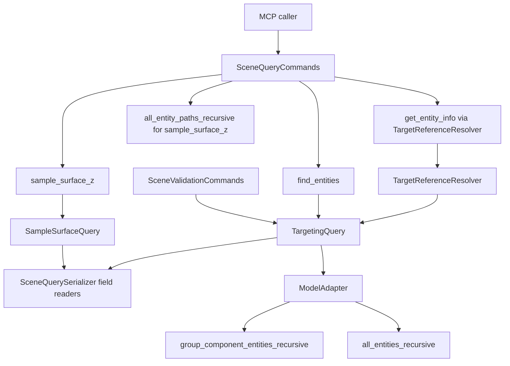

# Technical Plan: STI-04 Optimize Scene Target Resolution and Surface Profile Queries
**Task ID**: `STI-04`
**Title**: `Optimize Scene Target Resolution and Surface Profile Queries`
**Status**: `finalized`
**Date**: `2026-05-18`

## Source Task

- [Optimize Scene Target Resolution and Surface Profile Queries](./task.md)

## Problem Summary

The scene-query layer had one shared performance failure mode: broad recursive scans were acceptable, but candidate filtering serialized a full public target match for every entity. In large SketchUp scenes this made exact identity lookups and target-reference consumers take several seconds. The implementation needed to keep the existing public contracts and recursive semantics while moving filtering onto lightweight field readers and reusing that path across query consumers.

## Goals

- Centralize optimized predicate filtering in `TargetingQuery`.
- Replace full-match serialization during filtering with direct identity, attribute, and metadata field readers.
- Reuse optimized filtering in `find_entities`, `TargetReferenceResolver`, validation target selectors, and `SampleSurfaceQuery`.
- Preserve old ambiguity semantics for duplicate `sourceElementId` values.
- Remove redundant recursive entity enumeration from `sample_surface_z` command execution.

## Non-Goals

- No public MCP schema changes.
- No persistent scene index or cache.
- No changes to scene mutation behavior.
- No broad rewrite of sample-surface geometry or visibility semantics.
- No new query operators, ranking behavior, or fuzzy matching.

## Related Context

- [Scene Targeting and Interrogation HLD](../../../hlds/hld-scene-targeting-and-interrogation.md)
- [PRD: Scene Targeting and Interrogation](../../../prds/prd-scene-targeting-and-interrogation.md)
- [STI-01 Targeting MVP and find_entities](../STI-01-targeting-mvp-and-find-entities/task.md)
- [STI-02 Explicit Surface Interrogation via sample_surface_z](../STI-02-explicit-surface-interrogation-via-sample-surface-z/task.md)
- [STI-03 Extend sample_surface_z With Profile and Section Sampling](../STI-03-extend-sample-surface-z-with-profile-and-section-sampling/task.md)

## Research Summary

- Live profiling showed `adapter.all_entities_recursive` was subsecond for the representative large scene, while filtering through `serialize_target_match` dominated elapsed time.
- `get_entity_info` and `measure_scene` sourceElementId paths shared the same target-reference resolution behavior and benefited from the same optimization.
- `sample_surface_z` profile sampling itself was cheap for the tested target; target resolution and recursive path enumeration dominated elapsed time.
- A first fast path that returned a single container match was too aggressive because it could hide a duplicate lower-level entity. The final approach preserves ambiguity by using container enumeration only as an early ambiguity detector, then running the exhaustive lightweight scan when ambiguity is not already proven.

## Technical Decisions

### Data Model

No public data model changes were introduced.

Internal matching now uses focused serializer readers:

- `target_identity_value(entity, key)`
- `target_attribute_value(entity, key)`
- `target_metadata_value(entity, key)`
- `target_source_element_id?(entity, expected_value)`
- `target_reference_match?(entity, query)`

These readers preserve the public summary semantics while avoiding construction of a full response hash for every candidate.

### API and Interface Design

`TargetingQuery#filter_adapter` is the shared adapter-aware filtering entrypoint.

For sourceElementId-only selectors:

1. Scan group/component containers first.
2. If multiple containers match, return those matches as an already-ambiguous result.
3. Otherwise run the exhaustive recursive scan using `target_source_element_id?`.

For all other selectors, run the existing recursive scan but evaluate predicates through lightweight serializer readers.

`TargetReferenceResolver` delegates non-native references to `TargetingQuery#filter_adapter`, while preserving direct native lookup for `entityId` and `persistentId`.

`SceneValidationCommands` uses `filter_adapter` for `targetSelector` resolution and applies `public_surface_entity?` filtering after matching, preserving validation's public-surface boundary.

`SampleSurfaceQuery` uses `target_reference_match?` where available and falls back to `serialize_target_match` for minimal test doubles.

### Public Contract Updates

Not applicable. Public tool names, schemas, request shapes, response shapes, and refusal payload contracts remain unchanged.

### Error Handling

No new error classes or refusal shapes were added. Existing `none`, `unique`, and `ambiguous` resolution behavior remains the public result model for targeting. The duplicate `sourceElementId` edge case is intentionally preserved as `ambiguous`.

### State Management

The optimization is read-only. No scene state is mutated, cached, or persisted.

### Integration Points

- `SceneQueryCommands#find_entities` calls `TargetingQuery#filter_adapter`.
- `TargetReferenceResolver#lookup_matches` delegates sourceElementId and mixed-reference scans to `TargetingQuery#filter_adapter`.
- `SceneValidationCommands#resolve_target` reuses `filter_adapter` for target selectors.
- `SampleSurfaceQuery#target_reference_matches?` reuses serializer field matching.
- `ModelAdapter#group_component_entities_recursive` provides the container pre-scan.
- `SceneQueryCommands#sample_surface_z` passes recursive path entries and avoids the unused recursive entity list.

### Configuration

No configuration was added.

## Architecture Context

## Key Relationships

- `TargetingQuery` owns optimized predicate matching so command callers do not duplicate filtering rules.
- `SceneQuerySerializer` owns the low-level field readers so public serialization and internal predicate semantics stay aligned.
- `ModelAdapter` owns SketchUp traversal variants.
- `SampleSurfaceQuery` remains responsible for explicit host sampling and path-aware target resolution.

## Acceptance Criteria

- `find_entities` serializes only final matches for sourceElementId-only queries.
- Lower-level sourceElementId values remain discoverable.
- Container plus lower-level duplicate sourceElementId values return `ambiguous`.
- `TargetReferenceResolver` uses the shared optimized filtering path for non-native reference scans.
- Validation target selectors reuse the optimized filtering path and preserve public-surface filtering.
- `sample_surface_z` target resolution avoids full target-match serialization.
- `sample_surface_z` command execution does not collect an unused recursive entity list when recursive path entries are supplied.

## Test Strategy

### TDD Approach

Tests target the changed behavior at the owning seams:

1. Add query tests proving sourceElementId-only matching avoids full candidate serialization.
2. Add recursive lookup tests for lower-level entities.
3. Add duplicate ambiguity tests for container plus lower-level `sourceElementId`.
4. Update adapter-injection tests to verify command traversal choices.
5. Update target-reference and validation tests to verify shared `filter_adapter` usage.
6. Add sample-surface tests proving target resolution uses field readers instead of full serialization.

### Required Test Coverage

| Provisional queue order | AC / requirement | Behavior or risk | Candidate implementation slice | Likely owner | Unit/core coverage | Integration/runtime coverage | Contract/schema coverage | Error/refusal coverage | Hosted/manual validation | Likely fixtures/helpers | Integration points | Suggested focused command | Suggested broader command | Blocker or explicit gap |
|---|---|---|---|---|---|---|---|---|---|---|---|---|---|---|
| 1 | Lightweight sourceElementId filtering | Candidate serialization causes multi-second scans | Serializer field readers and `TargetingQuery` | Scene query | `find_entities_scene_query_commands_test` counting serializer calls | `scene_query_commands_adapter_test` | n/a | n/a | Live `find_entities STR-002` | Counting serializer | `SceneQueryCommands`, `TargetingQuery` | `bundle exec ruby -Itest ... test/scene_query/find_entities_scene_query_commands_test.rb` | full Ruby suite | none |
| 2 | Nested/lower-level lookup | Fast path misses non-container entities | Conservative exhaustive lightweight scan | Scene query | lower-level sourceElementId test | live missing/known sourceElementId smoke | n/a | none/ambiguous resolution | Live nested query | scene query support model | `ModelAdapter`, `TargetingQuery` | `bundle exec ruby -Itest ... test/scene_query/*_test.rb` | full Ruby suite | none |
| 3 | Duplicate ambiguity preservation | Single container fast path hides duplicate | Container pre-scan only short-circuits multiple container matches | Scene query | duplicate container + lower-level ambiguity test | n/a | n/a | ambiguous resolution | n/a | managed fixture entities | `TargetingQuery` | `bundle exec ruby -Itest ... test/scene_query/find_entities_scene_query_commands_test.rb` | full Ruby suite | none |
| 4 | Shared target-reference reuse | `get_entity_info` and `measure_scene` duplicate old scan | `TargetReferenceResolver#lookup_matches` delegates to `filter_adapter` | Scene query | resolver tests | live `get_entity_info` and `measure_scene` smoke | unchanged | existing invalid target refusals | Live sourceElementId targetReference smoke | FastLookupAdapter | resolver, commands, measure | `bundle exec ruby -Itest ... test/scene_query/target_reference_resolver_test.rb` | full Ruby suite | none |
| 5 | Sample-surface profile cost | Profile pays unused recursive entity enumeration and serialized resolution | field matching plus command traversal reduction | Surface query | sample-surface counting serializer test | live profile timing | unchanged | existing sample refusals | Live `sample_surface_z` profile | sample-surface model | `SceneQueryCommands`, `SampleSurfaceQuery` | `bundle exec ruby -Itest ... test/scene_query/sample_surface_z_scene_query_commands_test.rb` | full Ruby suite | none |

Likely first failing target: `test_source_element_id_filter_only_serializes_final_matches`.

## Instrumentation and Operational Signals

- Live SketchUp elapsed times were measured before and after changes for representative `find_entities`, `get_entity_info`, `measure_scene`, and `sample_surface_z` calls.
- Automated serializer call counters prove filtering no longer serializes every candidate.
- Resolution states remain visible as `none`, `unique`, or `ambiguous`.

## Implementation Phases

1. Extract serializer field readers and update `TargetingQuery` predicate evaluation.
2. Add adapter-owned group/component container enumeration and sourceElementId-only pre-scan.
3. Route `find_entities`, target-reference resolution, validation selectors, and sample-surface target matching through the shared optimized path.
4. Remove unused `all_entities_recursive` collection from `sample_surface_z` command execution when `entity_entries` are supplied.
5. Add regression tests for serialization avoidance, lower-level lookup, duplicate ambiguity, traversal choices, and sample-surface resolution.
6. Run full Ruby tests, RuboCop, live SketchUp smoke checks, and external code review.

## Rollout Approach

- Ship as an internal behavior optimization with no public contract migration.
- Keep direct native `entityId` and `persistentId` lookup paths unchanged.
- Preserve exhaustive recursive fallback for sourceElementId-only queries unless ambiguity is already proven by multiple matching containers.
- Use live SketchUp smoke checks to validate representative large-scene performance before treating the task as complete.

## Risks and Controls

- Ambiguity regression: a unique container fast path could hide a duplicate lower-level entity. Control: exhaustive lightweight scan unless multiple containers already prove ambiguity, plus regression test.
- Nested transform regression in `sample_surface_z`: removing recursive entities could break nested targets if path entries were not supplied. Control: command still supplies `all_entity_paths_recursive`; query retains fallback for callers that omit entries.
- Validation filtering drift: applying public-surface filtering after adapter filtering could change resolution. Control: post-filter public-surface selection plus final unique-entity guard.
- Performance regression: conservative scan could reintroduce the original slow path. Control: scans now use direct field readers, and live sourceElementId checks stayed under one second in the representative scene.

## Dependencies

- Existing scene query serializer and targeting query seams.
- Existing `ModelAdapter` recursive traversal.
- Existing sample-surface explicit host and entity path behavior.
- Existing validation and measurement consumers of `TargetReferenceResolver`.

## Premortem

- Failure path: a future change reintroduces `serialize_target_match` inside candidate filtering. Validation: keep counting-serializer tests that fail if filtering serializes non-final candidates.
- Failure path: a future sourceElementId fast path returns a single container without checking lower-level duplicates. Validation: keep duplicate ambiguity test for container plus lower-level duplicate IDs.
- Failure path: sample-surface profile optimization removes path entries rather than only the unused entity list. Validation: keep nested target and sample-surface tests that require ancestor-aware entries.
- Failure path: live scene performance is only improved in unit fakes. Validation: keep manual/live smoke timing notes in implementation summaries until a hosted performance harness exists.

## Quality Checks

- [x] All required inputs validated
- [x] Problem statement documented
- [x] Goals and non-goals documented
- [x] Research summary documented
- [x] Technical decisions included
- [x] Architecture context included
- [x] Acceptance criteria included
- [x] Test requirements specified as a provisional coverage-matrix seed
- [x] Instrumentation and operational signals defined when needed
- [x] Risks and dependencies documented
- [x] Rollout approach documented when needed
- [x] Small reversible phases defined
- [x] Premortem completed with falsifiable failure paths and mitigations
- [x] Planning-stage size estimate produced retrospectively from the finalized plan
