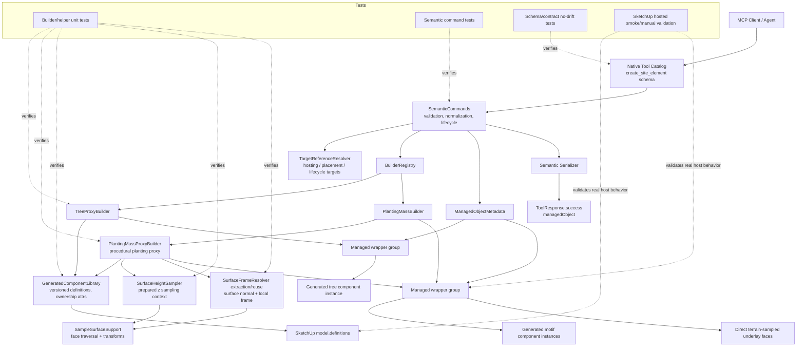

# Technical Plan: SEM-16 Realize Terrain-Sampled Planting Mass Proxy Representation
**Task ID**: `SEM-16`
**Title**: `Realize Terrain-Sampled Planting Mass Proxy Representation`
**Status**: `finalized`
**Date**: `2026-05-22`

## Source Task

- [Realize Terrain-Sampled Planting Mass Proxy Representation](./task.md)

## Problem Summary

`create_site_element` already accepts `planting_mass` requests with
`definition.mode: "mass_polygon"` and `representation.mode: "proxy_mass"`, but
the current Ruby builder realizes that request as a single push-pulled boundary
polygon. Real agents are already using that contract for shallow planting
pockets, so the implementation produces a valid semantic object that reads as a
crude cube rather than a planting mass.

This task promotes terrain-sampled procedural planting behavior into the
semantic runtime while preserving the public `create_site_element` request
shape. It also componentizes the
existing accepted `tree_proxy` realization without changing its public contract,
accepted SEM-04 geometry, or SEM-15 terrain anchoring, establishing the
generated-component pattern needed for planting motifs and future procedural
components.

## Goals

- Make `planting_mass + representation.mode: "proxy_mass"` produce procedural
  planting proxy geometry instead of a single extruded prism.
- Realize `planting_mass + hosting.mode: "surface_drape"` through the existing
  hosting contract as the primary terrain-dependent planting-mass path.
- Reuse existing optimized scene-query, surface-height, and surface-frame seams
  instead of broad ad hoc `Model#raytest` sampling.
- Use an internal procedural motif/component strategy behind semantic runtime
  plumbing.
- Componentize current `tree_proxy` output as an internal no-visual-change
  realization change.
- Preserve existing metadata, lifecycle, placement, material/tag, validation,
  serializer, and response-envelope behavior.
- Keep seed, spacing, style, count, edge fade, and component strategy as
  internal deterministic policy, not new public request fields.

## Non-Goals

- Redesigning the accepted SEM-04 `tree_proxy` visual baseline.
- Changing SEM-15 `tree_proxy + terrain_anchored` semantics.
- Adding public planting controls for seed, spacing, style, count, edge fade, or
  component strategy.
- Promoting any scratch/eval command shape, metadata namespace, or sampling
  architecture as the public implementation.
- Adding new semantic element families such as `water_feature_proxy`, `seat`,
  `tree_instance`, or `terrain_patch`.
- Replacing planting proxies with staged assets or curated asset search.
- Adding generated-definition reference counting or garbage collection in this
  task.

## Related Context

- `specifications/hlds/hld-semantic-scene-modeling.md`
- `specifications/tasks/semantic-scene-modeling/SEM-02-complete-first-wave-semantic-creation-vocabulary/plan.md`
- `specifications/tasks/semantic-scene-modeling/SEM-04-align-tree-proxy-geometry-with-accepted-volumetric-baseline/plan.md`
- `specifications/tasks/semantic-scene-modeling/SEM-08-adopt-builder-native-v2-input-for-pad-and-retaining-edge/plan.md`
- `specifications/tasks/semantic-scene-modeling/SEM-13-realize-path-surface-drape-hosting/plan.md`
- `specifications/tasks/semantic-scene-modeling/SEM-15-add-terrain-anchored-hosting-for-tree-proxy-and-structure/plan.md`
- `specifications/tasks/scene-targeting-and-interrogation/STI-02-explicit-surface-interrogation-via-sample-surface-z/plan.md`
- `specifications/tasks/scene-targeting-and-interrogation/STI-03-extend-sample-surface-z-with-profile-and-section-sampling/plan.md`
- `specifications/tasks/scene-targeting-and-interrogation/STI-04-optimize-scene-target-resolution-and-surface-profile-queries/plan.md`
- `src/su_mcp/staged_assets/surface_frame_resolver.rb`
- `src/su_mcp/semantic/surface_height_sampler.rb`

## Research Summary

- `SEM-02` and `SEM-08` established the current semantic command, builder
  registry, normalized sectioned payloads, metadata, and serializer foundation
  for `planting_mass` and `tree_proxy`.
- `SEM-04` defines the accepted `tree_proxy` geometry. Componentization must
  preserve the existing connected volumetric trunk/canopy topology rather than
  replacing it with visual-only assertions.
- `SEM-13` and `SEM-15` provide the closest hosted semantic implementation
  patterns: contextual hosting matrix entries, builder-owned refusals, sampling
  before wrapper creation, and hosted validation for terrain behavior.
- `STI-02` through `STI-04` established transformed surface traversal,
  target-bounded sampling, profile generation, ambiguity behavior, and
  performance hardening. SEM-16 must reuse those seams.
- `SurfaceHeightSampler` is the right semantic seam for repeated z sampling from
  a prepared context. `StagedAssets::SurfaceFrameResolver` already owns
  surface-normal/frame resolution for staged asset placement and should be
  reused or extracted for planting motif orientation.
- The desired planting output is terrain-sampled underlay, seeded footprint
  candidates, edge fade, reusable motif definitions, transformed component
  instances, and low-poly plant geometry. Eval-style command shape, ad hoc
  metadata dictionaries, entity-id-only targeting, and broad raycast sampling
  are not production architecture.

## Technical Decisions

### Data Model

- Managed wrapper groups remain the semantic identity boundary. Definitions are
  reusable geometry libraries, not managed scene objects.
- Add a small semantic generated-component library seam that owns generated
  component definition identity:
  `namespace + family + generator version + normalized signature`.
- Stamp owned generated definitions with attributes recording namespace, family,
  version, signature, and generator name. Only definitions with matching
  ownership attributes may be reused or rebuilt.
- `tree_proxy` generated definitions are keyed by normalized tree geometry
  signature so identical accepted tree proxies can reuse a component definition.
- Planting motif definitions are keyed by motif family/version/signature and are
  shared across planting masses. Footprint-specific underlay remains direct
  wrapper geometry.

### API and Interface Design

- Public API remains `create_site_element`.
- `SemanticCommands#builder_params_for_v2` should pass the existing `metadata`
  section through internal builder params so generated names and deterministic
  seeds can use source identity. This is not a public field change.
- `PlantingMassBuilder` remains the family entrypoint. It delegates
  `representation.mode: "proxy_mass"` to a semantic-local
  `PlantingMassProxyBuilder`; non-`proxy_mass` behavior stays compatible.
- The generated-component seam should expose a content-oriented API such as:
  family, version, signature, and a build block that emits geometry only when a
  matching owned definition is missing or intentionally rebuilt.
- Surface-frame reuse should happen through a minimal internal frame evaluator
  extracted from `StagedAssets::SurfaceFrameResolver` behavior. It must accept
  prepared face entries or an equivalent prepared context and support many XY
  samples without re-resolving the target per motif. Planting code should not
  fabricate staged-asset public orientation payloads or call the public
  single-sample resolver once per motif.

### Public Contract Updates

- Request shape: no new public fields.
- Response shape: no new top-level response fields; continue using
  `ToolResponse.success(outcome:, managedObject:)`.
- Contextual hosting matrix: add existing `hosting.mode: "surface_drape"` for
  `planting_mass`.
- Native schema and examples: check and update wording only if current docs list
  contextual hosting pairs or describe `proxy_mass`; do not advertise internal
  seed/spacing/style/count/component controls.
- Dispatcher/routing: no new tool route; existing `create_site_element`
  builder dispatch remains the route.
- Contract fixtures/tests: assert no public fields for seed, spacing, count,
  style, edge fade, component strategy, generated-definition controls, or proxy
  summaries.

### Error Handling

- Reuse existing semantic refusal plumbing through `BuilderRefusal` and
  `ToolResponse.refusal`.
- Refuse unsupported contextual hosting as `unsupported_hosting_mode` with
  updated `allowedValues`.
- Refuse missing/invalid terrain hosts, sample misses for required base/underlay
  samples, excessive motif/sample caps, invalid replacement targets, and
  generated-definition ownership conflicts where safe reuse is impossible.
- Optional orientation/frame misses may fall back to vertical orientation only
  when the required base z sample is valid and the fallback is explicitly
  covered by tests; required z sampling must not silently block-fallback.

### State Management

- Create/reuse generated definitions and wrapper child instances inside the
  command operation. The generated-component seam must track newly created or
  rebuilt owned definitions during a build and provide cleanup if a
  `BuilderRefusal` or later mutation failure occurs and SketchUp abort does not
  remove definition-side effects.
- Do not delete unused generated definitions in SEM-16. Stale owned definitions
  are acceptable model-library residue until a later cleanup task proves a real
  need.
- Replacement must preserve previous managed identity until the new object is
  created and metadata is written; if new build fails, the old entity remains.

### Integration Points

- `SemanticCommands` owns command orchestration, target resolution, lifecycle,
  operation wrapper, metadata, and serializer response.
- `BuilderRegistry` routes to `TreeProxyBuilder` and `PlantingMassBuilder`.
- `GeneratedComponentLibrary` owns generated component definition lifecycle but
  not geometry generation.
- `SurfaceHeightSampler` supplies prepared repeated z sampling.
- An internal extracted surface-frame evaluator supplies bulk normal/frame
  orientation using `SurfaceFrameResolver` math and `SampleSurfaceSupport`
  traversal semantics.
- `SampleSurfaceSupport` remains the traversal/transform source for both height
  and frame behavior.
- Test support must add minimal fake `model.definitions`, component definition
  entities, and ownership attributes.

### Configuration

- Internal constants, not public fields:
  - `DEFAULT_SPACING_METERS`: `0.62`
  - `DEFAULT_EDGE_FADE_METERS`: `0.42`
  - `DEFAULT_MIN_MOTIF_COUNT`: `12`
  - `DEFAULT_MAX_MOTIF_COUNT`: `32`
  - `DEFAULT_SAMPLE_BUDGET`: about `200` terrain lookups per build
  - default component strategy: motif component instances
- Deterministic seed should derive from normalized request geometry, planting
  category, and source identity when present.
- Hosted validation may tune constants, but tuning must preserve deterministic
  output for the same normalized request and model context.

## Architecture Context

## Key Relationships

- Generated component lifecycle is shared; generated geometry remains
  family-owned.
- Tree proxy componentization proves the component seam against a known accepted
  geometry baseline before planting motifs depend on it.
- Surface height and surface frame behavior remain shared with existing
  scene-query/staged-asset seams; planting proxy should not add new scene
  traversal or raycast code.
- Public semantic contract ownership remains with native catalog/schema,
  request validation, `SemanticCommands`, and contract tests.

## Acceptance Criteria

- `tree_proxy` creation remains contract-compatible and terrain anchoring still
  replaces caller z with sampled terrain z.
- Componentized `tree_proxy` preserves SEM-04 structural invariants: connected
  volumetric proxy, 12-sided trunk, stepped canopy bands, three-lobe profile,
  deterministic scaling, and no visual redesign.
- Generated definitions use stable namespace/family/version/signature identity
  and do not clear or rebuild unowned definitions.
- `planting_mass + proxy_mass + surface_drape` creates repeated procedural motif
  component instances plus a terrain-derived footprint/underlay, not a single
  push-pulled prism.
- Planting proxy output remains within or intentionally derived from the
  requested boundary, respects `averageHeight` as a proxy envelope, and is
  deterministic for the same normalized request/model context.
- `planting_mass + proxy_mass + hosting.none` remains supported as a fixed-datum
  compatibility path and performs no terrain-host sampling.
- Production terrain behavior reuses `SurfaceHeightSampler`, `SampleSurfaceSupport`,
  and `SurfaceFrameResolver` behavior; it does not use a broad ad hoc
  `Model#raytest` path.
- Create/replace refusals do not leave partial managed wrapper objects or erase
  previous targets prematurely.
- Public native schema, contract fixtures, and response envelope do not add
  public procedural controls or proxy summary fields.
- Hosted or manual SketchUp validation confirms component definition reuse,
  sloped terrain following, normal/frame orientation, runoff-pocket visual
  quality, replacement/undo behavior, and near-cap performance.

## Test Strategy

### TDD Approach

Start at the lowest shared dependency and move outward:

1. Add fake `model.definitions` support and failing generated-component helper
   tests.
2. Componentize `tree_proxy` while preserving existing tree topology tests.
3. Add `PlantingMassProxyBuilder` fixed-datum tests before terrain hosting.
4. Add surface-drape sampling/frame tests.
5. Wire command contextual hosting, metadata pass-through, and no-public-shape
   drift tests.
6. Close with hosted/manual SketchUp validation.

Likely first failing target:
`test/semantic/generated_component_library_test.rb` or the equivalent helper test
that proves owned versioned definitions can be created, reused, and protected
from unowned rebuild.

### Required Test Coverage

| Provisional queue order | AC / requirement | Behavior or risk | Candidate implementation slice | Likely owner | Unit/core coverage | Integration/runtime coverage | Contract/schema coverage | Error/refusal coverage | Hosted/manual validation | Likely fixtures/helpers | Integration points | Suggested focused command | Suggested broader command | Blocker or explicit gap |
|---|---|---|---|---|---|---|---|---|---|---|---|---|---|---|
| 1 | Generated definitions are owned/reused safely | Model-global definition mutation | Generated component library + fake definitions | `SU_MCP::Semantic::GeneratedComponentLibrary` | create/reuse/rebuild-owned/protect-unowned tests; track created/rebuilt definitions for cleanup | n/a | n/a | ownership conflict refusal/exception shape; build failure cleans owned definitions created in the failed attempt | Hosted definition browser sanity later | `SemanticTestSupport::FakeDefinitions` | `model.definitions`, attributes | `bundle exec ruby -Itest test/semantic/generated_component_library_test.rb` | `bundle exec ruby -Itest test/semantic/generated_component_library_test.rb test/support/semantic_test_support.rb` | Fake definitions do not exist yet |
| 2 | Tree proxy visual baseline unchanged | Componentization could alter accepted proxy | Tree definition generation + wrapper instance | `TreeProxyBuilder` | preserve existing ring/trunk/lobe tests by inspecting definition geometry; assert wrapper instance | builder registry still returns tree builder | n/a | terrain-anchor refusal still no wrapper | Hosted tree create visual smoke | existing `tree_proxy_builder_test` | generated component seam, terrain anchor resolver | `bundle exec ruby -Itest test/semantic/tree_proxy_builder_test.rb` | semantic focused suite | Need helper first |
| 3 | Fixed-datum planting proxy non-blocky | `hosting.none` still creates useful output | `PlantingMassProxyBuilder` fixed datum branch | `PlantingMassBuilder` / `PlantingMassProxyBuilder` | motif count, underlay faces, no pushpull-only prism, deterministic topology | n/a | n/a | cap refusal if exceeded | Fixed-elevation pocket visual smoke | `planting_mass_builder_test` fakes | generated component seam | `bundle exec ruby -Itest test/semantic/planting_mass_builder_test.rb` | semantic focused suite | Motif geometry adaptation |
| 4 | Surface-draped planting follows terrain | Sampling/frame reuse and sample misses | surface-drape branch + internal frame evaluator | `PlantingMassProxyBuilder` | one prepared z context, frame/normal reuse, z variation, deterministic placements; evaluator matches public resolver for equivalent sample | command passes resolved host | n/a | invalid host/sample miss/no wrapper | Sloped terrain hosted smoke | fake sample surface, frame evaluator fake | `SurfaceHeightSampler`, extracted frame evaluator | `bundle exec ruby -Itest test/semantic/planting_mass_builder_test.rb test/staged_assets/surface_frame_resolver_test.rb` | semantic + staged asset focused suite | Requires frame evaluator before motif transforms |
| 5 | Contextual hosting contract behavior | `planting_mass -> surface_drape` support | command matrix/wiring | `SemanticCommands` | n/a | allowed mode, target resolution, missing/ambiguous host, builder params include metadata | no new fields | `unsupported_hosting_mode`, target refusals | Covered in hosted create | `semantic_commands_test` | `TargetReferenceResolver`, builder registry | `bundle exec ruby -Itest test/semantic/semantic_commands_test.rb` | runtime native + semantic focused suite | Builder branch should exist |
| 6 | No public schema drift | Internal controls do not leak | native catalog/docs checks | native runtime catalog/tests | n/a | runtime loader contract examples | schema asserts no procedural controls | n/a | n/a | native runtime fixtures | native tool catalog | `bundle exec ruby -Itest test/runtime/native/mcp_runtime_loader_test.rb` | semantic + runtime focused suite | Docs may need wording only |
| 7 | Replace/rollback safety | Partial managed objects, erased targets, or stray owned definitions | create/replace lifecycle tests | `SemanticCommands`, builders, generated component seam | builder raises before wrapper when possible; generated definitions created during failed build are cleaned or proven rolled back | replace failure preserves previous entity | n/a | no wrapper on refusal, old entity remains, no stray owned definitions from failed attempt | Hosted undo/replace smoke | semantic command fakes | operation wrapper, serializer, model.definitions | `bundle exec ruby -Itest test/semantic/semantic_commands_test.rb test/semantic/generated_component_library_test.rb` | semantic focused suite | Need failure injection seams |
| 8 | Hosted visual/performance closeout | Fakes cannot prove SketchUp behavior | hosted probe/manual cases | implementation owner | n/a | n/a | n/a | hosted refusal cases | fixed pocket, sloped terrain, replacement, near-cap timing | SketchUp model/probe script | SketchUp API, definitions, frames | n/a | focused Ruby tests before hosted run | Manual evidence required if probe unavailable |

## Instrumentation and Operational Signals

- Builder/helper tests should expose motif count, component instance count,
  underlay face count, and sample/frame lookup count through fakes.
- Hosted validation should record elapsed time, motif/component counts, generated
  definition names, underlay face count, success/refusal outcome, and whether
  undo/replacement leaves expected scene state.
- No public response evidence is added in SEM-16 unless implementation discovers
  a diagnostic gap that cannot be validated through tests/hosted probes.

## Implementation Phases

1. Add generated-component library and fake definition support, including
   ownership protection and failed-build cleanup for created/rebuilt owned
   definitions.
2. Componentize `tree_proxy` with no visual or contract change.
3. Add internal metadata pass-through to builder params and no-drift command
   coverage.
4. Add `PlantingMassProxyBuilder` fixed-datum procedural output using generated
   motif definitions and direct underlay faces.
5. Extract a bulk/internal surface-frame evaluator from staged-asset
   `SurfaceFrameResolver` behavior before motif transform code depends on it.
6. Add `planting_mass -> surface_drape` support and terrain-sampled planting
   proxy behavior using prepared z sampling and surface frames.
7. Add command, contract, docs/guidance, and hosted validation closeout.

## Rollout Approach

- Ship as an implementation upgrade behind the existing `create_site_element`
  surface.
- Keep `tree_proxy` and unhosted planting behavior compatible while adding
  componentized internals.
- If hosted validation exposes performance or definition lifecycle issues,
  reduce motif caps or defer cleanup/GC rather than changing public contract.
- Do not expose internal procedural controls until a separate contract task
  approves them.

## Risks and Controls

- Public contract drift: no new request/response fields; update contextual
  hosting tests and docs if `planting_mass -> surface_drape` appears in guidance.
- Generated definitions mutate model-global state: versioned names, ownership
  attributes, owned-only rebuild, failed-build cleanup, no SEM-16 GC, hosted
  validation.
- Tree proxy visual regression: retain SEM-04 structural tests and add component
  assertions instead of replacing tests.
- Surface-frame coupling to staged assets: extract/reuse internal bulk frame
  logic, not staged-asset public request shape or per-motif public resolver calls.
- Sampling performance regression: one prepared z context, bounded frame lookups,
  sample budget tests, hosted near-cap smoke.
- Invalid live SketchUp geometry: triangles for sampled underlay/motifs, face
  orientation checks where needed, hosted sloped-terrain validation.
- Hidden randomness: derive internal seed from normalized request/source identity
  and assert deterministic topology.
- Partial state on refusal: plan refusal-prone work before wrapper creation and
  keep mutation inside `run_v2_operation`.
- Subjective proxy quality: structural invariants plus hosted/manual review
  against runoff-receiving pocket scenarios.

## Premortem Gate

Status: PASS

### Unresolved Tigers

- None.

### Plan Changes Caused By Premortem

- Added failed-build cleanup as an explicit responsibility of the generated
  component seam because SketchUp component definitions are model-global and may
  outlive wrapper rollback if not handled deliberately.
- Strengthened the first implementation phase and coverage matrix around
  owned-definition protection, created/rebuilt definition tracking, and
  no-stray-definition refusal paths.
- Replaced vague surface-frame reuse with an internal bulk frame evaluator
  requirement so planting motifs do not call the staged-asset public resolver per
  instance.
- Expanded replacement/refusal coverage to require old entity preservation and
  no stray owned generated definitions after failed create/replace attempts.

### Accepted Residual Risks

- Risk: deterministic motif output can still look too regular or not planting-like
  in real SketchUp.
  - Class: Paper Tiger
  - Why accepted: structural checks give a concrete target, but visual quality
    still needs host review.
  - Required validation: hosted runoff-pocket and sloped-terrain visual review
    against the accepted production motif direction.
- Risk: stale owned generated definitions may remain after successful objects are
  deleted or replaced.
  - Class: Paper Tiger
  - Why accepted: SEM-16 intentionally defers reference counting/GC; stale
    definitions are less harmful than unsafe deletion.
  - Required validation: hosted closeout records generated definition counts and
    confirms stale definitions do not affect managed-object behavior.
- Risk: future procedural component families may need lifecycle features beyond
  family/version/signature reuse.
  - Class: Elephant
  - Why accepted: the seam is named and shaped generically enough for extension,
    while GC/session scoping/cross-family sharing are explicit non-goals.
  - Required validation: future tasks must extend the generated-component seam
    rather than duplicating lifecycle policy.

### Carried Validation Items

- Generated component helper tests must prove owned reuse, unowned protection,
  rebuild rules, and cleanup after failed build attempts.
- Surface-frame evaluator tests must prove parity with `SurfaceFrameResolver`
  for fake sloped surfaces and runtime face-plane cases.
- Command replacement tests must prove failed hosted/proxy replacement leaves
  the previous managed entity intact and leaves no partial wrapper.
- Hosted validation must include fixed-datum pocket, sloped terrain drape,
  replacement/undo, near-cap footprint around 30 motifs, elapsed time, generated
  definition count, and user-visible visual quality.

### Implementation Guardrails

- Do not add public procedural controls or response fields in SEM-16.
- Do not clear or rebuild any component definition that lacks matching generated
  ownership attributes.
- Do not call public staged-asset orientation resolution once per planting motif.
- Do not use broad ad hoc `Model#raytest` as the production terrain sampling
  path.
- Do not replace SEM-04 tree topology tests with visual-only component assertions.
- Do not erase a lifecycle replacement target until the new managed object and
  metadata write are complete.

## Dependencies

- Existing semantic command/builder/metadata/serializer stack.
- Existing `SurfaceHeightSampler`, `SampleSurfaceSupport`, and staged asset
  `SurfaceFrameResolver` behavior.
- Expanded semantic test fakes for component definitions.
- Real SketchUp hosted/manual validation access for component definitions,
  surface frames, undo/replacement, and visual quality.
- Hosted/manual visual validation for generated planting geometry.

## Quality Checks

- [x] All required inputs validated
- [x] Problem statement documented
- [x] Goals and non-goals documented
- [x] Research summary documented
- [x] Technical decisions included
- [x] Architecture context included
- [x] Acceptance criteria included
- [x] Test requirements specified as a provisional coverage-matrix seed
- [x] Instrumentation and operational signals defined when needed
- [x] Risks and dependencies documented
- [x] Rollout approach documented when needed
- [x] Small reversible phases defined
- [x] Premortem completed with falsifiable failure paths and mitigations
- [x] Planning-stage size estimate considered before premortem finalization
