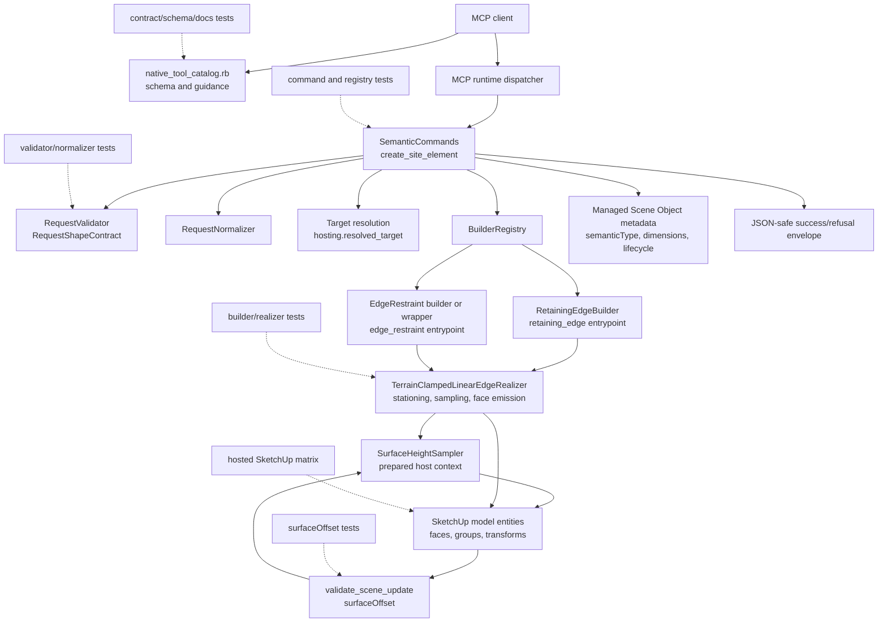

# Technical Plan: SEM-17 Realize Terrain-Clamped Linear Edge Semantics
**Task ID**: `SEM-17`
**Title**: `Realize Terrain-Clamped Linear Edge Semantics`
**Status**: `implemented`
**Date**: `2026-05-23`

## Source Task

- [Realize Terrain-Clamped Linear Edge Semantics](./task.md)

## Problem Summary

`create_site_element` already advertises and accepts `retaining_edge` with `hosting.mode: "edge_clamp"`, but the current retaining-edge builder still emits planar geometry at `definition.elevation` or `z = 0`. That creates a false hosted contract: clients can receive a managed semantic object that does not follow the targeted terrain.

SEM-17 fixes that hosted retaining-edge behavior and adds one canonical `edge_restraint` semantic type for curbs, setts, stone restraints, and path or hardscape edge restraints. The new type must stay inside the existing `create_site_element` surface, reuse established linear-edge fields where they have stable meaning, remain separate from `path` and terrain authoring state, and pair creation behavior with `validate_scene_update.surfaceOffset` acceptance guidance for catching off-terrain or z=0 regressions.

## Goals

- Make `retaining_edge + hosting.mode: "edge_clamp"` create terrain-clamped geometry against the resolved host instead of planar fallback output.
- Add `edge_restraint` as the canonical semantic type for path and hardscape edge restraint workflows without adding public alias types.
- Keep `edge_restraint` hosted-only in SEM-17 with `definition.mode: "polyline"`, `definition.polyline`, `definition.height`, and `definition.thickness`.
- Preserve optional `definition.elevation` for compatible unhosted planar `retaining_edge` behavior, while documenting that hosted `retaining_edge + edge_clamp` replaces it with sampled host z and does not treat it as an offset.
- Reuse existing semantic hosting, sampling, refusal, metadata, validation, schema, docs, and contract-test conventions.
- Document and test `surfaceOffset` as approximate acceptance guidance for hosted semantic edges.

## Non-Goals

- No new public creation tool outside `create_site_element`.
- No public aliases such as `curb`, `retaining_curb`, `sett_edge`, or `path_edge`.
- No new public linear-edge dimension fields such as `topOffset`, `embedDepth`, or a `width` alias.
- No `definition.elevation` support for `edge_restraint` in SEM-17.
- No terrain mutation, grading, cutting, or absorption of hardscape objects into terrain source state.
- No exact edge-topology validation or shape-derived validation anchors beyond the existing `surfaceOffset` posture.
- No change to `path + surface_drape` behavior except compatibility checks for shared sampling seams.

## Related Context

- [Semantic Scene Modeling HLD](specifications/hlds/hld-semantic-scene-modeling.md)
- [Managed Terrain Surface Authoring HLD](specifications/hlds/hld-managed-terrain-surface-authoring.md)
- [MCP Tool Authoring for SketchUp](specifications/guidelines/mcp-tool-authoring-sketchup.md)
- [Ruby Coding Guidelines](specifications/guidelines/ryby-coding-guidelines.md)
- [SVR-02 Broaden validate_scene_update with surface relationship and reference point validation](specifications/tasks/scene-validation-and-review/SVR-02-broaden-validate-scene-update-with-surface-relationship-and-reference-point-validation/task.md)
- [STI-02 Explicit surface interrogation via sample_surface_z](specifications/tasks/scene-targeting-and-interrogation/STI-02-explicit-surface-interrogation-via-sample-surface-z/task.md)
- SEM-08, SEM-13, SEM-15, and SEM-16 implementation evidence for section-native semantic builders, hosted surface sampling, no-partial-wrapper behavior, and hosted validation.

## Research Summary

- `SEM-08` established section-native `retaining_edge` input with `definition.mode: "polyline"`, `polyline`, `height`, `thickness`, and optional `elevation`.
- `SEM-13` provides the closest terrain-following linear analog: `PathDrapeBuilder`, `SurfaceHeightSampler`, prepared sampling contexts, station caps, and builder-owned refusals.
- `SEM-15` is the closest hosted semantic creation analog. Its main lesson is to resolve host feasibility before wrapper creation where possible and to prove create/replace parity.
- `SEM-16` reinforces that hosted procedural geometry often needs visual and live SketchUp validation even after strong fake-host tests.
- `STI-02` and `SurfaceHeightSampler` provide the internal surface-query lineage. SEM-17 should not route semantic creation through public `sample_surface_z`.
- `SVR-02` shipped `surfaceOffset` with approximate bounds-derived anchors and failed-anchor evidence. SEM-17 can use it to catch z=0/off-terrain regressions, but must not overclaim exact edge topology.
- Existing implementation research found that `SemanticCommands::SUPPORTED_HOSTING_MODES` already lists `retaining_edge => ["edge_clamp"]`, while `RetainingEdgeBuilder` remains planar and creates a group before hosted feasibility is known.

## Technical Decisions

### Data Model

- `edge_restraint` is a new finite `elementType` with managed metadata preserving `semanticType: "edge_restraint"`.
- `edge_restraint` uses `definition.mode: "polyline"`, `definition.polyline`, `definition.height`, and `definition.thickness`.
- `edge_restraint.definition.elevation` is unsupported and must be refused rather than accepted and ignored.
- `retaining_edge` keeps its existing public fields for compatibility. Unhosted planar retaining edges continue to use optional `definition.elevation` as the base elevation.
- Hosted linear edges use sampled host z as the base elevation at each station and extend upward by `height`, matching current retaining-edge base-plus-height semantics.
- `height` and `thickness` metadata must persist for `edge_restraint` as they do for `retaining_edge`.

### API and Interface Design

- Public entrypoint remains `create_site_element`.
- `hosting.mode: "edge_clamp"` remains the contextual hosted mode for both `retaining_edge` and `edge_restraint`.
- `edge_restraint` is hosted-only in SEM-17. `hosting.mode: "none"`, missing hosted target, or any non-`edge_clamp` mode refuses with contextual guidance.
- Internal design uses one shared terrain-clamped linear-edge realization seam for station generation, prepared sampling, section planning, cap/refusal behavior, and face emission.
- `RetainingEdgeBuilder` remains the `retaining_edge` entrypoint and delegates only hosted `edge_clamp` work to the shared realizer. Its unhosted branch remains planar.
- `edge_restraint` may use a thin builder wrapper or registry mapping to the shared realizer, but public metadata and responses must preserve the `edge_restraint` semantic type.

### Public Contract Updates

- Request deltas:
  - Add `edge_restraint` to `RequestValidator::SUPPORTED_ELEMENT_TYPES`.
  - Add `edge_restraint => ["polyline"]` to supported definition modes.
  - Add `edge_restraint` to allowed definition field and recovery maps with `mode`, `polyline`, `height`, and `thickness`.
  - Add `edge_restraint` geometry fields to normalizer meter-to-internal-unit conversion.
  - Add field-specific refusal for `edge_restraint.definition.elevation`.
  - Add `edge_restraint => ["edge_clamp"]` to contextual hosting.
- Response deltas:
  - No response-envelope change. Success remains the existing managed-object envelope. Refusals remain structured `ToolResponse.refusal` payloads.
- Schema and registration updates:
  - Update `src/su_mcp/runtime/native/native_tool_catalog.rb` contextual hosting prose, finite enum/discoverability guidance, and definition descriptions.
  - Keep public MCP tool registration co-located with the native catalog; no dispatcher route is added.
- Runtime/dispatcher updates:
  - Update builder registry and `SemanticCommands` builder payload/type handling.
  - Add command-level required-hosting enforcement for hosted-only `edge_restraint`.
- Contract and integration tests:
  - Update native runtime contract fixtures and public MCP contract posture checks for element type lists, hosted pairs, field descriptions, examples, and alias non-leakage.
- Docs and examples:
  - Update `docs/mcp-tool-reference.md` with contrastive `retaining_edge` versus `edge_restraint` guidance, hosted edge behavior, `edge_restraint` field set, and `surfaceOffset` acceptance examples.
  - Include an explicit `edge_restraint.definition.elevation` refusal example.
  - Include the approximate, centerline/station-sampling limitation in every semantic-edge `surfaceOffset` example.
  - Check `README.md` before implementation closeout and update only if it describes semantic creation surfaces.
- Atomic public-surface gate:
  - Phase 1 cannot close until runtime constants, request validation, normalizer, request-shape recovery, native schema/prose, contract fixtures, public posture tests, docs, and examples all agree on the same `edge_restraint` fields and hosted pair matrix.

### Error Handling

- Validator-owned refusals cover unsupported element type, unsupported definition mode, malformed polyline, missing fields, unsupported fields, non-positive `height`, non-positive `thickness`, non-finite `retaining_edge.definition.elevation`, and unsupported `edge_restraint.definition.elevation`.
- Command-owned refusals cover missing hosted target, unresolved or ambiguous host target, unsupported host mode, and `edge_restraint` missing required `edge_clamp` hosting.
- Builder-owned refusals cover feasible-target failures after target resolution:
  - `invalid_hosting_target` when the host exposes no sampleable surface geometry.
  - `terrain_sample_miss` when a required station misses the host.
  - `linear_edge_tessellation_limit_exceeded` when bounded station generation would exceed the cap.
- Hosted edge failures must never fall back to unhosted planar geometry.
- Refusals must remain JSON-serializable and avoid raw SketchUp objects.

### State Management

- Hosted feasibility and section planning should complete before creating wrapper geometry where practical.
- Invalid hosted edge requests must leave no empty group, stale metadata, or `sourceElementId`-resolvable partial object.
- Created edges remain Managed Scene Objects with stable material, tag, scene properties, destination placement, lifecycle/status metadata, and semantic type.
- `replace_preserve_identity` must use the same hosted behavior as `create_new` and preserve managed identity where existing behavior requires it.
- Semantic hardscape objects remain separate from terrain source state.

### Integration Points

- `RequestShapeContract`, `RequestValidator`, `RequestNormalizer`, and request-shape recovery own public input shape.
- `SemanticCommands` owns target resolution, contextual hosting enforcement, operation lifecycle, metadata writes, builder dispatch, and response serialization.
- Builder registry maps semantic types to builder entrypoints.
- Shared terrain-clamped linear-edge realization owns stationing, prepared host sampling through `SurfaceHeightSampler`, cap/refusal behavior, and geometry emission.
- `validate_scene_update.surfaceOffset` supplies post-create acceptance checks.
- Native catalog, contract fixtures, docs, and public posture tests keep the MCP surface discoverable and aligned with runtime behavior.

### Configuration

- No new user-facing configuration is planned.
- Station spacing and station-cap constants should be internal implementation constants, tested through behavior and refusal paths, and not exposed as hidden public controls.

## Architecture Context

## Key Relationships

- Public contract validation rejects bad shape before builders see it.
- Command hosting logic resolves explicit targets and decides whether a request can be dispatched.
- Builders receive normalized internal units and JSON-safe data, not raw public payloads.
- The shared realizer should not know native schema, docs, or public alias policy.
- Hosted validation is required for transform-sensitive SketchUp behavior that fake sample hosts cannot prove.

## Acceptance Criteria

- `retaining_edge + edge_clamp` with a resolvable sampleable host creates managed edge geometry whose base elevations vary with host terrain where the host varies.
- Hosted retaining-edge creation never silently falls back to planar `z = 0` output when host resolution or required station sampling fails.
- Existing unhosted planar `retaining_edge` requests remain compatible.
- Hosted `retaining_edge.definition.elevation` is replaced by sampled host z and is not an offset.
- `edge_restraint` is accepted as the canonical semantic type for curb, sett, stone, or path/hardscape restraint edges and persists that semantic type.
- `edge_restraint` requires `hosting.mode: "edge_clamp"` in SEM-17.
- `edge_restraint` accepts only `mode`, `polyline`, `height`, and `thickness` definition fields.
- `edge_restraint.definition.elevation`, public dimension aliases, and alias element types are refused or omitted from the public contract.
- Terrain-clamped linear edge realization preserves caller polyline vertices, adds bounded intermediate stations, prepares host sampling once per build, and refuses station-cap overflow.
- Invalid dimensions, unsupported fields, invalid hosts, sample misses, and station-cap overflow produce structured JSON-safe refusals.
- Failed hosted creation leaves no partial managed object.
- `create_new` and `replace_preserve_identity` use the same hosted behavior.
- Material, tag, scene properties, destination placement, lifecycle/status metadata, and height/thickness metadata remain compatible.
- Schema, docs, examples, fixtures, and public posture tests agree with live behavior.
- `surfaceOffset` examples/tests show a hosted pass and a z=0/off-terrain failure without claiming exact edge topology.
- Hosted SketchUp validation covers sloped or wavy terrain, a cross-slope visual case for centerline-only sampling, transformed or nested host behavior where practical, invalid host/sample-miss refusal, parented destination, replacement parity, and `surfaceOffset` pass/fail evidence.

## Test Strategy

### TDD Approach

Begin with public contract tests because `edge_restraint` field shape must be fixed before geometry work. Then implement the shared realizer behind failing builder tests, wire the two semantic entrypoints through command and registry tests, and finish with schema/docs posture, scene validation examples, and hosted SketchUp verification.

### Required Test Coverage

| Provisional queue order | AC / requirement | Behavior or risk | Candidate implementation slice | Likely owner | Unit/core coverage | Integration/runtime coverage | Contract/schema coverage | Error/refusal coverage | Hosted/manual validation | Likely fixtures/helpers | Integration points | Suggested focused command | Suggested broader command | Blocker or explicit gap |
|---|---|---|---|---|---|---|---|---|---|---|---|---|---|---|
| 1 | `edge_restraint` contract fields | Public shape accepts only canonical hosted fields | Public contract skeleton | Request validation | Normalizer meter conversion for polyline, height, thickness | n/a | Native contract fixture and public posture checks | Unsupported `definition.elevation` | n/a | Existing validator/normalizer fixtures | RequestShapeContract, RequestValidator, RequestNormalizer | `bundle exec ruby -Itest test/semantic/semantic_request_validator_test.rb test/semantic/semantic_request_normalizer_test.rb` | `bundle exec rake ruby:test` | none |
| 2 | Hosted-only `edge_restraint` | `hosting.mode: "none"` must refuse before builder dispatch | Public contract skeleton | Command layer | n/a | Command refusal test with allowed values and a builder-not-reached assertion | Catalog hosted-pair prose plus refusal example | Missing/none/invalid hosting modes | n/a | SemanticCommands host fixtures and builder spy | SemanticCommands, native catalog | `bundle exec ruby -Itest test/semantic/semantic_commands_test.rb` | `bundle exec rake ruby:test` | none |
| 3 | Shared terrain-clamped edge follows terrain | Nonflat host creates multi-z edge | Shared realizer | Semantic builder | Realizer tests for varying z and preserved vertices | RetainingEdgeBuilder hosted integration | n/a | Sample miss and unsampleable host | Later hosted matrix | Fake sampleable host, prepared-context spy | SurfaceHeightSampler, builder entrypoints | `bundle exec ruby -Itest test/semantic/retaining_edge_builder_test.rb` | `bundle exec rake ruby:test` | exact realizer test file is tactical |
| 4 | No planar fallback or partial wrapper | Hosted failures refuse before wrapper geometry is created | Shared realizer and command wiring | Builder and command | Builder refusal tests and retaining-edge hosted-path pre-group ordering test | Command no `sourceElementId` result after failure | n/a | `invalid_hosting_target`, `terrain_sample_miss`, cap overflow | Hosted invalid host/sample miss proves no group/managed object remains | Unsampleable host, sample-miss host | Operation boundary, metadata writes | `bundle exec ruby -Itest test/semantic/semantic_commands_test.rb test/semantic/retaining_edge_builder_test.rb` | `bundle exec rake ruby:test` | hosted cleanup must be verified |
| 5 | Retaining-edge compatibility | Hosted changes, unhosted remains planar | Builder wiring | RetainingEdgeBuilder | Hosted vs unhosted retaining-edge tests | Command create and replace propagation | Docs describe distinction | Hosted elevation replacement not offset | Hosted retaining edge on sloped terrain | Known z host fixture | RetainingEdgeBuilder, SemanticCommands | `bundle exec ruby -Itest test/semantic/retaining_edge_builder_test.rb test/semantic/semantic_commands_test.rb` | `bundle exec rake ruby:test` | live transformed host risk |
| 6 | `edge_restraint` managed metadata | New type persists semantic identity and dimensions | Command and builder wiring | SemanticCommands | Registry lookup test | Create/replace command tests | n/a | Unsupported aliases refused | Hosted edge restraint smoke | Existing material/tag/sceneProperties fixtures | BuilderRegistry, metadata attributes | `bundle exec ruby -Itest test/semantic/semantic_builder_registry_test.rb test/semantic/semantic_commands_test.rb` | `bundle exec rake ruby:test` | metadata parity must not be skipped |
| 7 | Public docs and schema match runtime | No drift across catalog/docs/fixtures | Docs/schema slice | Runtime native catalog | n/a | Runtime loader/schema test | Native contract and public posture tests | Alias non-leakage and `edge_restraint.definition.elevation` refusal example | n/a | `test/support/native_runtime_contract_cases.json` | native_tool_catalog, docs | `bundle exec ruby -Itest test/runtime/native/mcp_runtime_loader_test.rb test/runtime/native/mcp_runtime_native_contract_test.rb` | `bundle exec rake ruby:test` | docs must be checked with posture tests |
| 8 | `surfaceOffset` catches z=0 regression | Acceptance check passes/fails as documented but remains approximate | Validation slice | Scene validation | Surface offset pass/fail tests | n/a | Docs example posture includes approximate-anchor and centerline/station limitation | Failed anchors evidence | Hosted pass/fail evidence | Edge-like managed group and nonzero fake terrain | SceneValidationCommands, SurfaceHeightSampler | `bundle exec ruby -Itest test/scene_validation/scene_validation_commands_test.rb` | `bundle exec rake ruby:test` | approximate anchors only |
| 9 | Path and terrain behavior stay separate | No path or terrain state regression | Regression slice | Semantic and terrain boundaries | Existing path drape tests | Existing semantic command checks | n/a | n/a | Hosted smoke as needed | Existing path/terrain fixtures | PathDrapeBuilder, terrain state boundaries | `bundle exec ruby -Itest test/semantic/path_drape_builder_test.rb test/semantic/semantic_commands_test.rb` | `bundle exec rake ruby:test` | no terrain mutation should be introduced |
| 10 | Hosted closeout | Real SketchUp behavior matches fake tests | Hosted validation | SketchUp runtime | n/a | n/a | n/a | Invalid host/sample miss | Sloped/wavy terrain, cross-slope visual case, transformed/nested host when practical, parented destination, replacement, `surfaceOffset` pass/fail | Hosted scene matrix | SketchUp API, SurfaceHeightSampler, metadata | Hosted SketchUp smoke or acceptance probe | `bundle exec rake ruby:lint` and `bundle exec rake package:verify` | required closeout dependency |

Likely first failing target: validator/normalizer tests for `edge_restraint` fields and `edge_restraint.definition.elevation` refusal.

## Instrumentation and Operational Signals

- Builder/refusal payloads should expose refusal codes and field/section context sufficient to distinguish invalid host, sample miss, unsupported field, and tessellation cap.
- Hosted validation should record whether created edge vertices or bounds show nonzero/nonconstant z on sloped or wavy hosts.
- `surfaceOffset` validation evidence should include failed anchors for a deliberately planar z=0 edge against a nonzero host.
- Performance signal for long polylines is bounded station count and cap refusal, not unbounded sampling time.

## Implementation Phases

1. Public contract skeleton: add `edge_restraint` constants, field allowlists, validation, normalization, recovery, hosted-only refusal behavior, native catalog/docs assertions, refusal examples, atomic public-surface gate, and failing contract tests first.
2. Shared terrain-clamped linear-edge realization: introduce or extract the internal realizer with bounded station generation, prepared sampling, geometry section planning, face emission, and builder-owned refusals.
3. Builder and command wiring: route hosted `retaining_edge` and hosted `edge_restraint` through the realizer, refactor the hosted retaining-edge path so sampling/section planning occurs before wrapper group creation, preserve unhosted retaining-edge compatibility, add registry, metadata, create/replace, builder-not-reached hosted-only, and no-partial-result coverage.
4. Validation guidance: add `surfaceOffset` pass/fail examples or tests for semantic edge-like geometry and document approximate-anchor plus centerline/station-sampling limits.
5. Public contract and docs closeout: update `docs/mcp-tool-reference.md`, native contract fixtures, posture tests, and any README references that describe semantic creation.
6. Hosted closeout: run the SketchUp hosted matrix including cross-slope visual evidence, fix live-only issues, and record any unavoidable validation gaps.

## Rollout Approach

- Land as one public-contract change set so runtime behavior, schema, docs, fixtures, and examples cannot drift.
- Preserve backward compatibility for unhosted `retaining_edge`.
- Treat `edge_restraint` as opt-in new vocabulary with strict hosted-only validation.
- Use refusals rather than fallback geometry for hosted failures.
- Do not expose internal station spacing, clearance, or cap controls unless a later task establishes a public need.

## Risks and Controls

- Public contract drift: update schema, validator, normalizer, docs, fixtures, posture tests, and runtime constants in the same slice.
- Hosted `elevation` ambiguity: refuse `edge_restraint.definition.elevation`; document hosted retaining-edge replacement semantics; add tests for both.
- Host sampling mismatch: reuse `SurfaceHeightSampler` and prove with hosted sloped/wavy and transformed/nested cases where practical.
- Partial managed object state: perform hosted feasibility before wrapper creation and test invalid host/sample-miss cleanup.
- Centerline sampling limits: scope SEM-17 to station sampling, document approximation, and use hosted cross-slope visual checks as the gate for whether side sampling must be promoted before closeout.
- Performance scaling: cap stations and refuse overflow with `linear_edge_tessellation_limit_exceeded`.
- Metadata parity: add height/thickness and semantic type assertions for `edge_restraint`.
- `surfaceOffset` overclaim: frame it as a z=0/off-terrain regression check, not exact topology validation.

## Premortem Gate

Status: PASS

### Unresolved Tigers

- None. Premortem Tigers were converted into implementation gates and test requirements before finalization.

### Plan Changes Caused By Premortem

- Added an atomic public-surface gate requiring runtime constants, validation, normalization, recovery, native schema/prose, fixtures, posture tests, docs, and examples to agree before phase 1 closes.
- Strengthened hosted-only `edge_restraint` coverage with a command-level builder-not-reached assertion for `hosting.mode: "none"` and invalid modes.
- Added explicit `edge_restraint.definition.elevation` refusal documentation and example requirements.
- Added a hosted cross-slope visual validation case for the station-only sampling limitation.
- Strengthened no-partial-wrapper planning by requiring the hosted retaining-edge path to sample and plan sections before wrapper group creation.
- Added a requirement that every semantic-edge `surfaceOffset` example states approximate-anchor and centerline/station-sampling limits.

### Accepted Residual Risks

- Risk: Centerline-only station sampling may be visually insufficient on steep cross-slope.
  - Class: Paper Tiger
  - Why accepted: SEM-17 is explicitly scoped to station sampling, and side/thickness sampling would widen the task materially.
  - Required validation: Hosted cross-slope visual case must pass or force side-sampling scope reconsideration before closeout.
- Risk: Transformed or nested SketchUp host sampling may differ from fake tests.
  - Class: Paper Tiger
  - Why accepted: Existing `SurfaceHeightSampler` owns this seam, but fake tests are not enough.
  - Required validation: Hosted SketchUp matrix must include transformed or nested hosts where practical, or record a host validation gap.
- Risk: `surfaceOffset` may be misunderstood as exact topology validation.
  - Class: Elephant
  - Why accepted: The task only needs a practical z=0/off-terrain regression check, not exact topology validation.
  - Required validation: Docs and examples must state approximate-anchor limits wherever semantic edge `surfaceOffset` examples appear.

### Carried Validation Items

- Hosted sloped or wavy terrain creation for `retaining_edge + edge_clamp`.
- Hosted `edge_restraint + edge_clamp` creation with preserved `semanticType`.
- Hosted cross-slope visual check for centerline/station-only sampling.
- Invalid host and sample-miss hosted checks proving no partial object remains.
- Create and `replace_preserve_identity` parity for hosted linear edges.
- `surfaceOffset` pass/fail evidence against hosted and deliberately planar z=0 edge cases.

### Implementation Guardrails

- Do not add a new public tool, alias element type, `topOffset`, `embedDepth`, or `width` synonym.
- Do not accept `edge_restraint.definition.elevation`.
- Do not treat hosted `retaining_edge.definition.elevation` as an offset.
- Do not let hosted failures fall back to planar output.
- Do not create wrapper geometry before hosted retaining-edge feasibility and section planning.
- Do not ship docs/examples that imply `surfaceOffset` proves exact edge topology.

## Dependencies

- Implemented SEM-08, SEM-13, SEM-15, SEM-16, STI-02, and SVR-02 behavior.
- `SurfaceHeightSampler` prepared-context support.
- Existing semantic request validation, normalization, command, builder registry, metadata, native catalog, docs posture, and contract fixture infrastructure.
- SketchUp hosted validation access before closeout.
- Ruby test/lint/package tooling: focused `bundle exec ruby -Itest ...`, `bundle exec rake ruby:test`, `bundle exec rake ruby:lint`, and `bundle exec rake package:verify`.

## Quality Checks

- [x] All required inputs validated
- [x] Problem statement documented
- [x] Goals and non-goals documented
- [x] Research summary documented
- [x] Technical decisions included
- [x] Architecture context included
- [x] Acceptance criteria included
- [x] Test requirements specified as a provisional coverage-matrix seed
- [x] Instrumentation and operational signals defined when needed
- [x] Risks and dependencies documented
- [x] Rollout approach documented when needed
- [x] Small reversible phases defined
- [x] Premortem completed with falsifiable failure paths and mitigations
- [x] Planning-stage size estimate considered before premortem finalization
